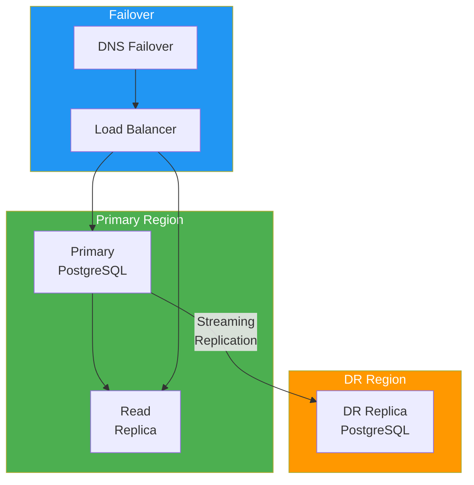

# High Availability / DR Configuration

> **Project:** [Project Name]
> **Version:** [X.Y] | **Status:** [Draft | Under Review | Approved]
> **Last Updated:** [YYYY-MM-DD]

---

## 1. Purpose

> Defines high availability and disaster recovery configuration for database systems — minimizing downtime and data loss.

## 2. HA/DR Architecture

## 3. HA Configuration

| Component | Configuration | RTO | RPO |
|---------|-------------|-----|-----|
| [Primary DB] | [Multi-AZ, auto-failover] | [1 min] | [0] |
| [Read Replica] | [Same region, streaming replication] | [N/A] | [< 1 sec] |
| [DR Replica] | [Cross-region, async replication] | [4 hours] | [< 1 min] |
| [Connection Pool] | [PgBouncer, auto-reconnect] | [30 sec] | [0] |

## 4. Failover Procedures

### 4.1 Automatic Failover (Primary → Replica)

| Step | Action | Duration | Automatic |
|------|--------|---------|----------|
| 1 | [Health check fails] | [30 sec] | ✅ |
| 2 | [Promote replica] | [10 sec] | ✅ |
| 3 | [Update DNS] | [30 sec] | ✅ |
| 4 | [Reconnect clients] | [30 sec] | ✅ |
| **Total** | | **~2 min** | |

### 4.2 Manual Failover (Primary → DR)

| Step | Action | Command | Duration |
|------|--------|---------|---------|
| 1 | [Assess primary failure] | [Manual assessment] | [15 min] |
| 2 | [Promote DR replica] | `SELECT pg_promote();` | [1 min] |
| 3 | [Update DNS] | [DNS failover] | [15 min] |
| 4 | [Verify DR data] | [Consistency checks] | [30 min] |
| 5 | [Notify stakeholders] | [Communication] | [5 min] |
| **Total** | | | **~1 hour** |

## 5. Replication Monitoring

| Metric | Threshold | Alert |
|--------|----------|-------|
| [Replication lag] | [< 10 seconds] | [PagerDuty] |
| [Replication state] | [Streaming] | [PagerDuty] |
| [WAL generation rate] | [Monitor trend] | [Dashboard] |
| [DR replica status] | [Running] | [PagerDuty] |

## 6. DR Testing Schedule

| Test | Frequency | Last Test | Result |
|------|----------|----------|--------|
| [Replica promotion] | [Monthly] | [YYYY-MM-DD] | ✅ Pass |
| [DR failover] | [Quarterly] | [YYYY-MM-DD] | ✅ Pass |
| [Full DR drill] | [Annually] | [YYYY-MM-DD] | ✅ Pass |

---

## Related Documents

| Document | Relationship |
|----------|-------------|
| [[Backup-Recovery-Plan]] | Backup strategy |
| [[Database-Operational-Runbook]] | Operational procedures |
| [[Disaster-Recovery-Plan]] | Overall DR plan |

---

> **Template Standard:** Based on DMBOK v2
> **Usage:** HA is for *availability*, DR is for *disaster*. Test both regularly. Automatic failover is great — until it isn't. Have a manual plan too.
