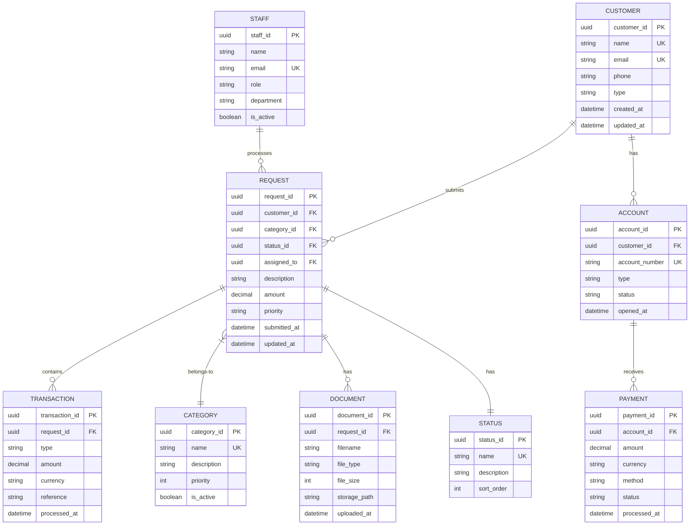

# Logical Data Model (LDM)

> **Project:** [Project Name]
> **Version:** [X.Y] | **Status:** [Draft | Under Review | Approved]
> **Last Updated:** [YYYY-MM-DD]

---

## 1. Purpose

> Detailed, technology-independent data model with attributes, keys, and normalization — bridging business concepts to physical implementation.

## 2. Logical Model

## 3. Entity-Attribute Details

### CUSTOMER

| Attribute | Type | Nullable | Unique | Default | Description |
|-----------|------|---------|--------|---------|------------|
| [customer_id] | [UUID] | [No] | [Yes] | [gen_random_uuid()] | [Primary key] |
| [name] | [VARCHAR(255)] | [No] | [No] | — | [Full name] |
| [email] | [VARCHAR(255)] | [No] | [Yes] | — | [Email address] |
| [phone] | [VARCHAR(20)] | [Yes] | [No] | — | [Phone in E.164] |
| [type] | [ENUM] | [No] | [No] | [STANDARD] | [Customer type] |
| [created_at] | [TIMESTAMP] | [No] | [No] | [now()] | [Creation time] |
| [updated_at] | [TIMESTAMP] | [No] | [No] | [now()] | [Last update] |

### REQUEST

| Attribute | Type | Nullable | Unique | Default | Description |
|-----------|------|---------|--------|---------|------------|
| [request_id] | [UUID] | [No] | [Yes] | [gen_random_uuid()] | [Primary key] |
| [customer_id] | [UUID] | [No] | [No] | — | [FK → Customer] |
| [category_id] | [UUID] | [No] | [No] | — | [FK → Category] |
| [status_id] | [UUID] | [No] | [No] | — | [FK → Status] |
| [assigned_to] | [UUID] | [Yes] | [No] | — | [FK → Staff] |
| [description] | [TEXT] | [No] | [No] | — | [Request description] |
| [amount] | [DECIMAL(12,2)] | [No] | [No] | — | [Requested amount] |
| [priority] | [ENUM] | [No] | [No] | [NORMAL] | [Priority level] |
| [submitted_at] | [TIMESTAMP] | [No] | [No] | [now()] | [Submission time] |
| [updated_at] | [TIMESTAMP] | [No] | [No] | [now()] | [Last update] |

## 4. Normalization

| Normal Form | Status | Evidence |
|------------|--------|---------|
| [1NF] | ✅ | [Atomic values, no repeating groups] |
| [2NF] | ✅ | [No partial dependencies] |
| [3NF] | ✅ | [No transitive dependencies] |

## 5. Constraints

| Entity | Constraint | Type | Description |
|--------|-----------|------|-----------|
| [Customer] | [email_unique] | [UNIQUE] | [No duplicate emails] |
| [Request] | [amount_positive] | [CHECK] | [Amount > 0] |
| [Request] | [customer_fk] | [FK] | [Must reference valid customer] |
| [Request] | [category_fk] | [FK] | [Must reference valid category] |
| [Request] | [status_fk] | [FK] | [Must reference valid status] |

---

## Related Documents

| Document | Relationship |
|----------|-------------|
| [[Conceptual-Data-Model-CDM]] | Business model |
| [[Physical-Data-Model-PDM]] | Physical implementation |
| [[Data-Dictionary]] | Detailed definitions |

---

> **Template Standard:** Based on DMBOK v2
> **Usage:** The LDM is the *logical design*. It defines what data exists, its attributes, and relationships — without database-specific details.
