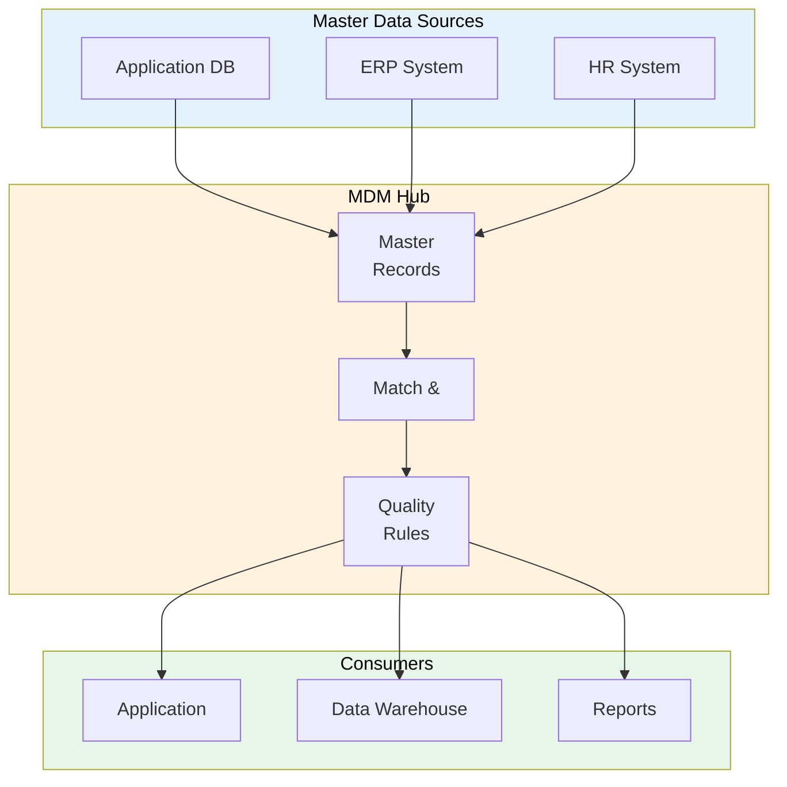

# MDM Strategy (Master Data Management)

> **Project:** [Project Name]
> **Version:** [X.Y] | **Status:** [Draft | Under Review | Approved]
> **Last Updated:** [YYYY-MM-DD]

---

## 1. Purpose

> Defines strategy for managing master data — ensuring consistent, accurate reference data across all systems.

## 2. Master Data Domains

| Domain | Description | Source of Truth | Systems Using |
|--------|-----------|----------------|--------------|
| [Customer] | [Customer master data] | [Application DB] | [Application, ERP, DW] |
| [Product/Service] | [Product catalog] | [Application DB] | [Application, ERP] |
| [Employee] | [Staff master data] | [HR System] | [Application, ERP] |
| [Organization] | [Company structure] | [ERP] | [All systems] |
| [Reference Data] | [Codes, categories] | [Application DB] | [All systems] |

## 3. MDM Architecture

## 4. Master Data Rules

| Rule | Description | Implementation |
|------|-----------|---------------|
| [Single source of truth] | [One system owns each master data domain] | [Source system designation] |
| [Golden record] | [One canonical record per entity] | [Match & merge rules] |
| [Data quality] | [Master data meets quality standards] | [Quality rules enforcement] |
| [Change control] | [Master data changes are controlled] | [Change request process] |
| [Distribution] | [Master data is distributed to consumers] | [Sync mechanisms] |

## 5. Match & Merge Rules

| Domain | Match Criteria | Merge Strategy | Conflict Resolution |
|--------|---------------|---------------|-------------------|
| [Customer] | [Email (exact), Name (fuzzy)] | [Survivorship rules] | [Source of truth wins] |
| [Product] | [SKU (exact)] | [Latest wins] | [Source system wins] |
| [Employee] | [Employee ID (exact)] | [HR system wins] | [HR system wins] |

## 6. Data Stewardship for Master Data

| Domain | Steward | Responsibilities |
|--------|---------|-----------------|
| [Customer] | [Customer Data Steward] | [Quality, dedup, merge] |
| [Product] | [Product Data Steward] | [Catalog management] |
| [Employee] | [HR Data Steward] | [Employee records] |
| [Reference] | [Reference Data Steward] | [Codes, categories] |

---

## Related Documents

| Document | Relationship |
|----------|-------------|
| [[Reference-Data-Catalog]] | Reference data |
| [[Golden-Record-Definition]] | Golden record rules |
| [[Data-Governance-Charter]] | Governance framework |

---

> **Template Standard:** Based on DMBOK v2
> **Usage:** MDM ensures *one version of the truth*. Without it, every system has its own version of "customer."
