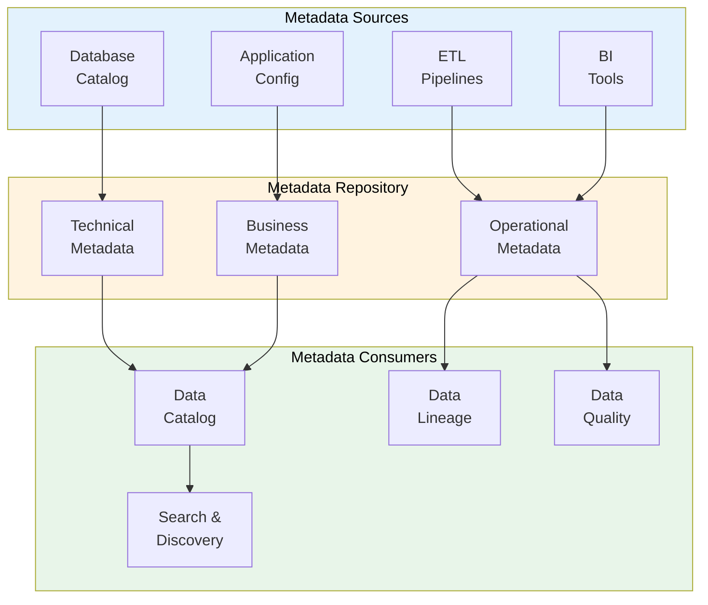

# Metadata Repository

> **Project:** [Project Name]
> **Version:** [X.Y] | **Status:** [Draft | Under Review | Approved]
> **Last Updated:** [YYYY-MM-DD]

---

## 1. Purpose

> Central repository for metadata — technical, business, and operational metadata about all data assets.

## 2. Metadata Types

| Type | Description | Examples | Source |
|------|-----------|---------|--------|
| [Technical Metadata] | [Structure, format, storage] | [Table names, column types, indexes] | [Database catalog] |
| [Business Metadata] | [Meaning, context, usage] | [Business names, definitions, owners] | [Business glossary] |
| [Operational Metadata] | [Usage, quality, lineage] | [Query logs, quality scores, lineage] | [Monitoring tools] |

## 3. Metadata Architecture

## 4. Metadata Standards

| Standard | Description | Implementation |
|---------|-----------|---------------|
| [Naming conventions] | [Consistent naming] | [[Data-Standards]] |
| [Data classification] | [Classification tags] | [[Data-Classification-Schema]] |
| [Business glossary] | [Term definitions] | [[Business-Glossary]] |
| [Lineage tracking] | [Data origin and flow] | [[Data-Lineage-Documentation]] |

## 5. Metadata Collection

| Metadata | Collection Method | Frequency | Owner |
|---------|------------------|----------|-------|
| [Table/column names] | [Database introspection] | [On change] | [Automated] |
| [Business definitions] | [Manual entry] | [On change] | [Data Steward] |
| [Data lineage] | [ETL logging] | [On run] | [Automated] |
| [Quality scores] | [Quality monitoring] | [Daily] | [Automated] |
| [Usage statistics] | [Query logging] | [Real-time] | [Automated] |

## 6. Metadata Governance

| Rule | Description |
|------|-----------|
| [Completeness] | [All data assets have metadata] |
| [Accuracy] | [Metadata reflects current state] |
| [Timeliness] | [Metadata updated within SLA] |
| [Ownership] | [Every metadata element has an owner] |

---

## Related Documents

| Document | Relationship |
|----------|-------------|
| [[Data-Catalog]] | Catalog using metadata |
| [[Metadata-Standards]] | Metadata standards |
| [[Data-Lineage-Documentation]] | Lineage metadata |

---

> **Template Standard:** Based on DMBOK v2
> **Usage:** Metadata is *data about data*. Without it, you can't find, understand, or trust your data.
