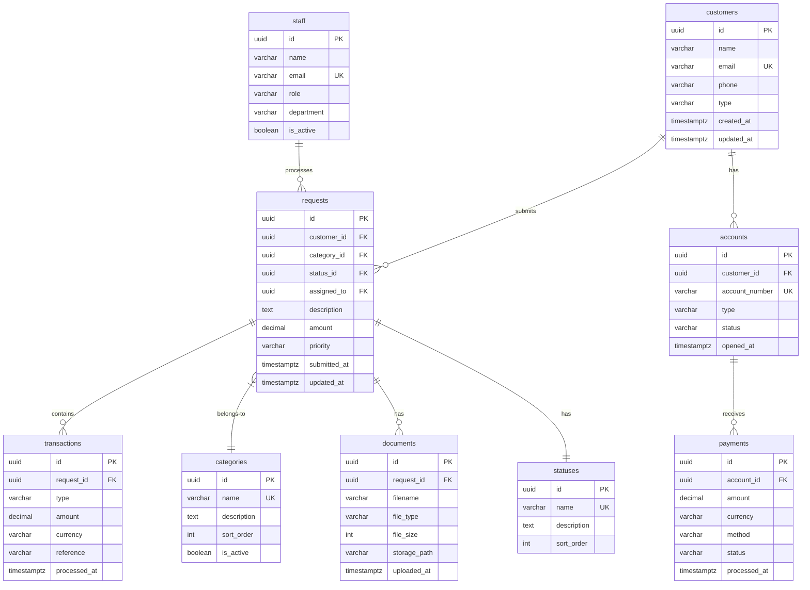

# Physical Data Model (PDM)

> **Project:** [Project Name]
> **Version:** [X.Y] | **Status:** [Draft | Under Review | Approved]
> **Last Updated:** [YYYY-MM-DD]

---

## 1. Purpose

> Database-specific implementation of the logical model — tables, indexes, constraints, and storage details.

## 2. Database Configuration

| Aspect | Configuration |
|--------|-------------|
| [RDBMS] | [PostgreSQL 16] |
| [Character Set] | [UTF-8] |
| [Collation] | [en_US.UTF-8] |
| [Schema] | [public] |
| [Extensions] | [uuid-ossp, pgcrypto] |

## 3. Physical Model



## 4. Table Definitions

### customers

```sql
CREATE TABLE customers (
    id UUID PRIMARY KEY DEFAULT gen_random_uuid(),
    name VARCHAR(255) NOT NULL,
    email VARCHAR(255) NOT NULL UNIQUE,
    phone VARCHAR(20),
    type VARCHAR(20) NOT NULL DEFAULT 'STANDARD',
    created_at TIMESTAMPTZ NOT NULL DEFAULT now(),
    updated_at TIMESTAMPTZ NOT NULL DEFAULT now()
);

CREATE INDEX idx_customers_email ON customers(email);
CREATE INDEX idx_customers_type ON customers(type);
```

### requests

```sql
CREATE TABLE requests (
    id UUID PRIMARY KEY DEFAULT gen_random_uuid(),
    customer_id UUID NOT NULL REFERENCES customers(id),
    category_id UUID NOT NULL REFERENCES categories(id),
    status_id UUID NOT NULL REFERENCES statuses(id),
    assigned_to UUID REFERENCES staff(id),
    description TEXT NOT NULL,
    amount DECIMAL(12,2) NOT NULL CHECK (amount > 0),
    priority VARCHAR(20) NOT NULL DEFAULT 'NORMAL',
    submitted_at TIMESTAMPTZ NOT NULL DEFAULT now(),
    updated_at TIMESTAMPTZ NOT NULL DEFAULT now()
);

CREATE INDEX idx_requests_customer ON requests(customer_id);
CREATE INDEX idx_requests_status ON requests(status_id);
CREATE INDEX idx_requests_assigned ON requests(assigned_to);
CREATE INDEX idx_requests_submitted ON requests(submitted_at);
```

## 5. Indexes Summary

| Table | Index | Columns | Type | Purpose |
|-------|-------|---------|------|---------|
| [customers] | [idx_customers_email] | [email] | [B-tree, unique] | [Email lookup] |
| [requests] | [idx_requests_customer] | [customer_id] | [B-tree] | [Customer requests] |
| [requests] | [idx_requests_status] | [status_id] | [B-tree] | [Status filtering] |
| [requests] | [idx_requests_submitted] | [submitted_at] | [B-tree] | [Date sorting] |

## 6. Triggers

```sql
-- Auto-update updated_at
CREATE OR REPLACE FUNCTION update_updated_at()
RETURNS TRIGGER AS $$
BEGIN
    NEW.updated_at = now();
    RETURN NEW;
END;
$$ LANGUAGE plpgsql;

CREATE TRIGGER trg_customers_updated
    BEFORE UPDATE ON customers
    FOR EACH ROW EXECUTE FUNCTION update_updated_at();

CREATE TRIGGER trg_requests_updated
    BEFORE UPDATE ON requests
    FOR EACH ROW EXECUTE FUNCTION update_updated_at();
```

## 7. Storage Estimates

| Table | Rows (Year 1) | Row Size | Total Size |
|-------|-------------|---------|-----------|
| [customers] | [10,000] | [~500 bytes] | [~5 MB] |
| [requests] | [100,000] | [~800 bytes] | [~80 MB] |
| [transactions] | [200,000] | [~400 bytes] | [~80 MB] |
| [documents] | [150,000] | [~300 bytes] | [~45 MB] |

---

## Related Documents

| Document | Relationship |
|----------|-------------|
| [[Logical-Data-Model-LDM]] | Logical model |
| [[Database-Schema-DDL]] | DDL scripts |
| [[Data-Dictionary]] | Definitions |

---

> **Template Standard:** Based on DMBOK v2
> **Usage:** The PDM is the *physical reality*. Every table, index, and constraint. This is what gets deployed.
