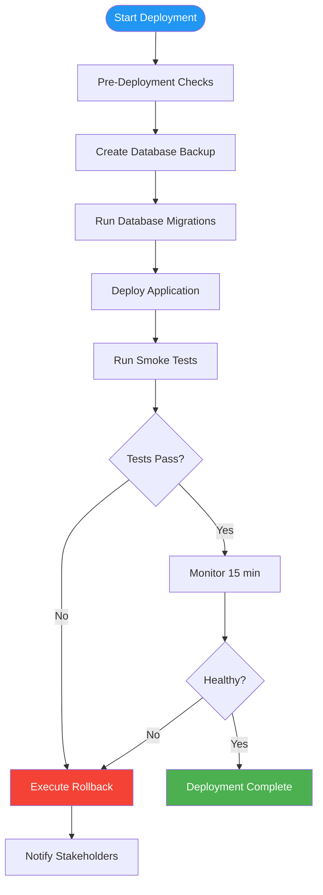

# Deployment Plan

> **Project:** [Project Name]
> **Version:** [X.Y] | **Status:** [Draft | Under Review | Approved]
> **Last Updated:** [YYYY-MM-DD]

---

## 1. Purpose

> Step-by-step deployment procedures — pre-deployment checks, deployment steps, verification, and rollback.

## 2. Deployment Overview

| Field | Detail |
|-------|--------|
| [Release Version] | [vX.Y.Z] |
| [Deployment Date] | [YYYY-MM-DD HH:MM] |
| [Deployment Window] | [HH:MM - HH:MM] |
| [Downtime] | [Zero / X minutes] |
| [Deployment Method] | [Blue-Green / Rolling / Canary] |
| [Responsible] | [DevOps Engineer] |

## 3. Pre-Deployment Checklist

| # | Check | Owner | Status |
|---|-------|-------|--------|
| 1 | [All tests pass in CI/CD] | [QA] | ☐ |
| 2 | [UAT sign-off received] | [BA] | ☐ |
| 3 | [Release notes prepared] | [PM] | ☐ |
| 4 | [Database migrations tested] | [Dev] | ☐ |
| 5 | [Rollback plan reviewed] | [DevOps] | ☐ |
| 6 | [Stakeholders notified] | [PM] | ☐ |
| 7 | [Monitoring dashboards open] | [DevOps] | ☐ |
| 8 | [On-call team identified] | [DevOps] | ☐ |

## 4. Deployment Steps

| Step | Action | Command | Duration | Verification |
|------|--------|---------|---------|-------------|
| 1 | [Create backup] | [pg_dump > backup.sql] | [5 min] | [Backup file exists] |
| 2 | [Run migrations] | [npm run db:migrate] | [2 min] | [Migration output] |
| 3 | [Deploy application] | [kubectl apply -f deployment.yaml] | [2 min] | [Pods running] |
| 4 | [Run smoke tests] | [npm run test:smoke] | [5 min] | [All tests pass] |
| 5 | [Monitor] | [Watch dashboards] | [15 min] | [No errors] |
| 6 | [Notify success] | [Slack notification] | [1 min] | [Message sent] |

## 5. Post-Deployment Verification

| # | Check | Expected | Actual | Status |
|---|-------|---------|--------|--------|
| 1 | [Application health check] | [200 OK] | | ☐ |
| 2 | [Database connectivity] | [Connected] | | ☐ |
| 3 | [Cache connectivity] | [Connected] | | ☐ |
| 4 | [External integrations] | [All connected] | | ☐ |
| 5 | [Error rate < 1%] | [< 1%] | | ☐ |
| 6 | [Response time < 2s] | [< 2s] | | ☐ |

## 6. Communication Plan

| When | Who | Channel | Message |
|------|-----|---------|---------|
| [Before deployment] | [All stakeholders] | [Email + Slack] | [Deployment starting at HH:MM] |
| [During deployment] | [Team] | [Slack #deployments] | [Step-by-step updates] |
| [After success] | [All stakeholders] | [Email + Slack] | [Deployment complete, v1.2.0 live] |
| [If rollback] | [All stakeholders] | [Email + Slack] | [Deployment rolled back, investigating] |

---

## Related Documents

| Document | Relationship |
|----------|-------------|
| [[Rollback-Plan]] | Rollback procedures |
| [[Release-Notes]] | Release details |
| [[CI-CD-Pipeline-Configuration]] | Pipeline configuration |

---

> **Template Standard:** Based on SWEBOK v4
> **Usage:** Never deploy without a rollback plan. Test the rollback plan before the deployment window.
