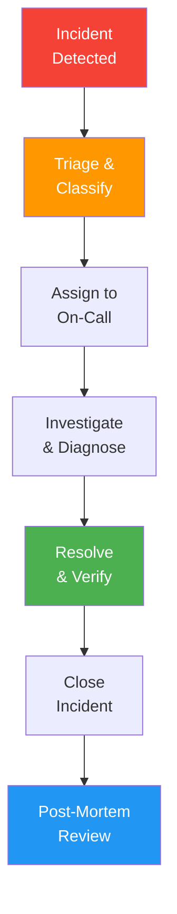

# Incident Management Process

> **Project:** [Project Name]
> **Version:** [X.Y] | **Status:** [Draft | Under Review | Approved]
> **Last Updated:** [YYYY-MM-DD]

---

## 1. Purpose

> Defines how incidents are detected, triaged, resolved, and reviewed — minimizing impact on users.

## 2. Incident Lifecycle

## 3. Severity Classification

| Severity | Definition | Response | Resolution | Example |
|---------|-----------|---------|-----------|--------|
| 🔴 **SEV-1** | [System down, data loss] | [15 min] | [1 hour] | [Production outage] |
| 🟠 **SEV-2** | [Major feature broken] | [30 min] | [4 hours] | [Cannot submit requests] |
| 🟡 **SEV-3** | [Minor feature broken] | [1 hour] | [1 day] | [Report filter issue] |
| 🟢 **SEV-4** | [Cosmetic, minor] | [4 hours] | [Next sprint] | [UI alignment issue] |

## 4. Incident Response Procedure

| Step | Action | Owner | Duration |
|------|--------|-------|---------|
| 1 | [Alert received] | [On-call] | [Immediate] |
| 2 | [Acknowledge alert] | [On-call] | [< 5 min] |
| 3 | [Triage — classify severity] | [On-call] | [< 10 min] |
| 4 | [Notify stakeholders (if SEV-1/2)] | [On-call] | [< 15 min] |
| 5 | [Investigate root cause] | [On-call] | [Varies] |
| 6 | [Implement fix/workaround] | [On-call] | [Varies] |
| 7 | [Verify resolution] | [On-call + QA] | [< 15 min] |
| 8 | [Close incident] | [On-call] | [After verification] |
| 9 | [Schedule post-mortem] | [On-call] | [Within 24h] |

## 5. Escalation Matrix

| Time Elapsed | SEV-1 | SEV-2 | SEV-3 |
|-------------|-------|-------|-------|
| [0 min] | [On-call engineer] | [On-call engineer] | [On-call engineer] |
| [15 min] | [DevOps Lead] | — | — |
| [30 min] | [Engineering Manager] | [DevOps Lead] | — |
| [1 hour] | [CTO] | [Engineering Manager] | — |
| [4 hours] | [CEO] | [CTO] | [Engineering Manager] |

## 6. Communication Templates

### Incident Started

> 🔴 **INCIDENT — SEV-1**
> **Impact:** [Description of user impact]
> **Status:** Investigating
> **ETA:** [Estimated resolution time]
> **Incident Commander:** [Name]

### Incident Resolved

> ✅ **INCIDENT RESOLVED — SEV-1**
> **Duration:** [X hours Y minutes]
> **Root Cause:** [Brief description]
> **Impact:** [Users affected, data impact]
> **Post-Mortem:** [Scheduled for YYYY-MM-DD]

## 7. Post-Mortem Template

| Field | Content |
|-------|---------|
| [Incident ID] | [INC-XXX] |
| [Date] | [YYYY-MM-DD] |
| [Duration] | [X hours] |
| [Severity] | [SEV-X] |
| [Impact] | [Users affected, data impact] |
| [Root Cause] | [What caused it] |
| [Timeline] | [Minute-by-minute] |
| [What went well] | [Positive aspects] |
| [What went wrong] | [Negative aspects] |
| [Action Items] | [Prevention measures] |

---

## Related Documents

| Document | Relationship |
|----------|-------------|
| [[Rollback-Plan]] | Rollback during incidents |
| [[Operations-Manual-Runbook]] | Troubleshooting procedures |
| [[SLA]] | Incident SLAs |

---

> **Template Standard:** Based on SWEBOK v4, ITIL
> **Usage:** Incidents happen. What matters is how fast you detect, respond, and learn. Blameless post-mortems build trust.
