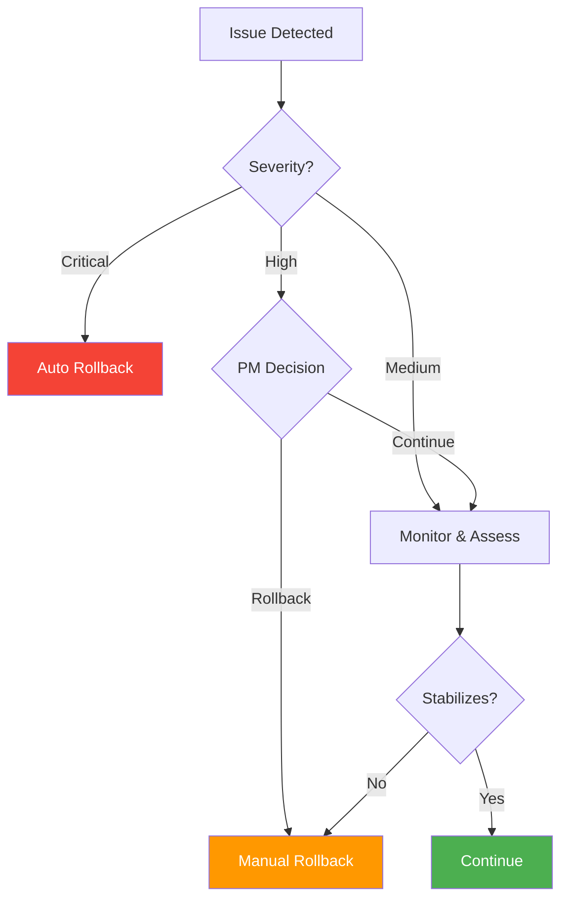

# Rollback Plan

> **Project:** [Project Name]
> **Version:** [X.Y] | **Status:** [Draft | Under Review | Approved]
> **Last Updated:** [YYYY-MM-DD]

---

## 1. Purpose

> Step-by-step rollback procedures to revert a failed deployment to the previous stable state.

## 2. Rollback Triggers

| # | Trigger | Automatic/Manual | Action |
|---|---------|-----------------|--------|
| 1 | [Smoke tests fail] | [Automatic] | [Immediate rollback] |
| 2 | [Error rate > 5%] | [Automatic] | [Immediate rollback] |
| 3 | [Response time > 5s] | [Manual] | [PM decision] |
| 4 | [Critical bug discovered] | [Manual] | [PM decision] |
| 5 | [External integration failure] | [Manual] | [PM decision] |

## 3. Rollback Decision Matrix

## 4. Rollback Steps

| Step | Action | Command | Duration | Verification |
|------|--------|---------|---------|-------------|
| 1 | [Announce rollback] | [Slack #deployments] | [1 min] | [Message sent] |
| 2 | [Revert application] | [kubectl rollout undo deployment/app] | [2 min] | [Previous version running] |
| 3 | [Revert database] | [psql < backup.sql] | [5 min] | [Data intact] |
| 4 | [Verify rollback] | [Smoke tests] | [5 min] | [All tests pass] |
| 5 | [Notify stakeholders] | [Email + Slack] | [1 min] | [Message sent] |
| 6 | [Post-mortem] | [Schedule meeting] | [Next day] | [Meeting scheduled] |

## 5. Rollback Time Estimates

| Scenario | Rollback Time | Total Downtime |
|---------|-------------|---------------|
| [Application only] | [5 minutes] | [5 minutes] |
| [Application + database] | [15 minutes] | [15 minutes] |
| [Full environment] | [30 minutes] | [30 minutes] |

## 6. Rollback Checklist

| # | Action | Owner | Status |
|---|-------|-------|--------|
| 1 | [Announce rollback to team] | [DevOps] | ☐ |
| 2 | [Stop all traffic to new version] | [DevOps] | ☐ |
| 3 | [Revert to previous version] | [DevOps] | ☐ |
| 4 | [Verify database integrity] | [Dev] | ☐ |
| 5 | [Run smoke tests] | [QA] | ☐ |
| 6 | [Verify monitoring shows healthy] | [DevOps] | ☐ |
| 7 | [Notify stakeholders] | [PM] | ☐ |
| 8 | [Schedule post-mortem] | [PM] | ☐ |

## 7. Communication Template

> **Rollback Notification**
>
> Subject: [ROLLBACK] Project v1.2.0 — Deployment Rolled Back
>
> Team,
>
> We have rolled back the v1.2.0 deployment due to [reason].
>
> **Impact:** [Description of impact]
> **Current State:** [Running v1.1.0]
> **Next Steps:** [Investigation timeline, next deployment window]
>
> Post-mortem scheduled for [date/time].

---

## Related Documents

| Document | Relationship |
|----------|-------------|
| [[Deployment-Plan]] | Forward deployment |
| [[Incident-Management-Process]] | Incident handling |
| [[Disaster-Recovery-Plan]] | Major failure recovery |

---

> **Template Standard:** Based on SWEBOK v4
> **Usage:** Test your rollback plan before you need it. A rollback you've never tried is not a plan — it's a hope.
