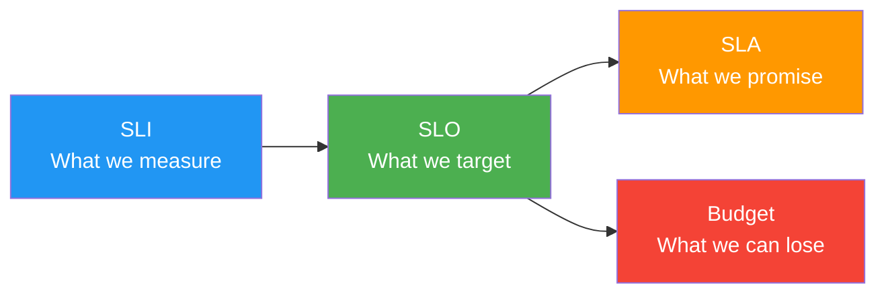

# SLO/SLI Definitions

> **Project:** [Project Name]
> **Version:** [X.Y] | **Status:** [Draft | Under Review | Approved]
> **Last Updated:** [YYYY-MM-DD]

---

## 1. Purpose

> Defines Service Level Indicators (SLIs) — what we measure — and Service Level Objectives (SLOs) — what we target.

## 2. SLI/SLO Relationship

## 3. SLI Definitions

| SLI | Description | Measurement | Source |
|-----|-----------|------------|--------|
| [Availability] | [Successful requests / Total requests] | [Percentage] | [Load balancer logs] |
| [Latency — p50] | [50th percentile response time] | [Milliseconds] | [APM] |
| [Latency — p95] | [95th percentile response time] | [Milliseconds] | [APM] |
| [Latency — p99] | [99th percentile response time] | [Milliseconds] | [APM] |
| [Error Rate] | [5xx responses / Total responses] | [Percentage] | [Load balancer logs] |
| [Throughput] | [Requests per second] | [Count/sec] | [Load balancer logs] |

## 4. SLO Definitions

| SLI | SLO Target | Measurement Window | Error Budget |
|-----|-----------|-------------------|-------------|
| [Availability] | [99.9%] | [30 days] | [43.8 min/month] |
| [Latency — p95] | [< 2000ms] | [30 days] | [1% of requests] |
| [Latency — p99] | [< 5000ms] | [30 days] | [1% of requests] |
| [Error Rate] | [< 1%] | [30 days] | [1% of requests] |

## 5. Error Budget

| SLO | Budget per Month | Budget per Quarter | Status |
|-----|-----------------|-------------------|--------|
| [99.9% availability] | [43.8 min] | [131.4 min] | [X min used] |
| [< 1% error rate] | [~4,320 requests] | [~12,960 requests] | [X used] |

### Error Budget Policy

| Budget Remaining | Action |
|-----------------|--------|
| [> 50%] | [Normal development velocity] |
| [25-50%] | [Increase testing, reduce risk] |
| [< 25%] | [Feature freeze, focus on reliability] |
| [Exhausted] | [Stop releases, incident review] |

## 6. SLO Dashboard

| Metric | Current | SLO | Status | Trend |
|--------|---------|-----|--------|-------|
| [Availability] | [99.95%] | [99.9%] | ✅ | → |
| [Latency p95] | [1.8s] | [< 2s] | ✅ | ↓ |
| [Error Rate] | [0.3%] | [< 1%] | ✅ | → |

## 7. SLO Review Cadence

| Review | Frequency | Participants | Purpose |
|--------|----------|-------------|---------|
| [SLO Dashboard] | [Real-time] | [Team] | [Current status] |
| [SLO Review] | [Monthly] | [Engineering] | [Trend analysis] |
| [SLO Revision] | [Quarterly] | [Engineering + PM] | [Adjust targets] |

---

## Related Documents

| Document | Relationship |
|----------|-------------|
| [[SLA]] | External commitment |
| [[Operational-KPIs-Report]] | Operational metrics |
| [[Monitoring-Dashboard-Spec]] | Monitoring specification |

---

> **Template Standard:** Based on SWEBOK v4, Google SRE Book
> **Usage:** SLOs are *internal targets* — more strict than SLAs. The error budget tells you when to slow down and focus on reliability.
