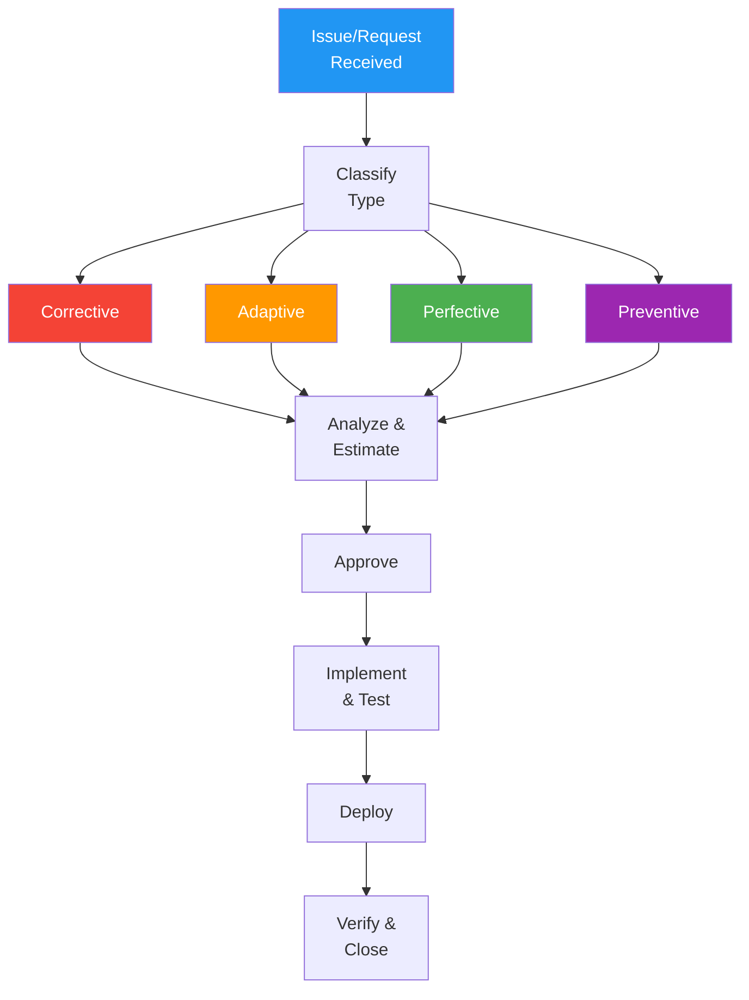

# Maintenance Plan

> **Project:** [Project Name]
> **Version:** [X.Y] | **Status:** [Draft | Under Review | Approved]
> **Last Updated:** [YYYY-MM-DD]

---

## 1. Purpose

> Defines the maintenance strategy — how the system will be supported, enhanced, and kept healthy after go-live.

## 2. Maintenance Types

| Type | Description | Priority | Frequency |
|------|-----------|---------|-----------|
| [Corrective] | [Fix defects and bugs] | 🔴 | [As needed] |
| [Adaptive] | [Adapt to environment changes] | 🟡 | [Quarterly] |
| [Perfective] | [Improve performance/features] | 🟡 | [Per sprint] |
| [Preventive] | [Prevent future problems] | 🟢 | [Monthly] |

## 3. Maintenance Team

| Role | Name | Responsibility | Availability |
|------|------|---------------|-------------|
| [Maintenance Lead] | [Name] | [Coordinate maintenance activities] | [Business hours] |
| [Developer 1] | [Name] | [Bug fixes, enhancements] | [Business hours] |
| [Developer 2] | [Name] | [Bug fixes, enhancements] | [Business hours] |
| [On-Call Engineer] | [Rotation] | [Emergency response] | [24/7] |

## 4. Support Levels

| Level | Description | Response Time | Resolution Time | Hours |
|-------|-----------|-------------|----------------|-------|
| [L1 — Help Desk] | [First response, triage] | [15 min] | [1 hour] | [Business] |
| [L2 — Support Engineer] | [Investigation, workaround] | [1 hour] | [4 hours] | [Business] |
| [L3 — Development] | [Root cause, fix] | [4 hours] | [1 day] | [Business] |
| [L4 — Emergency] | [Critical production issues] | [15 min] | [4 hours] | [24/7] |

## 5. Maintenance Windows

| Activity | Frequency | Window | Duration | Notification |
|---------|----------|--------|---------|-------------|
| [Patching] | [Monthly] | [Sun 2-4 AM] | [2 hours] | [72 hours] |
| [Minor release] | [Bi-weekly] | [Sat 10 PM - 12 AM] | [2 hours] | [48 hours] |
| [Major release] | [Quarterly] | [Sat 10 PM - 4 AM] | [6 hours] | [1 week] |
| [Emergency fix] | [As needed] | [Anytime] | [Varies] | [Immediate] |

## 6. Maintenance Process

## 7. SLA Targets

| Metric | Target | Measurement |
|--------|--------|-----------|
| [System availability] | [99.9%] | [Monthly] |
| [Incident response — Critical] | [< 15 min] | [Per incident] |
| [Incident resolution — Critical] | [< 4 hours] | [Per incident] |
| [Bug fix turnaround — High] | [< 1 day] | [Per bug] |
| [Enhancement delivery] | [Per sprint] | [Sprint velocity] |

## 8. Maintenance Budget

| Category | Monthly | Annual | Notes |
|---------|---------|--------|-------|
| [Team salaries] | [$X] | [$Y] | [2 developers + 1 lead] |
| [Infrastructure] | [$X] | [$Y] | [Cloud hosting] |
| [Tools & licenses] | [$X] | [$Y] | [Monitoring, support tools] |
| [Contingency] | [$X] | [$Y] | [15% buffer] |
| **Total** | **[$X]** | **[$Y]** | |

---

## Related Documents

| Document | Relationship |
|----------|-------------|
| [[SLA-Compliance-Report]] | SLA tracking |
| [[Maintenance-Log-Change-History]] | Change history |
| [[Technical-Debt-Register]] | Technical debt |

---

> **Template Standard:** Based on SWEBOK v4, ISO/IEC/IEEE 14764
> **Usage:** Maintenance is *not* afterthought — it's 60-80% of total software cost. Plan for it from day one.
