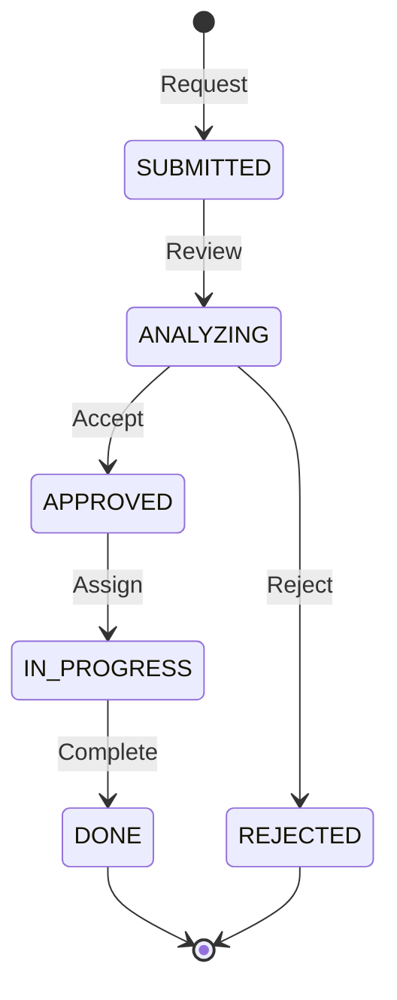

# MR/PR (Modification Request)

> **Project:** [Project Name]
> **Version:** [X.Y] | **Status:** [Active]
> **Last Updated:** [YYYY-MM-DD]

---

## 1. Purpose

> Formal request for system modifications — defects, enhancements, or changes. Every change starts here.

## 2. Modification Request Template

| Field | Value |
|-------|-------|
| **MR ID** | [MR-XXX] |
| **Title** | [Brief descriptive title] |
| **Type** | [Defect / Enhancement / Change / New Feature] |
| **Priority** | [🔴 Critical / 🟡 High / 🟢 Medium / ⚪ Low] |
| **Status** | [Submitted / Approved / In Progress / Done / Rejected] |
| **Requested By** | [Name, Role] |
| **Request Date** | [YYYY-MM-DD] |
| **Target Release** | [vX.Y.Z] |
| **Impact Analysis** | [[IA-XXX]] |

### Description

> [Clear description of what needs to change and why]

### Business Justification

> [Why this change matters — business value, user impact, compliance]

### Acceptance Criteria

| # | Criterion |
|---|----------|
| 1 | [Criterion 1] |
| 2 | [Criterion 2] |
| 3 | [Criterion 3] |

### Affected Components

| Component | Impact | Notes |
|---------|--------|-------|
| [Module X] | [Change required] | [Details] |
| [API] | [None] | — |
| [Database] | [Schema change] | [Migration needed] |

## 3. MR Lifecycle

## 4. MR Register

| ID | Title | Type | Priority | Status | Requested | Target |
|----|-------|------|---------|--------|---------|--------|
| [MR-001] | [Add document preview] | Enhancement | 🟡 High | ✅ Done | [Jul 1] | [v1.1] |
| [MR-002] | [Fix mobile upload] | Defect | 🔴 Critical | ✅ Done | [Jul 5] | [v1.0.1] |
| [MR-003] | [Add bulk export] | Enhancement | 🟢 Medium | 🔄 In Progress | [Jul 10] | [v1.2] |
| [MR-004] | [New payment gateway] | New Feature | 🟡 High | ⏳ Pending | [Jul 12] | [v2.0] |

## 5. MR Metrics

| Metric | Value | Target |
|--------|-------|--------|
| [Total MRs submitted] | [X] | — |
| [MRs completed] | [X] | — |
| [Avg resolution time] | [X days] | [< 5 days] |
| [MR backlog] | [X] | [< 20] |

---

## Related Documents

| Document | Relationship |
|----------|-------------|
| [[Impact-Analysis-Report]] | Impact analysis |
| [[Maintenance-Log-Change-History]] | Change history |
| [[Requirements-Change-Log]] | Requirements changes |

---

> **Template Standard:** Based on SWEBOK v4
> **Usage:** Every change gets an MR — no exceptions. "Quick fixes" without MRs are how production breaks.
