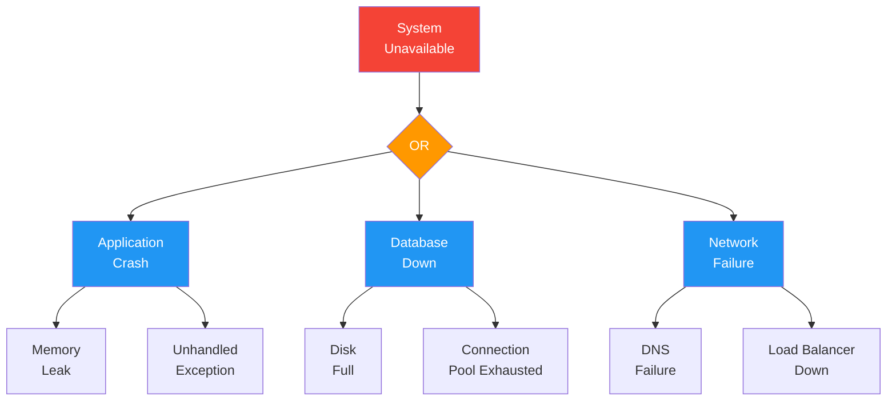

# FMEA / FTA Reports

> **Project:** [Project Name]
> **Version:** [X.Y] | **Status:** [Draft | Under Review | Approved]
> **Last Updated:** [YYYY-MM-DD]

---

## 1. Purpose

> **FMEA** (Failure Mode and Effects Analysis): Systematic identification of failure modes and their effects.
> **FTA** (Fault Tree Analysis): Top-down analysis of system failures.

## 2. FMEA Analysis

### FMEA-XXX: [System/Component]

| Field | Detail |
|-------|--------|
| **FMEA ID** | [FMEA-XXX] |
| **Scope** | [What's being analyzed] |
| **Date** | [YYYY-MM-DD] |
| **Team** | [Names] |

### FMEA Worksheet

| # | Component | Failure Mode | Effect | Severity | Cause | Probability | Detection | RPN | Action |
|---|----------|-------------|--------|---------|-------|-----------|----------|-----|--------|
| 1 | [Auth Service] | [Token expired] | [User logged out] | [3] | [No refresh] | [4] | [2] | [24] | [Add refresh] |
| 2 | [Database] | [Connection lost] | [Requests fail] | [5] | [Network issue] | [2] | [1] | [10] | [Retry logic] |
| 3 | [Queue] | [Messages lost] | [Notifications lost] | [4] | [Broker crash] | [2] | [2] | [16] | [Persistent queue] |
| 4 | [File Upload] | [Upload timeout] | [Document lost] | [3] | [Large file] | [3] | [3] | [27] | [Chunked upload] |

### RPN Calculation

```
RPN = Severity × Probability × Detection
Range: 1-125
Action threshold: RPN > 20
```

### Priority Matrix

| RPN Range | Priority | Action |
|----------|---------|--------|
| [> 50] | 🔴 Critical | [Immediate action required] |
| [20-50] | 🟡 High | [Action required before release] |
| [10-20] | 🟢 Medium | [Monitor and plan action] |
| [< 10] | ⚪ Low | [Accept risk] |

## 3. FTA Analysis

### FTA-XXX: [Top-Level Failure]

| Field | Detail |
|-------|--------|
| **FTA ID** | [FTA-XXX] |
| **Top Event** | [System unavailable] |
| **Date** | [YYYY-MM-DD] |

### Fault Tree



### Cut Sets

| Cut Set | Components | Probability | Mitigation |
|---------|-----------|-----------|-----------|
| [Set 1] | [Application Crash] | [Low] | [Auto-restart, health checks] |
| [Set 2] | [Database Down] | [Low] | [Multi-AZ, auto-failover] |
| [Set 3] | [Network Failure] | [Very Low] | [Multi-AZ, DNS failover] |

## 4. FMEA/FTA Register

| ID | Type | Scope | Findings | Actions | Status |
|----|------|-------|---------|---------|--------|
| [FMEA-001] | [FMEA] | [Authentication] | [4 failure modes] | [4 actions] | ✅ |
| [FMEA-002] | [FMEA] | [File Upload] | [3 failure modes] | [3 actions] | ✅ |
| [FTA-001] | [FTA] | [System Availability] | [3 cut sets] | [3 mitigations] | ✅ |

---

## Related Documents

| Document | Relationship |
|----------|-------------|
| [[RCA-Reports]] | Root cause analysis |
| [[Risk-Register]] | Project risks |
| [[Disaster-Recovery-Plan]] | DR planning |

---

> **Template Standard:** Based on SWEBOK v4, SEBoK v2
> **Usage:** FMEA is *bottom-up* (what can fail?). FTA is *top-down* (why did it fail?). Use both for critical systems.
