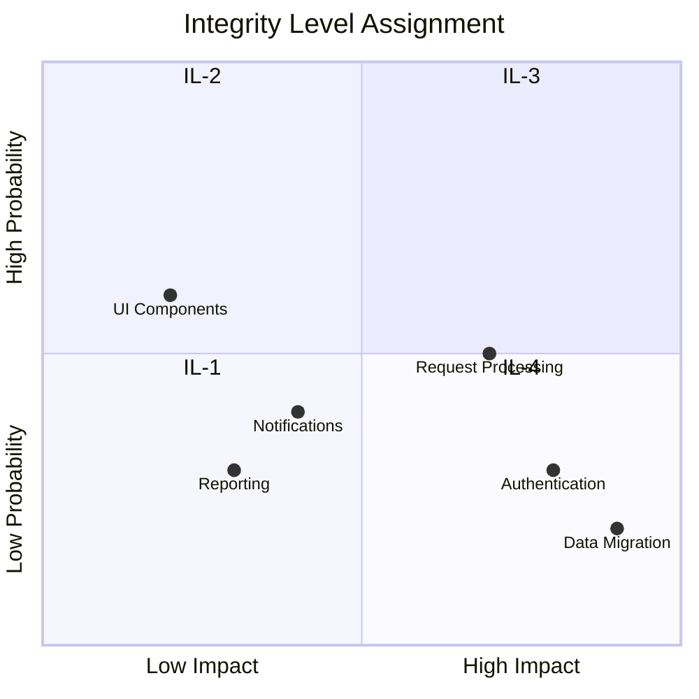

# Integrity Level Assignments

> **Project:** [Project Name]
> **Version:** [X.Y] | **Status:** [Draft | Under Review | Approved]
> **Last Updated:** [YYYY-MM-DD]

---

## 1. Purpose

> Assigns integrity levels to software components based on criticality — determining the rigor of testing and verification required.

## 2. Integrity Levels

| Level | Name | Description | Testing Rigor | Example |
|-------|------|-----------|-------------|--------|
| [IL-4] | [Mission Critical] | [Failure causes severe harm] | [Highest — formal methods, 100% coverage] | [Medical devices, aviation] |
| [IL-3] | [Safety Critical] | [Failure causes significant impact] | [High — comprehensive testing, >95% coverage] | [Financial systems, automotive] |
| [IL-2] | [Business Critical] | [Failure causes business impact] | [Medium — standard testing, >80% coverage] | [Business applications] |
| [IL-1] | [Non-Critical] | [Failure causes minor impact] | [Basic — functional testing] | [Internal tools] |

## 3. Component Integrity Assignments

| Component | Integrity Level | Rationale | Testing Requirements |
|---------|---------------|----------|-------------------|
| [Authentication] | [IL-3] | [Security critical] | [100% coverage, security testing] |
| [Request Processing] | [IL-3] | [Financial impact] | [95% coverage, comprehensive testing] |
| [Data Migration] | [IL-3] | [Data integrity critical] | [100% data validation] |
| [Notifications] | [IL-2] | [Business impact] | [80% coverage, integration testing] |
| [Reporting] | [IL-2] | [Business impact] | [80% coverage, functional testing] |
| [UI Components] | [IL-1] | [Minor impact] | [Functional testing] |

## 4. Testing Requirements by Level

| Level | Unit Coverage | Integration | System | Security | Formal Methods |
|-------|-------------|------------|--------|---------|---------------|
| [IL-4] | [100%] | [100%] | [100%] | [Full] | [Required] |
| [IL-3] | [95%] | [100%] | [100%] | [Full] | [Recommended] |
| [IL-2] | [80%] | [80%] | [80%] | [Standard] | [Not required] |
| [IL-1] | [60%] | [50%] | [Critical paths] | [Basic] | [Not required] |

## 5. Integrity Level Matrix

## 6. Review and Updates

| Trigger | Action | Owner |
|---------|--------|-------|
| [New component added] | [Assign integrity level] | [QA Lead] |
| [Component becomes critical] | [Re-assess level] | [QA Lead] |
| [Major incident] | [Review all levels] | [QA Lead] |
| [Annual review] | [Re-assess all levels] | [QA Lead] |

---

## Related Documents

| Document | Relationship |
|----------|-------------|
| [[SQAP]] | Quality assurance plan |
| [[Test-Strategy]] | Testing approach per level |
| [[FMEA-FTA-Reports]] | Failure analysis |

---

> **Template Standard:** Based on SWEBOK v4, ISO/IEC 61508
> **Usage:** Not all components need the same rigor. Integrity levels ensure testing effort matches risk.
