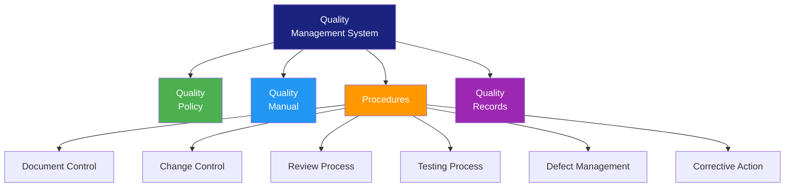

# QMS Documentation (Quality Management System)

> **Project:** [Project Name]
> **Version:** [X.Y] | **Status:** [Draft | Under Review | Approved]
> **Last Updated:** [YYYY-MM-DD]

---

## 1. Purpose

> Defines the Quality Management System — policies, procedures, and work instructions that ensure consistent quality.

## 2. QMS Structure

## 3. Quality Policy

> [Organization] is committed to delivering software that meets customer requirements and exceeds expectations. We achieve this through:
> - Continuous improvement
> - Customer focus
> - Process adherence
> - Team empowerment

## 4. QMS Procedures

| # | Procedure | Owner | Frequency | Status |
|---|----------|-------|----------|--------|
| 1 | [Document Control] | [QA Lead] | [Ongoing] | ✅ Active |
| 2 | [Change Control] | [PM] | [Ongoing] | ✅ Active |
| 3 | [Review Process] | [QA Lead] | [Per artifact] | ✅ Active |
| 4 | [Testing Process] | [QA Lead] | [Per sprint] | ✅ Active |
| 5 | [Defect Management] | [QA Lead] | [Ongoing] | ✅ Active |
| 6 | [Corrective Action] | [QA Lead] | [As needed] | ✅ Active |

## 5. Quality Records

| Record | Retention | Location | Owner |
|--------|----------|---------|-------|
| [Review Records] | [3 years] | [Repository] | [QA Lead] |
| [Test Reports] | [3 years] | [Repository] | [QA Lead] |
| [Defect Reports] | [3 years] | [Defect tracking] | [QA Lead] |
| [Audit Reports] | [5 years] | [Repository] | [QA Lead] |
| [Corrective Actions] | [3 years] | [Repository] | [QA Lead] |

## 6. Document Control

| Rule | Implementation |
|------|---------------|
| [Version control] | [Git repository] |
| [Review required] | [All documents reviewed before approval] |
| [Change history] | [Documented in each document] |
| [Approval signatures] | [Required for baselines] |
| [Distribution] | [Controlled via repository access] |

---

## Related Documents

| Document | Relationship |
|----------|-------------|
| [[SQAP]] | Quality assurance plan |
| [[Review-Records]] | Review evidence |
| [[Audit-Reports]] | Audit evidence |

---

> **Template Standard:** Based on SWEBOK v4, ISO 9001
> **Usage:** The QMS is the *quality backbone*. If it's not documented, it's not a process.
