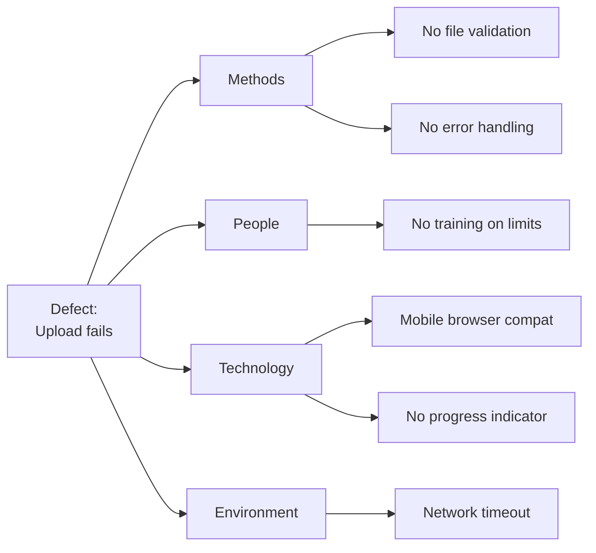

# RCA Reports (Root Cause Analysis)

> **Project:** [Project Name]
> **Version:** [X.Y] | **Status:** [Active]
> **Last Updated:** [YYYY-MM-DD]

---

## 1. Purpose

> Systematic analysis of defects and incidents to find root causes — not just symptoms.

## 2. RCA Methods

| Method | When | Best For |
|--------|------|---------|
| [5 Whys] | [Simple problems] | [Single cause] |
| [Fishbone (Ishikawa)] | [Complex problems] | [Multiple causes] |
| [Fault Tree Analysis] | [System failures] | [Safety-critical] |
| [Pareto Analysis] | [Recurring issues] | [Prioritization] |

## 3. RCA Template

### RCA-XXX: [Issue Title]

| Field | Detail |
|-------|--------|
| **RCA ID** | [RCA-XXX] |
| **Related** | [DEF-XXX / INC-XXX] |
| **Date** | [YYYY-MM-DD] |
| **Facilitator** | [Name] |
| **Team** | [Names] |

### Problem Statement

> [Clear description of the problem — what happened, when, impact]

### 5 Whys Analysis

| # | Why | Answer |
|---|-----|--------|
| 1 | [Why did the defect occur?] | [Because X happened] |
| 2 | [Why did X happen?] | [Because Y was missing] |
| 3 | [Why was Y missing?] | [Because Z process failed] |
| 4 | [Why did Z process fail?] | [Because no check existed] |
| 5 | [Why was there no check?] | [Because it wasn't in the requirements] |

### Root Cause

> [The fundamental cause — fix this, not the symptom]

### Fishbone Diagram

### Corrective Actions

| # | Action | Owner | Due Date | Status |
|---|--------|-------|---------|--------|
| 1 | [Add file size validation] | [Dev] | [Date] | ✅ |
| 2 | [Add upload progress indicator] | [Dev] | [Date] | ✅ |
| 3 | [Add error handling for timeout] | [Dev] | [Date] | ✅ |
| 4 | [Document file size limits] | [BA] | [Date] | ✅ |

### Prevention

| # | Prevention Measure | Owner | Status |
|---|-------------------|-------|--------|
| 1 | [Add file validation to coding standards] | [TL] | ✅ |
| 2 | [Add upload testing to test plan] | [QA] | ✅ |
| 3 | [Add mobile testing to release checklist] | [QA] | ✅ |

## 4. RCA Register

| ID | Issue | Root Cause | Corrective Actions | Status |
|----|-------|-----------|-------------------|--------|
| [RCA-001] | [Upload fails on mobile] | [No file validation] | [4 actions] | ✅ Closed |
| [RCA-002] | [Token refresh race condition] | [No mutex lock] | [3 actions] | ✅ Closed |
| [RCA-003] | [Dashboard slow at peak] | [Missing index] | [2 actions] | ✅ Closed |

---

## Related Documents

| Document | Relationship |
|----------|-------------|
| [[Defect-Report]] | Defect being analyzed |
| [[Incident-Problem-Reports]] | Incident being analyzed |
| [[FMEA-FTA-Reports]] | Failure analysis |

---

> **Template Standard:** Based on SWEBOK v4
> **Usage:** RCA answers *why*, not *who*. Blameless analysis finds real causes. Fix the system, not the person.
