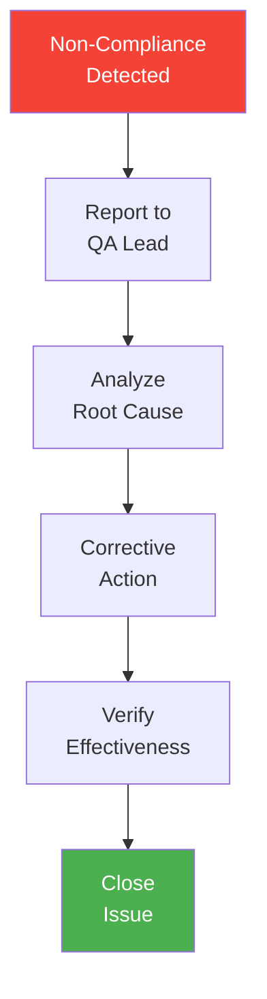

# SQAP (Software Quality Assurance Plan)

> **Project:** [Project Name]
> **Version:** [X.Y] | **Status:** [Draft | Under Review | Approved | Baselined]
> **Last Updated:** [YYYY-MM-DD]

---

## Document Control

| Field | Value |
|-------|-------|
| Document Owner | [QA Lead] |
| Approvals | [PM, Tech Lead, QA Lead] |

### Approvals

| Role | Name | Signature | Date |
|------|------|-----------|------|
| Project Manager | | | |
| Technical Lead | | | |
| QA Lead | | | |

---

## 1. Purpose

> Defines the quality assurance activities, standards, and responsibilities for the project.

## 2. Quality Objectives

| # | Objective | Measurement | Target |
|---|----------|-----------|--------|
| 1 | [Deliver defect-free software] | [Defect density] | [< 2 defects/feature] |
| 2 | [Meet all requirements] | [Requirements coverage] | [100%] |
| 3 | [Follow coding standards] | [Linting pass rate] | [100%] |
| 4 | [Complete on time] | [Schedule variance] | [< 5%] |
| 5 | [Stay within budget] | [Cost variance] | [< 10%] |

## 3. Quality Standards

| Standard | Applicability | Compliance |
|---------|-------------|-----------|
| [ISO 9001] | [Quality management system] | [Compliant] |
| [ISO/IEC/IEEE 90003] | [Software quality assurance] | [Compliant] |
| [WCAG 2.1 AA] | [Accessibility] | [Compliant] |
| [OWASP Top 10] | [Security] | [Compliant] |

## 4. QA Activities

| Activity | Phase | Frequency | Responsible | Standards |
|---------|-------|----------|-----------|----------|
| [Requirements Review] | [Requirements] | [Per sprint] | [BA + QA] | [[Review-Records]] |
| [Design Review] | [Design] | [Per sprint] | [Architect + QA] | [[Review-Records]] |
| [Code Review] | [Construction] | [Every PR] | [Developers] | [[Coding-Standards]] |
| [Static Analysis] | [Construction] | [Every commit] | [CI/CD] | [[Static-Analysis-Reports]] |
| [Unit Testing] | [Construction] | [Every commit] | [Developers] | [[Test-Strategy]] |
| [Integration Testing] | [Testing] | [Every PR] | [QA] | [[Test-Plan]] |
| [System Testing] | [Testing] | [Per sprint] | [QA] | [[Test-Plan]] |
| [UAT] | [Testing] | [Pre-release] | [Business] | [[UAT-Sign-off]] |
| [Performance Testing] | [Testing] | [Per release] | [QA] | [[Performance-Test-Report]] |
| [Security Testing] | [Testing] | [Per release] | [Security] | [[Security-Test-Report]] |

## 5. Quality Metrics

| Metric | Definition | Target | Collection |
|--------|-----------|--------|-----------|
| [Defect Density] | [Defects per feature] | [< 2] | [Defect tracking] |
| [Test Coverage] | [Code coverage %] | [≥ 80%] | [Jest] |
| [Requirements Coverage] | [Requirements tested %] | [100%] | [[Traceability-Matrix-Req-Tests]] |
| [Code Review Coverage] | [PRs reviewed %] | [100%] | [GitHub] |
| [Static Analysis] | [Linting errors] | [0] | [ESLint] |

## 6. Non-Compliance Process

## 7. QA Tools

| Tool | Purpose | Integration |
|------|---------|-----------|
| [Jest] | [Unit testing] | [CI/CD] |
| [Playwright] | [E2E testing] | [CI/CD] |
| [ESLint] | [Static analysis] | [Pre-commit] |
| [SonarQube] | [Code quality] | [CI/CD] |
| [axe] | [Accessibility] | [CI/CD] |

---

## Related Documents

| Document | Relationship |
|----------|-------------|
| [[Test-Strategy]] | Testing approach |
| [[Quality-Metrics-Dashboard]] | Quality metrics |
| [[QMS-Documentation]] | Quality management system |

---

> **Template Standard:** Based on SWEBOK v4, ISO/IEC/IEEE 90003
> **Usage:** The SQAP is the *quality contract*. Everyone knows what quality means and how it's measured.
