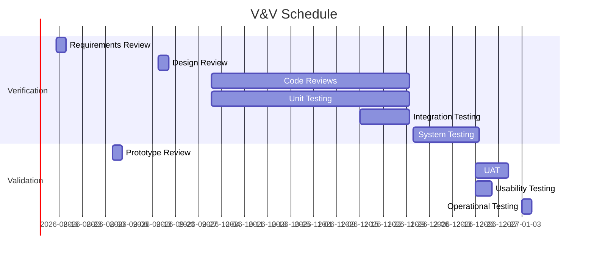

# V&V Plan (Verification & Validation Plan)

> **Project:** [Project Name]
> **Version:** [X.Y] | **Status:** [Draft | Under Review | Approved]
> **Last Updated:** [YYYY-MM-DD]

---

## 1. Purpose

> Defines verification (building right) and validation (building right product) activities.

## 2. V&V Overview

| Aspect | Verification | Validation |
|--------|-------------|-----------|
| **Question** | [Are we building the product right?] | [Are we building the right product?] |
| **Focus** | [Specifications] | [User needs] |
| **Methods** | [Reviews, inspections, testing] | [User testing, acceptance] |
| **When** | [During development] | [After development] |
| **Output** | [Conformance evidence] | [Acceptance evidence] |

## 3. Verification Activities

| Activity | Phase | Method | Criteria | Status |
|---------|-------|--------|---------|--------|
| [Requirements Review] | [Requirements] | [Peer review] | [Complete, consistent, traceable] | ✅ |
| [Design Review] | [Design] | [Formal review] | [Meets requirements] | ✅ |
| [Code Review] | [Construction] | [PR review] | [[Coding-Standards]] compliance] | ✅ |
| [Unit Testing] | [Construction] | [Automated] | [≥ 80% coverage] | ✅ |
| [Integration Testing] | [Testing] | [Automated] | [All interfaces verified] | ✅ |
| [System Testing] | [Testing] | [Automated + Manual] | [All requirements verified] | ✅ |

## 4. Validation Activities

| Activity | Phase | Method | Criteria | Status |
|---------|-------|--------|---------|--------|
| [Prototype Review] | [Design] | [Stakeholder review] | [Design direction approved] | ✅ |
| [UAT] | [Testing] | [User testing] | [Business scenarios pass] | ✅ |
| [Usability Testing] | [Testing] | [User testing] | [SUS ≥ 68] | ✅ |
| [Operational Testing] | [Pre-deployment] | [Operations review] | [Runbook verified] | ✅ |

## 5. V&V Matrix

| Requirement | V: Design | V: Code | V: Test | V: UAT | Status |
|-------------|----------|--------|--------|--------|--------|
| [FR-001] | ✅ | ✅ | ✅ | ✅ | ✅ |
| [FR-002] | ✅ | ✅ | ✅ | ✅ | ✅ |
| [FR-101] | ✅ | ✅ | ✅ | ✅ | ✅ |
| [NFR-001] | ✅ | ✅ | ✅ | — | ✅ |
| [NFR-002] | ✅ | ✅ | ✅ | — | ✅ |

## 6. V&V Schedule

---

## Related Documents

| Document | Relationship |
|----------|-------------|
| [[Verification-Reports]] | Verification results |
| [[Validation-Reports]] | Validation results |
| [[SQAP]] | Quality assurance plan |

---

> **Template Standard:** Based on SWEBOK v4, ISO/IEC/IEEE 15288
> **Usage:** V&V is *not* just testing. Verification checks specs; validation checks needs. You need both.
