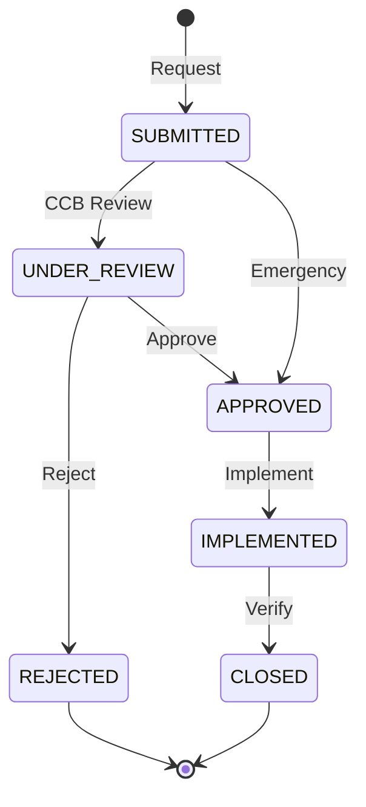

# Change Request (CR/SCR)

> **Project:** [Project Name]
> **Version:** [X.Y] | **Status:** [Active]
> **Last Updated:** [YYYY-MM-DD]

---

## 1. Purpose

> Formal request to change a baselined configuration item. Every change to a baseline requires a CR.

## 2. Change Request Template

| Field | Value |
|-------|-------|
| **CR ID** | [CR-XXX] |
| **Title** | [Brief descriptive title] |
| **Type** | [Defect / Enhancement / Change / Emergency] |
| **Priority** | [🔴 Critical / 🟡 High / 🟢 Medium / ⚪ Low] |
| **Status** | [Submitted / Under Review / Approved / Rejected / Implemented / Closed] |
| **Submitted By** | [Name, Role] |
| **Submission Date** | [YYYY-MM-DD] |
| **Baseline Affected** | [BL-XXX] |
| **CIs Affected** | [List of CIs] |

### Description

> [Clear description of the change — what needs to change and why]

### Justification

> [Why this change is necessary — business value, defect fix, compliance]

### Impact Analysis

| Dimension | Impact | Details |
|---------|--------|---------|
| [Scope] | [Impact / None] | [Details] |
| [Schedule] | [Impact / None] | [Details] |
| [Cost] | [Impact / None] | [Details] |
| [Quality] | [Impact / None] | [Details] |
| [Risk] | [Impact / None] | [Details] |
| [Other CIs] | [Impact / None] | [Details] |

### Implementation Plan

| Step | Action | Owner | Duration | Status |
|------|--------|-------|---------|--------|
| 1 | [Implementation step] | [Name] | [X days] | ⬜ |
| 2 | [Testing] | [Name] | [X days] | ⬜ |
| 3 | [Documentation update] | [Name] | [X days] | ⬜ |
| 4 | [Baseline update] | [CM] | [X hours] | ⬜ |

## 3. Change Request Lifecycle

## 4. Change Request Register

| ID | Title | Type | Priority | Baseline | Status | Submitted | Closed |
|----|-------|------|---------|---------|--------|---------|--------|
| [CR-001] | [Add document preview] | Enhancement | 🟡 | [BL-003] | ✅ Closed | [YYYY-MM-DD] | [YYYY-MM-DD] |
| [CR-002] | [Fix mobile upload] | Defect | 🔴 | [BL-003] | ✅ Closed | [YYYY-MM-DD] | [YYYY-MM-DD] |
| [CR-003] | [Add bulk export] | Enhancement | 🟡 | [BL-004] | 🔄 Implemented | [YYYY-MM-DD] | — |
| [CR-004] | [Update email template] | Change | 🟢 | [BL-004] | ⏳ Approved | [YYYY-MM-DD] | — |

## 5. Change Metrics

| Metric | Value | Target | Status |
|--------|-------|--------|--------|
| [Total CRs submitted] | [X] | — | — |
| [CRs approved] | [X] | — | — |
| [CRs rejected] | [X] | — | — |
| [Avg processing time] | [X days] | [< 5 days] | 🟢🟡🔴 |
| [Emergency CRs] | [X] | [0] | 🟢🟡🔴 |

---

## Related Documents

| Document | Relationship |
|----------|-------------|
| [[SCMP]] | CM plan |
| [[Baseline-Records]] | Baselines being changed |
| [[Configuration-Management-Plan]] | CM process |

---

> **Template Standard:** Based on SWEBOK v4
> **Usage:** If it's baselined, it needs a CR. No exceptions. "Just a quick fix" is how baselines get corrupted.
