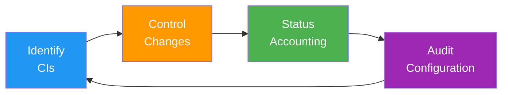

# Configuration Management Plan

> **Project:** [Project Name]
> **Version:** [X.Y] | **Status:** [Draft | Under Review | Approved]
> **Last Updated:** [YYYY-MM-DD]

---

## 1. Purpose

> Defines how project artifacts are managed — identification, control, status accounting, and auditing.

## 2. CM Process

## 3. Configuration Items

| Category | Items | Repository | Version Control |
|---------|-------|-----------|----------------|
| [Code] | [Source, scripts, configs] | [GitHub] | [Git] |
| [Documents] | [Plans, specs, reports] | [GitHub] | [Git] |
| [Infrastructure] | [IaC, Docker, K8s] | [GitHub] | [Git] |
| [Tests] | [Test cases, scripts] | [GitHub] | [Git] |
| [Artifacts] | [Docker images, binaries] | [Registry] | [Tags] |
| [Data] | [Migrations, seeds] | [GitHub] | [Git] |

## 4. Change Control Board (CCB)

| Role | Name | Authority |
|------|------|----------|
| [CCB Chair] | [PM] | [Approve/reject all changes] |
| [Technical Lead] | [Name] | [Approve technical changes] |
| [QA Lead] | [Name] | [Approve quality impacts] |
| [Configuration Manager] | [Name] | [Implement approved changes] |

## 5. Change Authority

| Change Type | Authority | Approval |
|------------|---------|---------|
| [Minor — no impact] | [Developer] | [Self-approve] |
| [Moderate — limited impact] | [Tech Lead] | [1 approval] |
| [Major — significant impact] | [CCB] | [CCB approval] |
| [Emergency — production down] | [On-call] | [Post-hoc CCB review] |

## 6. CM Tools

| Tool | Purpose | Integration |
|------|---------|-----------|
| [Git] | [Source control] | [GitHub] |
| [GitHub] | [Repository hosting] | [CI/CD] |
| [Docker Registry] | [Artifact storage] | [CI/CD] |
| [Terraform] | [Infrastructure CM] | [CI/CD] |

## 7. CM Metrics

| Metric | Target | Current | Status |
|--------|--------|---------|--------|
| [CIs under CM] | [100%] | [X%] | 🟢🟡🔴 |
| [Changes with CR] | [100%] | [X%] | 🟢🟡🔴 |
| [Baselines created on time] | [100%] | [X%] | 🟢🟡🔴 |
| [Audits completed] | [Per schedule] | [X] | 🟢🟡🔴 |

---

## Related Documents

| Document | Relationship |
|----------|-------------|
| [[SCMP]] | Software-specific CM plan |
| [[Baseline-Records]] | Baseline documentation |
| [[Version-Description-Document]] | Version details |

---

> **Template Standard:** Based on PMBOK v8, SEBoK v2
> **Usage:** Configuration management is *order from chaos*. Without it, you don't know what you have or what changed.
