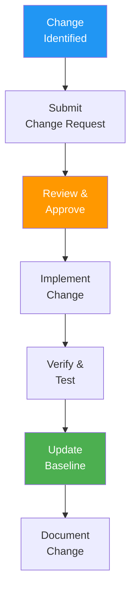

# SCMP (Software Configuration Management Plan)

> **Project:** [Project Name]
> **Version:** [X.Y] | **Status:** [Draft | Under Review | Approved | Baselined]
> **Last Updated:** [YYYY-MM-DD]

---

## Document Control

| Field | Value |
|-------|-------|
| Document Owner | [Configuration Manager] |
| Approvals | [PM, Tech Lead, CM] |

### Approvals

| Role | Name | Signature | Date |
|------|------|-----------|------|
| Project Manager | | | |
| Technical Lead | | | |
| Configuration Manager | | | |

---

## 1. Purpose

> Defines how software configuration items are identified, controlled, tracked, and audited throughout the project lifecycle.

## 2. Configuration Items (CIs)

| CI Type | Examples | Storage | Control |
|---------|---------|--------|--------|
| [Source Code] | [Application code, scripts] | [Git repository] | [Branch strategy] |
| [Documents] | [Plans, specs, reports] | [Repository] | [Version control] |
| [Tests] | [Test cases, scripts] | [Repository] | [Version control] |
| [Infrastructure] | [IaC, configs] | [Repository] | [Version control] |
| [Build Artifacts] | [Docker images, binaries] | [Registry] | [Tagged versions] |
| [Data] | [Migrations, seeds] | [Repository] | [Version control] |

## 3. CI Identification

| CI | Naming Convention | Version Scheme | Example |
|----|------------------|---------------|---------|
| [Source Code] | [project-name] | [SemVer] | [project v1.2.3] |
| [Documents] | [project-doc-type] | [vX.Y] | [project-srs v1.0] |
| [Docker Images] | [registry/project] | [Git SHA + SemVer] | [ghcr.io/org/project:v1.2.3] |
| [API] | [api-vX] | [Major version] | [api-v1] |

## 4. Configuration Control

## 5. Branch Strategy

| Branch | Purpose | Protection | Merge To |
|--------|---------|-----------|---------|
| [main] | [Production-ready code] | [Protected, PR required] | — |
| [develop] | [Integration branch] | [Protected, PR required] | [main] |
| [feature/*] | [Feature development] | [None] | [develop] |
| [hotfix/*] | [Production fixes] | [None] | [main + develop] |
| [release/*] | [Release preparation] | [Protected] | [main] |

## 6. Configuration Status Accounting

| Activity | Tool | Frequency | Report |
|---------|------|----------|--------|
| [CI tracking] | [Git] | [Every commit] | [Commit log] |
| [Build tracking] | [CI/CD] | [Every build] | [Build log] |
| [Deployment tracking] | [Kubernetes] | [Every deploy] | [Deploy log] |
| [Change tracking] | [Change log] | [Every change] | [Change report] |

## 7. Configuration Audits

| Audit | Purpose | Frequency | When |
|-------|---------|----------|------|
| [FCA] | [Verify functional requirements] | [Per release] | [Before deployment] |
| [PCA] | [Verify physical configuration] | [Per release] | [Before deployment] |
| [Status Audit] | [Verify CI status] | [Monthly] | [Regular review] |

---

## Related Documents

| Document | Relationship |
|----------|-------------|
| [[Configuration-Management-Plan]] | Overall CM plan |
| [[Baseline-Records]] | Baseline documentation |
| [[Change-Request-CR-SCR]] | Change control |

---

> **Template Standard:** Based on SWEBOK v4, IEEE 828
> **Usage:** If it's not in version control, it doesn't exist. Every change gets a change request. Every release gets audited.
