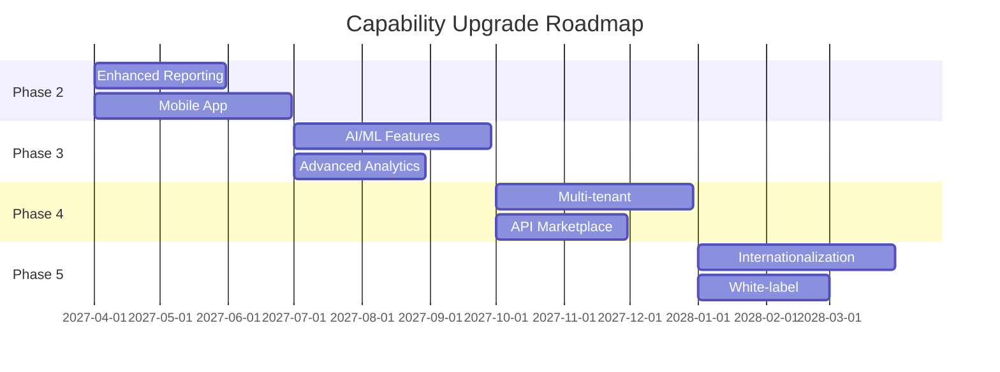

# Capability Upgrade Plan

> **Project:** [Project Name]
> **Version:** [X.Y] | **Status:** [Draft | Under Review | Approved]
> **Last Updated:** [YYYY-MM-DD]

---

## 1. Purpose

> Plans future capability enhancements — what features, improvements, and upgrades are planned after initial deployment.

## 2. Capability Roadmap

## 3. Capability Enhancements

| # | Capability | Phase | Priority | Effort | Value | Dependencies |
|---|----------|-------|---------|--------|-------|-------------|
| 1 | [Enhanced Reporting] | [Phase 2] | 🔴 High | [2 months] | [High] | [DW upgrade] |
| 2 | [Mobile App] | [Phase 2] | 🔴 High | [3 months] | [High] | [API stable] |
| 3 | [AI/ML Features] | [Phase 3] | 🟡 Medium | [3 months] | [High] | [Data quality] |
| 4 | [Advanced Analytics] | [Phase 3] | 🟡 Medium | [2 months] | [Medium] | [DW upgrade] |
| 5 | [Multi-tenant] | [Phase 4] | 🟡 Medium | [3 months] | [High] | [Architecture review] |
| 6 | [API Marketplace] | [Phase 4] | 🟢 Low | [2 months] | [Medium] | [API stable] |
| 7 | [Internationalization] | [Phase 5] | 🟢 Low | [3 months] | [Medium] | [UI refactor] |
| 8 | [White-label] | [Phase 5] | 🟢 Low | [2 months] | [Medium] | [Multi-tenant] |

## 4. Capability Details

### Enhanced Reporting

| Field | Detail |
|-------|--------|
| [Description] | [Custom reports, scheduled reports, export formats] |
| [Business Value] | [Better decision-making, reduced manual work] |
| [Technical Approach] | [DW upgrade, BI tool enhancement] |
| [Dependencies] | [Data Warehouse upgrade] |
| [Timeline] | [2 months] |

### Mobile App

| Field | Detail |
|-------|--------|
| [Description] | [Native iOS/Android app for key functions] |
| [Business Value] | [Accessibility, user satisfaction] |
| [Technical Approach] | [React Native, shared API] |
| [Dependencies] | [API stable, design system] |
| [Timeline] | [3 months] |

## 5. Investment & ROI

| Phase | Investment | Expected Benefit | ROI |
|-------|-----------|-----------------|-----|
| [Phase 2] | [$X] | [Reporting + Mobile access] | [3x] |
| [Phase 3] | [$X] | [AI insights + Advanced analytics] | [4x] |
| [Phase 4] | [$X] | [Multi-tenant + API ecosystem] | [5x] |
| [Phase 5] | [$X] | [Global reach + White-label] | [3x] |

---

## Related Documents

| Document | Relationship |
|----------|-------------|
| [[SEMP]] | SE management context |
| [[Data-Technology-Roadmap]] | Technology alignment |
| [[Recommended-Actions]] | Improvement actions |

---

> **Template Standard:** Based on SEBoK v2
> **Usage:** The capability plan is the *future vision*. Prioritize by value and feasibility. Review quarterly.
