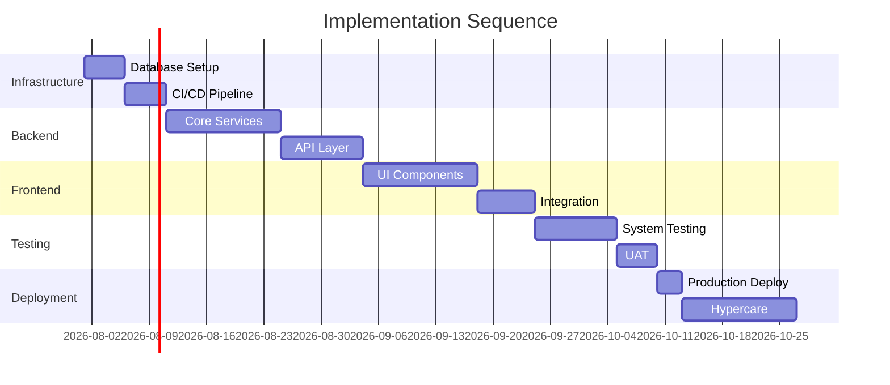

# Implementation Plan

> **Project:** [Project Name]
> **Version:** [X.Y] | **Status:** [Draft | Under Review | Approved]
> **Last Updated:** [YYYY-MM-DD]

---

## 1. Purpose

> Defines how the system will be implemented — build order, resources, constraints, and acceptance criteria.

## 2. Implementation Strategy

| Aspect | Approach |
|--------|---------|
| [Build Order] | [Infrastructure → Backend → Frontend → Integration] |
| [Environment Strategy] | [Dev → Staging → Production] |
| [Release Strategy] | [Incremental releases, feature flags] |
| [Rollback Strategy] | [Blue-green deployment] |

## 3. Implementation Sequence

## 4. Implementation Components

| Component | Build Order | Dependencies | Owner | Duration |
|----------|-----------|-------------|-------|---------|
| [Database] | [1] | [None] | [DBA] | [5 days] |
| [CI/CD Pipeline] | [2] | [Database] | [DevOps] | [5 days] |
| [Core Services] | [3] | [CI/CD] | [Dev Team] | [14 days] |
| [API Layer] | [4] | [Core Services] | [Dev Team] | [10 days] |
| [UI Components] | [5] | [API Layer] | [Frontend] | [14 days] |
| [Integration] | [6] | [UI Components] | [Dev Team] | [7 days] |

## 5. Resource Requirements

| Role | Count | Duration | Allocation |
|------|-------|---------|-----------|
| [Backend Developer] | [2] | [8 weeks] | [100%] |
| [Frontend Developer] | [1] | [6 weeks] | [100%] |
| [DevOps Engineer] | [1] | [2 weeks] | [50%] |
| [DBA] | [1] | [1 week] | [50%] |
| [QA Engineer] | [1] | [3 weeks] | [100%] |

## 6. Acceptance Criteria

| # | Criteria | Verification Method |
|---|---------|-------------------|
| 1 | [All functional requirements implemented] | [Test execution] |
| 2 | [All non-functional requirements met] | [Performance testing] |
| 3 | [All integration points working] | [Integration testing] |
| 4 | [Security requirements satisfied] | [Security testing] |
| 5 | [Documentation complete] | [Review] |

---

## Related Documents

| Document | Relationship |
|----------|-------------|
| [[SEMP]] | SE management context |
| [[Project-Schedule]] | Schedule alignment |
| [[Transition-Plan]] | Post-implementation |

---

> **Template Standard:** Based on SEBoK v2
> **Usage:** The implementation plan is the *build strategy*. Know what to build, in what order, with what resources.
