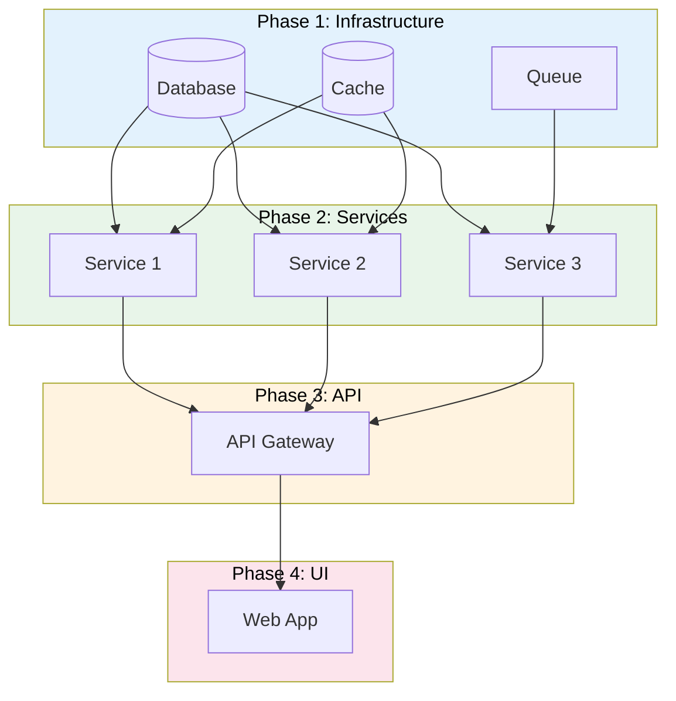

# Integration Plan + Reports

> **Project:** [Project Name]
> **Version:** [X.Y] | **Status:** [Draft | Under Review | Approved]
> **Last Updated:** [YYYY-MM-DD]

---

## 1. Purpose

> Defines how system components are integrated — order, strategy, verification, and reporting.

## 2. Integration Strategy

| Strategy | Description | When to Use |
|---------|-----------|------------|
| [Big Bang] | [Integrate all at once] | [Small systems] |
| [Top-Down] | [Start from top, stub lower] | [UI-driven systems] |
| [Bottom-Up] | [Start from bottom, driver above] | [Data-driven systems] |
| [Sandwich] | [Both ends toward middle] | [Most systems] |

**Selected:** [Sandwich — integrate infrastructure, then services, then UI]

## 3. Integration Sequence

## 4. Integration Tests

| # | Test | Components | Expected Result | Status |
|---|------|-----------|----------------|--------|
| 1 | [Database connectivity] | [Services → DB] | [CRUD operations work] | ✅ |
| 2 | [Cache connectivity] | [Services → Cache] | [Read/write cache] | ✅ |
| 3 | [Service-to-service] | [Service 1 ↔ Service 2] | [API calls succeed] | ✅ |
| 4 | [API Gateway] | [All services → API] | [Routing works] | ✅ |
| 5 | [End-to-end] | [UI → API → Services → DB] | [Full flow works] | ✅ |

## 5. Integration Report

| # | Integration | Date | Components | Result | Issues |
|---|------------|------|-----------|--------|--------|
| 1 | [Infrastructure] | [YYYY-MM-DD] | [DB, Cache, Queue] | ✅ Pass | [0] |
| 2 | [Services] | [YYYY-MM-DD] | [Service 1, 2, 3] | ✅ Pass | [1 minor] |
| 3 | [API] | [YYYY-MM-DD] | [API Gateway] | ✅ Pass | [0] |
| 4 | [UI] | [YYYY-MM-DD] | [Web App] | ✅ Pass | [2 minor] |
| 5 | [End-to-end] | [YYYY-MM-DD] | [All] | ✅ Pass | [0] |

## 6. Integration Issues

| # | Issue | Components | Severity | Resolution | Status |
|---|-------|-----------|---------|-----------|--------|
| 1 | [Timeout on service call] | [Service 1 → Service 2] | 🟡 | [Increased timeout to 30s] | ✅ Fixed |
| 2 | [CORS error] | [UI → API] | 🟡 | [Added CORS headers] | ✅ Fixed |
| 3 | [Cache miss rate high] | [Services → Cache] | 🟢 | [Adjusted TTL] | ✅ Fixed |

---

## Related Documents

| Document | Relationship |
|----------|-------------|
| [[SEMP]] | SE management context |
| [[Interface-Control-Document]] | Interface definitions |
| [[Verification-Reports]] | Verification evidence |

---

> **Template Standard:** Based on SEBoK v2
> **Usage:** Integration is where *components become a system*. Plan the sequence. Test each integration. Document results.
