# SEMP (Systems Engineering Management Plan)

> **Project:** [Project Name]
> **Version:** [X.Y] | **Status:** [Draft | Under Review | Approved]
> **Last Updated:** [YYYY-MM-DD]

---

## 1. Purpose

> Defines how systems engineering activities are planned, organized, and managed across the system lifecycle.

## 2. SE Approach

| Aspect | Approach |
|--------|---------|
| [Lifecycle Model] | [V-Model with Agile components] |
| [SE Standards] | [ISO/IEC/IEEE 15288] |
| [Technical Reviews] | [SRR, PDR, CDR, TRR, FCA, PCA] |
| [Requirements Management] | [Bidirectional traceability] |
| [Risk Management] | [Continuous risk management] |
| [Configuration Management] | [IEEE 828] |

## 3. SE Lifecycle

```mermaid
flowchart LR
    subgraph Concept["Concept"]
        CONCEPT[Concept<br>Definition]
    end

    subgraph Development["Development"]
        REQ[Requirements]
        ARCH[Architecture]
        DESIGN[Design]
        IMPLEMENT[Implementation]
        VERIFY[Verification]
    end

    subgraph Production["Production"]
        PRODUCE[Production]
        VALIDATE[Validation]
    end

    subgraph Operations["Operations"]
        OPERATE[Operations]
        MAINTAIN[Maintenance]
    end

    subgraph Retirement["Retirement"]
        DISPOSE[Disposal]
    end

    CONCEPT --> REQ
    REQ --> ARCH
    ARCH --> DESIGN
    DESIGN --> IMPLEMENT
    IMPLEMENT --> VERIFY
    VERIFY --> PRODUCE
    PRODUCE --> VALIDATE
    VALIDATE --> OPERATE
    OPERATE --> MAINTAIN
    MAINTAIN --> DISPOSE

    style Concept fill:#e3f2fd,color:#000
    style Development fill:#e8f5e9,color:#000
    style Production fill:#fff3e0,color:#000
    style Operations fill:#fce4ec,color:#000
    style Retirement fill:#9E9E9E,color:#fff
```

## 4. SE Activities

| Activity | Phase | Owner | Output | Status |
|---------|-------|-------|--------|--------|
| [Stakeholder needs analysis] | [Concept] | [SE] | [[Stakeholder-Needs-Document]] | ✅ |
| [Requirements engineering] | [Concept/Dev] | [SE + BA] | [[System-Requirements-Specification]] | ✅ |
| [Architecture definition] | [Development] | [SE] | [[System-Architecture-Description]] | ✅ |
| [Design development] | [Development] | [SE + Dev] | [[High-Level-Design]] | ✅ |
| [Implementation oversight] | [Development] | [SE] | [Implementation reports] | ✅ |
| [Verification] | [Development] | [SE + QA] | [[Verification-Reports]] | ✅ |
| [Validation] | [Production] | [SE + Users] | [[Validation-Reports]] | ✅ |
| [Integration] | [Development] | [SE] | [[Integration-Plan-Reports]] | ✅ |
| [Transition] | [Production] | [SE] | [[Transition-Plan]] | ✅ |

## 5. Technical Reviews

| Review | Phase | Purpose | Criteria | Status |
|--------|-------|---------|---------|--------|
| [SRR] | [Concept] | [Requirements baseline] | [Requirements complete] | ✅ |
| [PDR] | [Design] | [Design baseline] | [Design feasible] | ✅ |
| [CDR] | [Implementation] | [Implementation baseline] | [Ready to build] | ✅ |
| [TRR] | [Testing] | [Test readiness] | [Ready to test] | ✅ |
| [FCA] | [Verification] | [Functional completeness] | [All requirements verified] | ✅ |
| [PCA] | [Validation] | [Physical completeness] | [All CIs identified] | ✅ |

## 6. SE Team

| Role | Name | Responsibility |
|------|------|---------------|
| [Lead Systems Engineer] | [Name] | [Overall SE direction] |
| [Requirements Engineer] | [Name] | [Requirements management] |
| [Systems Architect] | [Name] | [Architecture definition] |
| [Integration Engineer] | [Name] | [System integration] |
| [V&V Engineer] | [Name] | [Verification and validation] |

---

## Related Documents

| Document | Relationship |
|----------|-------------|
| [[Project-Management-Plan]] | PM alignment |
| [[System-Architecture-Description]] | Architecture |
| [[Verification-Plan]] | Verification approach |

---

> **Template Standard:** Based on SEBoK v2, ISO/IEC/IEEE 15288
> **Usage:** The SEMP is the *SE contract*. It defines how we engineer the system. Align with the PMP.
