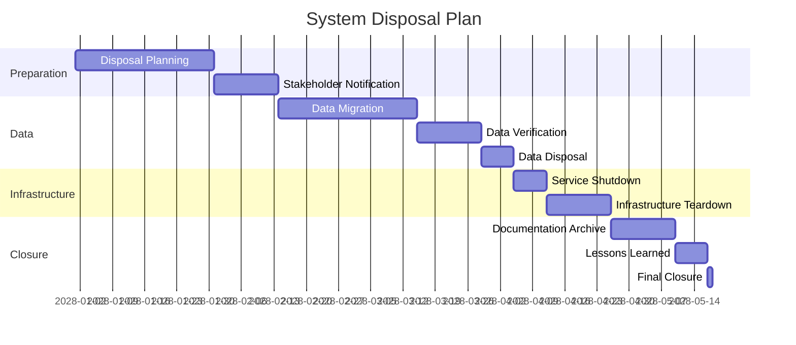

# System Disposal / Retirement Plan

> **Project:** [Project Name]
> **Version:** [X.Y] | **Status:** [Draft | Under Review | Approved]
> **Last Updated:** [YYYY-MM-DD]

---

## 1. Purpose

> Defines how the system will be decommissioned and disposed — data migration, infrastructure teardown, and documentation archival.

## 2. Disposal Triggers

| Trigger | Description | Lead Time |
|---------|-----------|----------|
| [End of life] | [System replaced by new version] | [6 months] |
| [End of support] | [Vendor ends support] | [12 months] |
| [Business decision] | [No longer needed] | [3 months] |
| [Regulatory requirement] | [Must dispose per regulation] | [As required] |

## 3. Disposal Phases

## 4. Data Disposal

| Data Type | Classification | Disposal Method | Verification | Certificate |
|----------|---------------|----------------|-------------|------------|
| [Customer PII] | 🔴 L1 | [Secure deletion] | [Deletion verification] | ✅ Required |
| [Financial data] | 🔴 L1 | [Secure deletion] | [Deletion verification] | ✅ Required |
| [Operational data] | 🟡 L2 | [Standard deletion] | [Deletion log] | ✅ Required |
| [System logs] | 🟡 L2 | [Standard deletion] | [Deletion log] | ✅ Required |
| [Backups] | [Various] | [Secure deletion] | [Deletion verification] | ✅ Required |

## 5. Infrastructure Disposal

| Component | Disposal Method | Verification |
|----------|----------------|-------------|
| [Cloud resources] | [Terminate instances] | [Confirmation of termination] |
| [DNS records] | [Remove records] | [DNS verification] |
| [SSL certificates] | [Revoke certificates] | [Certificate status check] |
| [Domain names] | [Release or retain] | [Domain status] |
| [Monitoring] | [Disable alerts] | [Alert verification] |

## 6. Stakeholder Notification

| Stakeholder | Notification | Timing | Content |
|------------|-------------|--------|---------|
| [Customers] | [Email + in-app] | [90 days before] | [Migration instructions] |
| [Staff] | [Email + meeting] | [60 days before] | [Transition plan] |
| [IT Support] | [Email + training] | [30 days before] | [Support procedures] |
| [Management] | [Report] | [Ongoing] | [Progress updates] |

## 7. Disposal Checklist

| # | Item | Owner | Status |
|---|------|-------|--------|
| 1 | [Disposal plan approved] | [SE] | ☐ |
| 2 | [Stakeholders notified] | [PM] | ☐ |
| 3 | [Data migrated] | [Data Architect] | ☐ |
| 4 | [Data verified] | [Data Steward] | ☐ |
| 5 | [Data disposed] | [DBA] | ☐ |
| 6 | [Infrastructure decommissioned] | [DevOps] | ☐ |
| 7 | [Documentation archived] | [SE] | ☐ |
| 8 | [Lessons learned documented] | [PM] | ☐ |
| 9 | [Final sign-off received] | [Operations Manager] | ☐ |

---

## Related Documents

| Document | Relationship |
|----------|-------------|
| [[SEMP]] | SE management context |
| [[Data-Retention-Archival-Policy]] | Data disposal rules |
| [[Lessons-Learned-Register]] | Lessons from project |

---

> **Template Standard:** Based on SEBoK v2
> **Usage:** Disposal is the *forgotten phase*. Plan it. Data doesn't delete itself. Infrastructure doesn't shut itself down.
