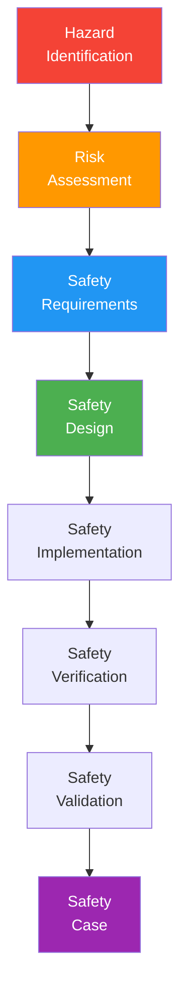

# System Safety Plan / Safety Case

> **Project:** [Project Name]
> **Version:** [X.Y] | **Status:** [Draft | Under Review | Approved]
> **Last Updated:** [YYYY-MM-DD]

---

## 1. Purpose

> Defines safety requirements and demonstrates that the system is acceptably safe for its intended use.

## 2. Safety Approach

| Aspect | Approach |
|--------|---------|
| [Safety Standard] | [ISO/IEC 61508] |
| [Safety Lifecycle] | [Hazard analysis → Risk assessment → Safety requirements → Verification] |
| [Safety Integrity Level] | [SIL 2 (if applicable)] |
| [Safety Evidence] | [Safety case with supporting arguments] |

## 3. Safety Lifecycle

## 4. Safety Requirements

| ID | Requirement | SIL | Source | Status |
|----|------------|-----|--------|--------|
| [SAFE-001] | [System shall not cause data loss] | [SIL 2] | [Hazard analysis] | ✅ |
| [SAFE-002] | [System shall detect and alert on failures] | [SIL 2] | [Hazard analysis] | ✅ |
| [SAFE-003] | [System shall fail to safe state] | [SIL 2] | [Hazard analysis] | ✅ |
| [SAFE-004] | [System shall prevent unauthorized access] | [SIL 1] | [Risk assessment] | ✅ |
| [SAFE-005] | [System shall maintain audit trail] | [SIL 1] | [Compliance] | ✅ |

## 5. Safety Arguments

| # | Argument | Evidence | Confidence |
|---|---------|---------|-----------|
| 1 | [Hazards identified and mitigated] | [[Hazard-Analysis-PHA-SHA-SSHA]] | [High] |
| 2 | [Safety requirements implemented] | [Design review, code review] | [High] |
| 3 | [Safety requirements verified] | [[Verification-Reports]] | [High] |
| 4 | [Residual risk acceptable] | [Risk assessment] | [High] |
| 5 | [Safety mechanisms tested] | [[Test-Report]] | [High] |

## 6. Residual Risk Assessment

| Hazard | Initial Risk | Mitigation | Residual Risk | Acceptable? |
|--------|-------------|-----------|--------------|------------|
| [Data loss] | 🔴 High | [Backups, replication, monitoring] | 🟢 Low | ✅ |
| [System failure] | 🟡 Medium | [HA, auto-failover, alerting] | 🟢 Low | ✅ |
| [Unauthorized access] | 🟡 Medium | [MFA, RBAC, audit logging] | 🟢 Low | ✅ |
| [Data breach] | 🔴 High | [Encryption, access controls, DLP] | 🟢 Low | ✅ |

## 7. Safety Case Summary

> Based on the hazard analysis, safety requirements, implementation evidence, and verification results, the system is acceptably safe for its intended use. All identified hazards have been mitigated to acceptable levels. Residual risks are monitored and controlled.

---

## Related Documents

| Document | Relationship |
|----------|-------------|
| [[Hazard-Analysis-PHA-SHA-SSHA]] | Hazard identification |
| [[Risk-Register]] | Risk management |
| [[Verification-Reports]] | Safety verification |

---

> **Template Standard:** Based on SEBoK v2, ISO/IEC 61508
> **Usage:** The safety case is the *argument for safety*. It's evidence-based. No evidence = no safety case.
