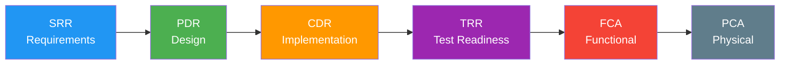

# Technical Review Records (SRR, PDR, CDR, TRR)

> **Project:** [Project Name]
> **Version:** [X.Y] | **Status:** [Active]
> **Last Updated:** [YYYY-MM-DD]

---

## 1. Purpose

> Records outcomes of formal technical reviews — ensuring technical baselines are established and approved.

## 2. Technical Review Lifecycle

## 3. Review Register

| Review | Date | Chair | Result | Action Items | Status |
|--------|------|-------|--------|-------------|--------|
| [SRR] | [YYYY-MM-DD] | [Chief Engineer] | ✅ Approved | [2] | ✅ Closed |
| [PDR] | [YYYY-MM-DD] | [Chief Engineer] | ✅ Approved | [3] | ✅ Closed |
| [CDR] | [YYYY-MM-DD] | [Chief Engineer] | ✅ Approved | [1] | ✅ Closed |
| [TRR] | [YYYY-MM-DD] | [Chief Engineer] | ✅ Approved | [0] | ✅ Closed |

## 4. Review Template

### [Review Name] — [Date]

| Field | Detail |
|-------|--------|
| **Review** | [SRR / PDR / CDR / TRR] |
| **Date** | [YYYY-MM-DD] |
| **Chair** | [Name] |
| **Attendees** | [List] |
| **Purpose** | [What was reviewed] |
| **Result** | [Approved / Approved with conditions / Not approved] |

### Entry Criteria

| # | Criterion | Met | Evidence |
|---|----------|-----|---------|
| 1 | [Criterion 1] | ✅ | [Evidence] |
| 2 | [Criterion 2] | ✅ | [Evidence] |

### Findings

| # | Finding | Severity | Owner | Due Date | Status |
|---|--------|---------|-------|---------|--------|
| 1 | [Finding description] | [Major/Minor] | [Name] | [YYYY-MM-DD] | ✅ Closed |

### Disposition

- [ ] ✅ Approved — proceed to next phase
- [ ] ⚠️ Approved with conditions — complete action items before proceeding
- [ ] ❌ Not approved — address findings and re-review

## 5. Review Statistics

| Review | Findings (Major) | Findings (Minor) | Action Items | Closure Rate |
|--------|-----------------|-----------------|-------------|-------------|
| [SRR] | [0] | [2] | [2] | [100%] |
| [PDR] | [1] | [2] | [3] | [100%] |
| [CDR] | [0] | [1] | [1] | [100%] |
| [TRR] | [0] | [0] | [0] | [N/A] |

---

## Related Documents

| Document | Relationship |
|----------|-------------|
| [[SEMP]] | SE management context |
| [[Design-Review-Records]] | Design reviews |
| [[Decision-Records]] | Decision documentation |

---

> **Template Standard:** Based on SEBoK v2, ISO/IEC/IEEE 15288
> **Usage:** Technical reviews are *gatekeepers*. No review = no progress. Document everything.
