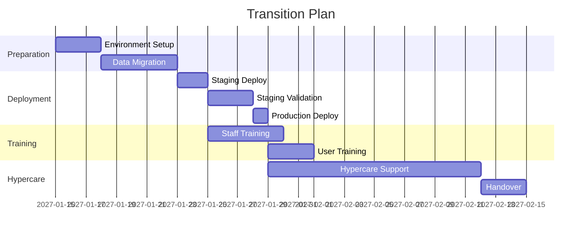

# Transition Plan

> **Project:** [Project Name]
> **Version:** [X.Y] | **Status:** [Draft | Under Review | Approved]
> **Last Updated:** [YYYY-MM-DD]

---

## 1. Purpose

> Defines how the system transitions from development to operations — deployment, training, and handover.

## 2. Transition Strategy

| Aspect | Approach |
|--------|---------|
| [Deployment Strategy] | [Blue-green deployment] |
| [Data Migration] | [ETL from legacy system] |
| [Training] | [Train-the-trainer + e-learning] |
| [Handover] | [Phased handover to operations] |
| [Hypercare] | [2-week intensive support] |

## 3. Transition Phases

## 4. Data Migration

| Step | Action | Source | Target | Validation |
|------|--------|--------|--------|-----------|
| 1 | [Extract legacy data] | [Legacy DB] | [Staging] | [Record count] |
| 2 | [Transform data] | [Staging] | [Transformed] | [Business rules] |
| 3 | [Load to production] | [Transformed] | [Production DB] | [Data quality checks] |
| 4 | [Verify migration] | [Production] | [—] | [Reconciliation] |

## 5. Training Plan

| Audience | Training | Duration | Format | Materials |
|---------|---------|---------|--------|----------|
| [Operations Staff] | [System operations] | [2 days] | [Classroom] | [User manual, videos] |
| [End Users] | [System usage] | [1 day] | [E-learning] | [Quick start guide] |
| [IT Support] | [Troubleshooting] | [2 days] | [Classroom] | [Runbook, FAQ] |
| [Management] | [Reporting] | [Half day] | [Demo] | [Dashboard guide] |

## 6. Handover Checklist

| # | Item | Owner | Status |
|---|------|-------|--------|
| 1 | [All documentation complete] | [SE] | ☐ |
| 2 | [Training delivered] | [Training Lead] | ☐ |
| 3 | [Support team ready] | [IT Manager] | ☐ |
| 4 | [Monitoring configured] | [DevOps] | ☐ |
| 5 | [Runbook complete] | [SE] | ☐ |
| 6 | [Escalation path defined] | [SE] | ☐ |
| 7 | [SLA agreed] | [PM] | ☐ |
| 8 | [Sign-off received] | [Operations Manager] | ☐ |

## 7. Hypercare Support

| Day | Focus | Team | Hours |
|-----|-------|------|-------|
| [Day 1-3] | [Intensive monitoring] | [Full team] | [24/7] |
| [Day 4-7] | [Issue resolution] | [Core team] | [12/7] |
| [Day 8-14] | [Stabilization] | [Support team] | [8/5] |

---

## Related Documents

| Document | Relationship |
|----------|-------------|
| [[SEMP]] | SE management context |
| [[Implementation-Plan]] | Build strategy |
| [[Operations-Manual-Runbook]] | Operations handover |

---

> **Template Standard:** Based on SEBoK v2
> **Usage:** Transition is *not* just deployment. It's training, handover, and support. Plan all of it.
