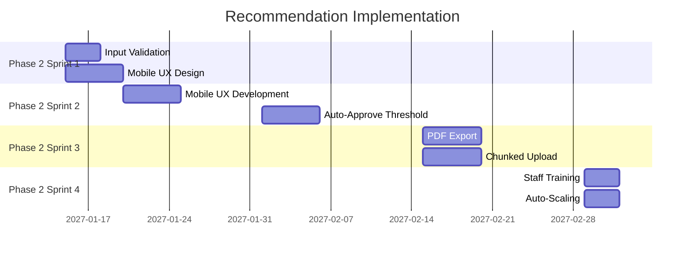

# Recommended Actions

> **Project:** [Project Name]
> **Version:** [X.Y] | **Status:** [Active]
> **Last Updated:** [YYYY-MM-DD]

---

## 1. Purpose

> Actionable recommendations to improve solution performance, address limitations, and maximize value realization.

## 2. Recommendations Summary

| # | Recommendation | Based On | Priority | Effort | Impact | Owner |
|---|---------------|---------|---------|--------|--------|-------|
| 1 | [Mobile UX redesign] | [NPS gap, user feedback] | 🔴 | [10 days] | [High] | [UX Team] |
| 2 | [Enhanced input validation] | [Error rate above target] | 🔴 | [3 days] | [Medium] | [Dev Team] |
| 3 | [Increase auto-approve threshold] | [Solution limitation] | 🟡 | [5 days] | [High] | [BA + Business] |
| 4 | [Add PDF report export] | [Solution limitation] | 🟡 | [5 days] | [Medium] | [Dev Team] |
| 5 | [Implement chunked upload] | [Solution limitation] | 🟡 | [5 days] | [Medium] | [Dev Team] |
| 6 | [Staff training refresh] | [Enterprise limitation] | 🟡 | [3 days] | [Medium] | [Change Manager] |
| 7 | [Auto-scaling infrastructure] | [Solution limitation] | 🟢 | [3 days] | [High] | [DevOps] |

## 3. Recommendation Details

### REC-001: Mobile UX Redesign

| Field | Detail |
|-------|--------|
| **Based On** | [NPS 2 points below target, user feedback on mobile experience] |
| **Description** | [Redesign mobile experience — responsive forms, touch-friendly upload, mobile-optimized navigation] |
| **Expected Impact** | [NPS +10 points, mobile usage +50%] |
| **Effort** | [10 days — UX design + development] |
| **Cost** | [$X] |
| **Priority** | 🔴 High |
| **Owner** | [UX Team] |
| **Timeline** | [Phase 2, Sprint 1-2] |

### REC-002: Enhanced Input Validation

| Field | Detail |
|-------|--------|
| **Based On** | [Error rate 1.2% vs target <1%] |
| **Description** | [Add client-side validation, improve error messages, add data quality checks] |
| **Expected Impact** | [Error rate < 0.5%] |
| **Effort** | [3 days] |
| **Cost** | [$X] |
| **Priority** | 🔴 High |
| **Owner** | [Dev Team] |
| **Timeline** | [Phase 2, Sprint 1] |

## 4. Implementation Roadmap

## 5. Expected Outcomes

| Recommendation | Current | Expected | Improvement |
|---------------|---------|---------|------------|
| [Mobile UX] | [NPS 58] | [NPS 68+] | [+10 points] |
| [Input Validation] | [1.2% error] | [< 0.5%] | [-60% errors] |
| [Auto-Approve] | [32%] | [45%+] | [+13% automation] |
| [PDF Export] | [CSV only] | [PDF + CSV] | [Better reports] |

## 6. Investment Summary

| Category | Investment | Expected Return | ROI |
|---------|-----------|----------------|-----|
| [Mobile UX] | [$X] | [NPS +10, usage +50%] | [High] |
| [Input Validation] | [$X] | [Error rate -60%] | [Medium] |
| [Auto-Approve] | [$X] | [Productivity +13%] | [High] |
| [Infrastructure] | [$X] | [Support 10x growth] | [High] |
| **Total** | **[$X]** | | |

---

## Related Documents

| Document | Relationship |
|----------|-------------|
| [[Solution-Performance-Analysis]] | Analysis driving recommendations |
| [[Solution-Limitation]] | Limitations being addressed |
| [[Benefits-Management-Plan]] | Benefits being realized |

---

> **Template Standard:** Based on BABOK v3
> **Usage:** Recommendations without actions are just opinions. Every recommendation needs: owner, timeline, expected impact, and cost.
