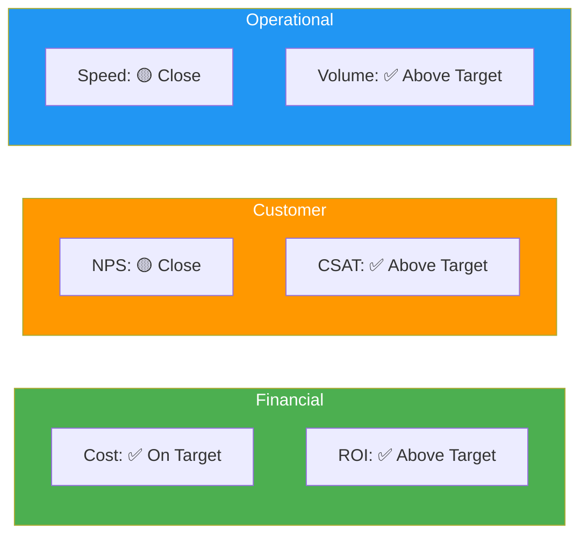

# Solution Performance Analysis

> **Project:** [Project Name]
> **Version:** [X.Y] | **Status:** [Active]
> **Last Updated:** [YYYY-MM-DD]

---

## 1. Purpose

> Analyzes solution performance data — trends, gaps, root causes, and recommendations for improvement.

## 2. Performance Summary

| Category | Measures | Meeting Target | Below Target | Above Target |
|---------|---------|---------------|-------------|-------------|
| [Financial] | [3] | [2] | [1] | [0] |
| [Customer] | [3] | [2] | [0] | [1] |
| [Operational] | [4] | [3] | [1] | [0] |
| **Total** | **[10]** | **[7]** | **[2]** | **[1]** |

## 3. Performance Trends

| Measure | Month 1 | Month 2 | Month 3 | Month 4 | Trend |
|---------|---------|---------|---------|---------|-------|
| [Processing Time] | [5 days] | [3 days] | [2 days] | [1.5 days] | ↓ Improving |
| [NPS] | [40] | [45] | [52] | [58] | ↑ Improving |
| [Auto-Approval Rate] | [15%] | [22%] | [28%] | [32%] | ↑ Improving |
| [Cost per Transaction] | [$18] | [$14] | [$12] | [$10] | ↓ Improving |
| [Staff Productivity] | [12] | [15] | [18] | [20] | ↑ Improving |

## 4. Gap Analysis

| Measure | Target | Actual | Gap | Root Cause | Recommendation |
|---------|--------|--------|-----|-----------|---------------|
| [NPS] | [≥ 60] | [58] | [-2] | [Mobile UX issues] | [Mobile redesign] |
| [Error Rate] | [< 1%] | [1.2%] | [+0.2%] | [Data quality issues] | [Input validation] |

## 5. Variance Analysis

| Measure | Expected | Actual | Variance | Explanation |
|---------|---------|--------|---------|-----------|
| [Processing Time] | [< 1 day] | [1.5 days] | [+0.5 days] | [Complex cases need manual review] |
| [Auto-Approval Rate] | [≥ 30%] | [32%] | [+2%] | [Better than expected rules] |
| [Cost per Transaction] | [< $10] | [$10] | [0] | [On target] |

## 6. Recommendations

| # | Finding | Recommendation | Priority | Owner |
|---|--------|---------------|---------|-------|
| 1 | [NPS 2 points below target] | [Mobile UX improvements] | 🟡 | [UX Team] |
| 2 | [Error rate above target] | [Enhanced input validation] | 🟡 | [Dev Team] |
| 3 | [Processing time above target] | [Optimize complex case routing] | 🟢 | [BA] |

## 7. Performance Scorecard

---

## Related Documents

| Document | Relationship |
|----------|-------------|
| [[Solution-Performance-Measures]] | Measures being analyzed |
| [[Solution-Limitation]] | Limitations identified |
| [[Recommended-Actions]] | Actions to improve |

---

> **Template Standard:** Based on BABOK v3
> **Usage:** Analysis turns data into insight. Don't just report numbers — explain *why* and recommend *what to do*.
