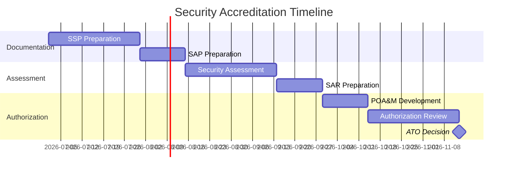

# Security Accreditation Package

> **Project:** [Project Name]
> **Version:** [X.Y] | **Status:** [Draft | Under Review | Approved]
> **Last Updated:** [YYYY-MM-DD]
>
> ⚠️ **Domain-Specific:** This document applies to government/defense projects requiring security accreditation.

---

## 1. Purpose

> Assembles the security documentation package required for system accreditation — per NIST RMF or FedRAMP.

## 2. Accreditation Framework

| Framework | Applicability | Level |
|---------|-------------|-------|
| [NIST RMF] | [Federal systems] | [Low / Moderate / High] |
| [FedRAMP] | [Cloud services] | [Low / Moderate / High] |
| [DoD RMF] | [Defense systems] | [IL2-IL6] |
| [ISO 27001] | [International] | [Certification] |

### Project Classification

| Field | Detail |
|-------|--------|
| [Security Categorization] | [Moderate] |
| [Impact Level] | [Confidentiality: Moderate, Integrity: Moderate, Availability: Moderate] |
| [Framework] | [NIST RMF] |
| [Authorizing Official] | [Name] |

## 3. Required Documentation

| # | Document | NIST Reference | Status | Location |
|---|---------|---------------|--------|---------|
| 1 | [System Security Plan (SSP)] | [NIST SP 800-18] | ✅ | [Link] |
| 2 | [Security Assessment Plan (SAP)] | [NIST SP 800-53A] | ✅ | [Link] |
| 3 | [Security Assessment Report (SAR)] | [NIST SP 800-53A] | ✅ | [Link] |
| 4 | [Plan of Action & Milestones (POA&M)] | [NIST SP 800-37] | ✅ | [Link] |
| 5 | [Risk Assessment] | [NIST SP 800-30] | ✅ | [[Risk-Register]] |
| 6 | [Contingency Plan] | [NIST SP 800-34] | ✅ | [[Disaster-Recovery-Plan]] |
| 7 | [Configuration Management Plan] | [NIST SP 800-128] | ✅ | [[Configuration-Management-Plan]] |
| 8 | [Incident Response Plan] | [NIST SP 800-61] | ✅ | [[Incident-Management-Process]] |
| 9 | [Security Awareness Training] | [NIST SP 800-50] | ✅ | [Link] |
| 10 | [Continuous Monitoring Plan] | [NIST SP 800-137] | ✅ | [[Monitoring-Dashboard-Spec]] |

## 4. Security Controls

| Control Family | Controls Implemented | Status |
|---------------|---------------------|--------|
| [Access Control (AC)] | [AC-1, AC-2, AC-3, AC-6] | ✅ |
| [Audit (AU)] | [AU-1, AU-2, AU-3, AU-6] | ✅ |
| [Configuration Management (CM)] | [CM-1, CM-2, CM-3, CM-6] | ✅ |
| [Identification (IA)] | [IA-1, IA-2, IA-5] | ✅ |
| [Incident Response (IR)] | [IR-1, IR-2, IR-4, IR-5] | ✅ |
| [Risk Assessment (RA)] | [RA-1, RA-3, RA-5] | ✅ |
| [System Protection (SC)] | [SC-1, SC-7, SC-8, SC-13] | ✅ |

## 5. POA&M Status

| # | Finding | Control | Severity | Status | Target Date |
|---|--------|---------|---------|--------|-----------|
| 1 | [MFA not enabled for all users] | [IA-2] | [Medium] | ✅ Closed | [YYYY-MM-DD] |
| 2 | [Encryption key rotation] | [SC-12] | [Low] | 🔄 In Progress | [YYYY-MM-DD] |
| 3 | [Continuous monitoring gaps] | [CA-7] | [Medium] | ⬜ Open | [YYYY-MM-DD] |

## 6. Accreditation Timeline

## 7. Accreditation Decision

| Field | Detail |
|-------|--------|
| [Decision] | [Authorized / Denied / Conditional] |
| [Authorization Date] | [YYYY-MM-DD] |
| [Expiration Date] | [YYYY-MM-DD] |
| [Conditions] | [If conditional — list conditions] |
| [Authorizing Official] | [Name] |

---

## Related Documents

| Document | Relationship |
|----------|-------------|
| [[Security-Controls]] | Security implementation |
| [[Security-Test-Report]] | Security testing |
| [[Incident-Management-Process]] | Incident response |
| [[Disaster-Recovery-Plan]] | Contingency planning |

---

> **Template Standard:** Based on SEBoK v2, NIST SP 800-37, FedRAMP
> **Usage:** Security accreditation is *mandatory* for government systems. Start documentation early — the assessment process takes 3-6 months.
