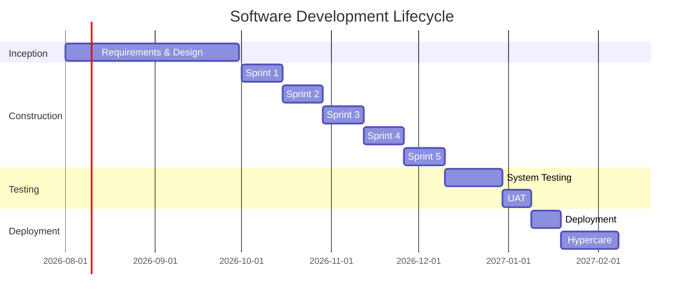

# Software Development Plan (SDP)

> **Project:** [Project Name]
> **Version:** [X.Y] | **Status:** [Draft | Under Review | Approved | Baselined]
> **Last Updated:** [YYYY-MM-DD]
>
> ⚠️ **Domain-Specific:** This document applies to SW-intensive projects.

---

## 1. Purpose

> Defines the software development approach — lifecycle, methods, tools, standards, and organization for SW-intensive projects.

## 2. Development Approach

| Aspect | Approach |
|--------|---------|
| [Lifecycle Model] | [Hybrid: Agile sprints + formal phase gates] |
| [Methodology] | [Scrum with 2-week sprints] |
| [Architecture Style] | [Microservices + Event-driven] |
| [Development Practice] | [TDD, CI/CD, Code Review] |
| [Quality Standard] | [ISO/IEC/IEEE 90003] |

## 3. Lifecycle Phases

## 4. Development Standards

| Standard | Tool | Enforcement |
|---------|------|-----------|
| [Code Style] | [ESLint + Prettier] | [Pre-commit hook] |
| [Type Safety] | [TypeScript strict] | [CI/CD] |
| [Testing] | [Jest + Playwright] | [CI/CD] |
| [Security] | [npm audit, Snyk] | [CI/CD] |
| [Documentation] | [JSDoc, README] | [Code review] |

## 5. Development Environment

| Environment | Purpose | Infrastructure | Data |
|------------|---------|---------------|------|
| [Local] | [Developer workstation] | [Docker Compose] | [Synthetic] |
| [Development] | [Integration testing] | [Cloud — minimal] | [Synthetic] |
| [Staging] | [Pre-production] | [Cloud — mirrors prod] | [Anonymized] |
| [Production] | [Live system] | [Cloud — full scale] | [Real] |

## 6. Development Team

| Role | Name | Responsibility |
|------|------|---------------|
| [Technical Lead] | [Name] | [Architecture, technical decisions] |
| [Senior Developer 1] | [Name] | [Backend services] |
| [Senior Developer 2] | [Name] | [Backend services] |
| [Junior Developer] | [Name] | [Frontend, support] |
| [DevOps Engineer] | [Name] | [Infrastructure, CI/CD] |
| [QA Lead] | [Name] | [Testing strategy, quality] |

## 7. Risk Management

| Risk | Probability | Impact | Mitigation |
|------|-----------|--------|-----------|
| [Technical complexity] | [Medium] | [High] | [POC, architecture review] |
| [Integration challenges] | [Medium] | [High] | [Early POC, fallback plan] |
| [Team capacity] | [Low] | [Medium] | [Cross-training, documentation] |

---

## Related Documents

| Document | Relationship |
|----------|-------------|
| [[Software-Requirements-Specification]] | Requirements |
| [[Software-Architecture-Document]] | Architecture |
| [[Test-Strategy]] | Testing approach |

---

> **Template Standard:** Based on SEBoK v2, ISO/IEC/IEEE 12207
> **Usage:** The SDP is the *development contract*. Everyone knows how we build, what tools we use, and what standards we follow.
