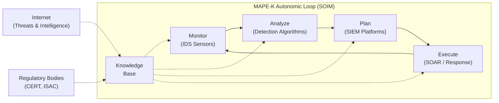
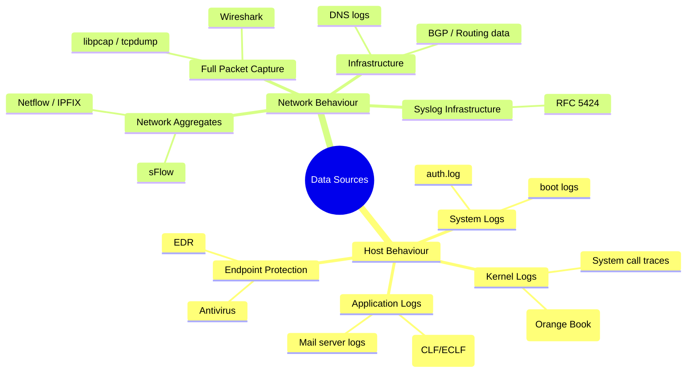

# Security Operations & Incident Management (CyBOK Ch8)

## Overview

Security Operations and Incident Management (SOIM) traces its roots to James Anderson's 1981 report, which theorised that **full protection of ICT infrastructure is impossible** — from both technical and economic perspectives. The report promoted the use of **detection techniques to complement protection**, a paradigm that remains foundational today.

The theoretical basis for most SOIM work is Denning's **intrusion detection model** (1987). SOIM can be viewed as an application of the **MAPE-K (Monitor-Analyze-Plan-Execute-Knowledge) autonomic computing loop** to cybersecurity.

> **Key Insight:** Protection alone is insufficient. An equilibrium between openness and protection is necessary, with detection filling the gap that prevention cannot cover.

---

## 8.1 Fundamental Concepts

### 8.1.1 Workflows and Vocabulary — The MAPE-K Loop

The SOIM domain implements the MAPE-K loop through three nested partial loops:

| Loop | Component | Era | Function |
|------|-----------|------|----------|
| **Inner** | **IDS** / **IDPS** | Earliest | Monitoring & detection at sensor level |
| **Middle** | **SIEM** platforms | Extended | Alert correlation, response planning, SOC integration |
| **Outer** | **SOAR** platforms | Recent | Advanced analytics, automated response, CTI integration |



**Key distinctions:**

- **Events** are produced and consumed in real-time; **knowledge** is more stable over time.
- **Monitor** → covered by IDSes (various data sources, §8.2).
- **Analyze** → covered by IDSes (detection algorithms, §8.3).
- **Plan** → realm of **SIEM** platforms (alert management, correlation).
- **Execute** → historically manual, now increasingly automated via **SOAR**.
- **IDS** → **IDPS** (Intrusion Detection and Prevention Systems) — modern sensors block in addition to detecting.

### 8.1.2 Architectural Principles

A typical SOIM deployment in an ICT infrastructure:

```
                    ┌─────────────┐
    Internet ──────│  Firewall    │────── Internal Network
                    └──────┬──────┘
                           │
                    ┌──────┴──────┐
                    │    DMZ      │  ← servers, proxies, exposed services
                    └──────┬──────┘
                           │
              ┌────────────┼────────────┐
              │            │            │
         ┌────┴────┐  ┌────┴────┐  ┌────┴────┐
         │Network  │  │ Host    │  │  App    │
         │IDPS     │  │IDPS     │  │Log Feed │
         └────┬────┘  └────┬────┘  └────┬────┘
              │            │            │
              └────────────┼────────────┘
                           │
                    ┌──────┴──────┐
                    │   SIEM      │ ← Alert collection, correlation
                    └──────┬──────┘
                           │
                    ┌──────┴──────┐
                    │ SOC Console │ ← Analyst triage, escalation
                    └─────────────┘
```

**Key architectural concepts:**

- **Zones of different sensitivity** → minimal: DMZ between inside private network and outside Internet.
- **Sensors** have dual network attachments:
  - Invisible (promiscuous) interface for data collection in monitored network.
  - Regular interface on protected SOIM management network for alert delivery.
- **Three core processes:**
  1. **Alert processing** → triage: ignore, react, or escalate to skilled analysts.
  2. **Sensor deployment & maintenance** → where to place, what to capture, continuous monitoring.
  3. **Reporting** → crucial for managed services; analyse SOC/SIEM functioning for improvement.

**External intelligence inputs:**
- ****CTI** (Cyber Threat Intelligence)** — commercial feeds, OSINT; fuzzy/reliability varies.
- ****ISAC** / **CERT**** — trusted sectoral information sharing, often regulatory-governed.

---

## 8.2 Monitor: Data Sources

> **Core objective:** From a continuous stream of data, detect localised attempts to compromise ICT infrastructure in real time.

Data sources are **event streams** (traces of activity). They feed into sensors, which produce **alerts** (security-relevant synthesized information).

### Data Source Landscape



---

### 8.2.1 Network Traffic (Full Packet Capture)

The **de-facto standard** for intrusion detection data. Uses **libpcap** library, **tcpdump**, and **Wireshark**.

**Requirements:**
- Network interface in **promiscuous mode** (capture all packets, not just addressed ones).
- No IP address bound to monitoring interface (silent, undetectable capture).

**Limitations and Issues:**

| Issue | Description |
|-------|-------------|
| **Volume** | Pcap files are enormous; operational sensors analyse on-the-fly, don't store all packets. |
| **Packet size** | Default config only captures headers; missing payload severely limits detection. |
| **Segmentation/Fragmentation** | Must reconstruct application-level data streams; beginnings/ends may be missing. |
| **Timestamps** | Not in packet headers; added by capture software relying on external clock. |
| **MAC layer** | Requires specific config and network segment knowledge; needed for ARP poisoning detection. |
| **Application layer** | TCP dynamics, application logic understanding needed; hard to acquire/reproduce. |
| **Encryption (TLS)** | Widespread TLS makes payload analysis impossible. Solution: **HSM (Hardware Security Module)** — terminates TLS before the application server, enabling clear-text analysis by network IDPS and **WAF**. |

**IoT/Industrial protocol considerations:**
- **LoRa** — low bandwidth, limited packets/day; needs communication context for useful detection.
- **PROFINET IRT** — strict timing requirements; inserting IDPS must not alter real-time guarantees.

---

### 8.2.2 Network Aggregates: Netflow

**Netflow** (standardised as **IPFIX**, RFC 7011) provides a synthetic aggregated view — counting packets sharing source, destination, protocol, or interface characteristics.

**Strengths:**
- Well-integrated in network equipment (Cisco origin).
- Excellent for **visualising communications** and **highlighting anomalies**.
- Widely used for both network management and security.

**Limitations:**
- **Performance impact** on router CPU (though newer hardware offloading mitigates this).
- **Sampling mode** commonly deployed (1 in N thousand packets analysed) — may completely miss events below sampling scale.
- Reliable only for **large-scale events** (e.g., DDoS); insufficient alone for precise security detection.

---

### 8.2.3 Network Infrastructure Information

#### 8.2.3.1 Naming (DNS)

**DNS** is one of the most crucial Internet services. Major security concerns:

- **Lack of authentication** → domain theft via fake DNS responses. Mitigation: **DNSSEC** provides authenticated responses.
- **DDoS amplification** → attacker spoofs victim's IP in DNS requests; DNS server sends unsolicited traffic to victim. DNSSEC unlikely to help.
- **Botnet C&C detection** → DNS is attractive for C&C because firewalls almost always allow it. Defenders use **DNS domain blacklists**, though effectiveness is hard to evaluate.
- **NTP** also a frequent DDoS amplification vector.

#### 8.2.3.2 Routing (BGP)

**BGP** incidents — mostly human error rather than malicious hijacks. Malicious BGP hijacks exist but the effort/reward ratio currently discourages widespread attacks.

---

### 8.2.4 Application Logs

**Advantage:** Similarity to reality; precision and accuracy of information. Originally created for debugging/system management — textual and intelligible.

#### 8.2.4.1 Web Server Logs

- **Common Log Format (CLF)** and **Extended Common Log Format (ECLF)** — de-facto standard (Apache, etc.).
- Records: requested resource, server response code.
- **Limitation:** Log is written AFTER request is served → the attack has already occurred. Not suitable for real-time blocking (IDPS needs to intercept the data stream before processing).

#### 8.2.4.2 Files and Documents

Rich document formats (PDF, Flash, Office suites, HTML email) are **attack vectors** for embedded malware (macros, JavaScript). Documents in transit (network) or at rest (system) provide traces of malicious code.

**Challenge:** Complex formats allow **different interpretations** of the same document → vulnerabilities. Well-written, unambiguous specifications (e.g., HTML5) reduce attacker opportunities.

---

### 8.2.5 System and Kernel Logs

**Historical context:** Denning's original model included system audit trails. However, most system logs are **insufficient** for intrusion detection — lacking precision (e.g., Unix accounting records only first 8 chars of command names).

**Orange Book audit trail:**
- Required precise privileged-user activity traces via system call interception.
- **Failed due to:** diverging vendor implementations, severe performance penalty making normal operation impossible.
- Quietly removed from most OSes; no standard system audit trail emerged.

**Modern endpoint protection:**
- Kernel logs now focus on internal OS operations, close to hardware.
- Commercial "endpoint protection" (antivirus/**EDR**) uses dedicated interceptors for specific activity.
- Solves the granularity problem: captures only relevant activity rather than everything.
- Malware detection engines and endpoint protection tools are considered **sensors** in the SOIM context.
- Related KA: **Malware & Attack Technologies** (CyBOK Ch6).

---

### 8.2.6 Syslog

**Syslog** provides a pervasive, generic logging infrastructure — an extremely efficient multi-purpose data source.

**Evolution:**
- **Original:** BSD Unix syslog → retro-specified as **RFC 3164**
- **Current:** **RFC 5424** with several improvements

**Syslog entry structure (in order):**

| Field | Description |
|-------|-------------|
| **Timestamp** | Date and time of event creation; text format, resolution to the second. |
| **Hostname** | Equipment generating the log. Private IP ranges/localhost can cause errors when consolidating. |
| **Process** | Name of the program generating the log. |
| **Message** | Free-text content describing the event. |

Many data sources (applications, networking equipment, OS) feed through syslog infrastructure.

---

## 8.3 Analyze: Detection Algorithms

*[This section is covered in the complete CyBOK text but was truncated in the source file. It addresses:]*

- **Misuse detection** (signature-based) vs **anomaly detection** (baseline-based)
- Detection algorithm families (statistical, machine learning, rule-based, specification-based)
- Alert generation, false positives/negatives
- Real-time constraints and sensor-level analysis

> See also: **Intrusion Detection**, **Anomaly Detection**

---

## 8.4 Plan: SIEM and SOC

*[This section covers SIEM platforms, alert correlation, and Security Operations Centers:]*

- ****SIEM** (Security Information and Event Management)** — consolidates alerts from multiple sensors, provides correlation, prioritisation, and decision support.
- ****SOC** (Security Operations Center)** — combines SIEM technology with human analyst teams for 24/7 monitoring.
- Alert triage workflows: ignore, automated response, escalate to Tier 2/3 analysts.
- Second-generation SIEM platforms handle increasing data volumes and diverse formats.

---

## 8.5 Execute: SOAR and Response

*[This section covers the execution/response phase:]*

- ****SOAR** (Security Orchestration, Automation and Response)** — extends SIEM with automated response capabilities.
- Security orchestration → coordinating multiple security tools.
- Automation → playbooks and runbooks for incident response.
- Response actions: blocking IPs, quarantining hosts, triggering **IR** (Incident Response) processes.
- Less mature than Monitor/Analyze phases; partial automation is the current state.

---

## 8.6 Knowledge Base Components

*[This section covers the knowledge foundation:]*

- **Configuration knowledge** — system/network topology, asset inventories.
- **Detection signatures** — rules, patterns, IoCs (**Indicators of Compromise**).
- ****CTI** (Cyber Threat Intelligence)** — external threat feeds, TTPs (Tactics, Techniques, Procedures), threat actor profiles.
- **Vulnerability databases** (**CVE**, **NVD**).
- ****MITRE ATT&CK**** framework integration.

---

## 8.7 Human Factors

*[This section addresses the human element in SOIM:]*

- Analyst fatigue and alert overload.
- Training and skill requirements for SOC personnel.
- Cognitive biases in alert triage and incident analysis.
- Communication and escalation procedures.
- The role of automation in reducing human error while maintaining human judgment for critical decisions.

---

## Key Takeaways

1. **Full protection is impossible** — SOIM accepts this premise and focuses on detection + response.
2. The **MAPE-K loop** (Monitor → Analyze → Plan → Execute, underpinned by Knowledge) is the conceptual backbone.
3. **Three generations** of technology: IDS → SIEM → SOAR, each expanding automation and scope.
4. **Data sources** span network (packets, flows), host (logs, system calls), and application layers, each with distinct strengths and limitations.
5. **Syslog** is the universal logging glue; **pcap** is the network analysis standard; **Netflow** provides scalable aggregate views.
6. **TLS encryption** is the major challenge for network-based detection — HSMs provide a workaround.
7. Modern SOIM integrates **external threat intelligence** (CTI, ISAC, CERT) and increasingly **automates response** via SOAR playbooks.

---

## Related Knowledge Areas

- **Risk Management & Governance** (CyBOK Ch2) — risk context for SOIM decisions
- **Malware & Attack Technologies** (CyBOK Ch6) — malware detection as sensor input
- **Adversarial Behaviours** (CyBOK Ch7) — understanding attacker motivations and TTPs
- **Forensics** (CyBOK Ch9) — post-incident investigation complements real-time SOIM
- **Network Security** (CyBOK Ch18) — network-level protections feed into monitoring

---

## References

- Anderson, J.P. (1981). *Computer Security Threat Monitoring and Surveillance*. [834]
- Denning, D.E. (1987). An Intrusion-Detection Model. *IEEE TSE*. [835]
- Kephart, J.O. & Chess, D.M. (2003). The Vision of Autonomic Computing. *IEEE Computer*. [836]
- RFC 7011 — IPFIX (Netflow standard)
- RFC 5424 — Syslog Protocol
- RFC 3164 — BSD Syslog Protocol
