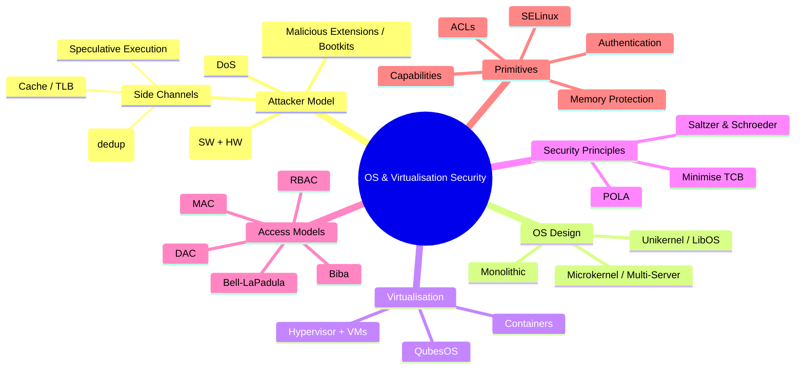

# Operating Systems & Virtualisation

> **CyBOK Knowledge Area — Chapter 11**  
> Introduces the principles, primitives and practices for ensuring security at the operating system and hypervisor levels.

---

## Overview

Operating systems and hypervisors are the **most privileged components** in the software stack — the bedrock on which all higher-level security is built. They manage resources (CPU, memory, disk) and enforce isolation between **security domains**: kernels, user processes, trusted execution environments, and virtual machines.

The challenges have evolved (from multi-user mainframes to shared clouds), but the core principle remains: **isolation**. However, threats have grown tremendously — from memory corruption to speculative-execution side channels — and so have the defence mechanisms.

> Saltzer & Schroeder's **Principle of Least Common Mechanism**: every mechanism shared between security domains may become a channel through which sensitive data may leak.

---

## 11.1 Attacker Model

Attackers aim to violate the **CIA triad** at the OS/hypervisor level:
- **Confidentiality**: leak crypto keys, sensitive data
- **Integrity**: elevate privileges, modify page tables
- **Availability**: crash the system, hog resources

### Attack Methods (Table 11.1)

| Attack | Description |
|---|---|
| **Malicious Extensions** | Malicious driver/kernel module loaded as a Trojan into monolithic OS |
| **Bootkits** | Compromise boot process (MBR, UEFI) to gain control before OS runs |
| **Memory Errors (software)** | Spatial/temporal bugs → control-flow hijack or information leaks |
| **Memory Corruption (hardware)** | **Rowhammer**: repeated DRAM row access flips neighbouring bits |
| **Uninitialised Data Leakage** | OS returns uninitialised memory containing sensitive data to userspace |
| **Concurrency Bugs / Double Fetch** | TOCTOU-like race where OS reads a userspace value twice, attacker changes it between reads |
| **Side Channels (hardware)** | Cache, TLB timing; attackers detect victim's resource usage patterns |
| **Side Channels (speculative)** | **Spectre**/**Meltdown**-class: speculative execution leaves micro-architectural traces (Foreshadow, RIDL) |
| **Side Channels (software)** | Memory deduplication, page caches — attacker measures write latency to infer shared content |
| **Resource Depletion (DoS)** | Hogging CPU, memory, buses to starve other processes |
| **Deadlocks/Hangs (DoS)** | Inducing deadlock states |

### Attack Surface

The **attack surface** **attack-surface** is a useful metric — all points an attacker can reach. Includes:
- System calls + arguments + implementation code (local)
- Network stack + device drivers (remote)
- DMA-accessible memory (malicious peripherals)

A smaller attack surface = fewer opportunities. Formal verification can reduce vulnerability classes even with a larger surface.

### Extended Threat Model

In cloud contexts, the attacker model extends to **malicious OS or hypervisor**. Defences aim to protect sensitive applications via hardware-protected **Trusted Execution Environments (TEEs)** / **enclaves**.

---

## 11.2 OS Design and Security

### Core Role
The OS provides **isolation** of security domains and **mediation** of all operations that could violate that isolation. This spans both:
- **Control plane**: configuring the MMU for memory isolation
- **Data plane**: operating on system call arguments

### Four Extreme Design Choices (Fig 11.1)

| Design | Description | Security Implication |
|---|---|---|
| **(a) Single Domain** | OS + apps in one domain (embedded systems) | No isolation; any component can corrupt any other |
| **(b) Monolithic OS** | Linux, Windows, macOS — OS in one kernel domain, isolated from user processes | Efficient (function calls); compromise of one component (e.g. driver) voids all security |
| **(c) Microkernel Multi-Server** | OS decomposed into separate processes (e.g. MINIX 3) communicating via IPC | Compromised driver cannot easily compromise rest of system; higher IPC overhead |
| **(d) Unikernel / Library OS** | App + minimal libOS on thin hypervisor/exokernel | Small TCB; libOS is app-specific and not shared; no privilege separation within domain |

#### Monolithic OS Concerns
- Device drivers and kernel modules (~third-party, buggy) run in the single kernel security domain
- Some OS functionality now runs in userspace: **FUSE** (Filesystem in Userspace), UMDF (User Mode Driver Framework)
- Modern trend: bypass kernel for high-speed networking

#### Microkernel Multi-Server
- All OS components are isolated processes
- Functions like a distributed system with reliable IPC (no network unreliability)
- **Security advantage**: damage containment
- **Cost**: higher overhead — the price of safety

#### Unikernels
- Resurgence in virtualised environments
- Small TCB: only hypervisor + needed libOS code
- Each application gets its own libOS — no sharing = compromised libOS only affects one app
- Compares favourably to microkernels on TCB size, but lacks internal privilege separation

#### The Tanenbaum–Torvalds Debate (1992)
The famous "flame war" about monolithic vs microkernel design. Tanenbaum (MINIX) criticised Linux's monolithic design as "obsolete." Torvalds defended it. The debate remains unresolved, though ideas from multi-server systems have influenced modern OS design. Ironically, MINIX now runs inside Intel Management Engine on hundreds of millions of processors.

### Virtualisation

| Approach | Description | Security |
|---|---|---|
| **Hypervisor + Full VMs** | Each VM has own OS; hypervisor provides illusion of dedicated hardware | Strong isolation; each OS needs separate maintenance |
| **OS-Level Virtualisation (Containers)** | Multiple environments share one kernel (**Docker**, FreeBSD Jails, `chroot`) | Lightweight; shared kernel = larger attack surface than VMs; enables microservices |
| **Integrated** | **QubesOS**: each user process in its own VM | Extreme isolation |

**Containers vs VMs**: VMs partition resources more strictly (only hypervisor shared). Containers share the kernel — but their lightweight nature enables microservices with well-defined interfaces, reducing overall attack surface. Trade-off is active debate.

### IoT / Embedded OS
- Extreme resource constraints (RIOT OS < 10KB)
- May lack MMU, multi-domain isolation, but provide real-time scheduling, low-power networking
- Security guarantees vary widely

---

## 11.3 Security Principles and Models

### Saltzer & Schroeder's Principles (Table 11.2)

| Principle | Meaning |
|---|---|
| **Economy of Mechanism** | Keep design simple; small TCB |
| **Fail-Safe Defaults** | Default = deny access; "No, unless" |
| **Complete Mediation** | Every access to every object must be checked |
| **Open Design** | Security should not depend on secrecy of design (Kerckhoffs's principle) |
| **Separation of Privilege** | Multiple conditions required for access |
| **Least Privilege / Least Authority** | Components get only the privileges they need (POLA) |
| **Least Common Mechanism** | Minimise shared state/mechanisms between domains |
| **Psychological Acceptability** | Security must be usable |

Additional principles: **Minimise the TCB** (Trusted Computing Base), **Principle of Intentional Use** (explicitly authorise only what is really intended).

### Applying Principles to OS Designs

- **Single domain**: TCB = all software; no mediation; maximum common mechanism — worst case
- **Monolithic**: applications isolated, but OS itself is one domain — driver compromise voids all
- **Multi-server**: best alignment — minimal microkernel, fail-safe mediation, POLA, small TCB per component
- **Unikernel**: Economy of Mechanism (small libOS), but no internal privilege separation; TCB limited to hypervisor + this app's components

### Security Models

#### Bell-LaPadula (Confidentiality) **Bell-LaPadula**
- **"Read down, write up"**
- Multi-Level Security for classified data (unclassified < secret < top secret)
- Subjects at level *L* can read ≤ *L*, write ≥ *L*
- Declassification only by trusted subjects
- Mandatory Access Control (MAC)

#### Biba (Integrity) **Biba-model**
- **"Read up, write down"** — exact opposite of Bell-LaPadula
- Prevents low-integrity subjects from corrupting high-integrity data

#### Access Control Types

| Type | Description |
|---|---|
| **Discretionary Access Control (DAC)** | Object owners control access; rights can be transferred (e.g. UNIX file permissions) |
| **Mandatory Access Control (MAC)** | System-wide policy; users cannot override (e.g. SELinux, Bell-LaPadula) |
| **Role-Based Access Control (RBAC)** | Access based on job-function roles; can implement both DAC and MAC |

DAC and MAC can be combined: users have freedom within MAC policy constraints.

---

## 11.4 Primitives for Isolation and Mediation

### Historical Foundation: Multics (1960s) **Multics**
- First OS designed from the ground up for security
- Introduced: protection rings, virtual memory, segment-based protection, hierarchical FS with DAC + MAC
- MAC directly implemented Bell-LaPadula
- Became too complex → Ken Thompson & Dennis Ritchie created **UNIX** ("Unics" as a pun on Multics)
- TCSEC (Orange Book) **TCSEC** was strongly based on Multics

### Core Primitives

1. **Authentication** — verify user/domain identity
2. **Access Control** — decide who can access what
3. **Memory Protection** — prevent unauthorised reads from another domain's memory
4. **Privilege Separation** — only privileged code configures isolation and guarantees mediation

### 11.4.1 Authentication
- Traditionally: username + password
- Modern: multi-factor (something you know + own + are)
- OS maintains: user ID, group membership, process ownership, binary ownership
- **Credentials stored securely** — hardware-backed: **TPM** for disk encryption keys, separate VM for credential store

### 11.4.2 Access Control Lists (ACLs) **access-control-list**
- Concept introduced in Multics filesystem (Daley & Neumann)
- Table mapping users × objects → access rights
- **UNIX implementation**: owner + group + other, with r/w/x bits
- Modern Linux/Windows: extended ACLs (multiple users/groups)
- **Reference monitors**: Linux pluggable framework; vet every security-sensitive operation
- ****SELinux**** (Security-Enhanced Linux): MAC via contexts — (username, role, domain); supports RBAC; derived from FLASK architecture; can enforce Bell-LaPadula, Biba, or custom policies
- **Distributed Information Flow Control**: research OS like Asbestos, HiStar, Flume — any process can create security labels and classify/declassify data

### 11.4.3 Capabilities **capability-based-security**
- Alternative to ACLs: "token, ticket, or key that gives the possessor permission to access an entity" (Henry Levy, 1966 — Dennis & Van Horn)
- Possession of capability = proof of access rights
- **Principle of Intentional Use** (Neumann): avoid confused deputy problem — a security domain unintentionally exercising a privilege on behalf of another
- **Protection from forgery**:
  - Kernel stores capabilities in protected memory; process uses references (e.g. file descriptors)
  - Cryptographic protection: process can hold capability but cannot modify it undetected

---

## Key Concepts Summary

---

## See Also

- **CyBOK-Cryptography** — Ch10, Cryptographic primitives underpinning OS security
- **CyBOK-Software-Security** — Ch? Memory errors, exploitation techniques
- **CyBOK-Authentication-Authorisation-Accountability** — Ch14, Detailed auth coverage
- **TCSEC-Orange-Book** — Trusted Computer System Evaluation Criteria
- **SELinux** — Security-Enhanced Linux
- **QubesOS** — Security-oriented OS using VM isolation
- **Spectre-Meltdown** — Speculative execution attacks
- **Rowhammer** — DRAM disturbance attack
