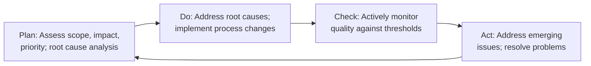

---
tags:
  - data-quality
  - data-management
  - dmbok
source: DMBoK v2 (Chapter 13)
knowledge_area: "11"
---

# Data Quality

## Overview

**Data Quality Management** is the planning, implementation, and control of activities that apply quality management techniques to data, in order to assure it is fit for consumption and meets the needs of data consumers. It is Knowledge Area 11 of the DAMA-DMBOK2 framework.

Data is of **high quality** to the degree that it meets the expectations and needs of data consumers — if the data is *fit for the purposes* to which they want to apply it. It is of **low quality** if it is not fit for those purposes. Data quality is thus dependent on context and on the needs of the data consumer.

### Goals

1. Develop a governed approach to make data fit for purpose based on data consumers' requirements
2. Define standards, requirements, and specifications for data quality controls as part of the data lifecycle
3. Define and implement processes to measure, monitor, and report on data quality levels
4. Identify and advocate for opportunities to improve the quality of data, through process and system improvements

---

## Business Drivers

The business drivers for establishing a formal Data Quality Management program include:

- **Increasing the value** of organizational data and the opportunities to use it
- **Reducing risks and costs** associated with poor quality data (fines, lost revenue, lost customers, negative media exposure)
- **Improving organizational efficiency and productivity** — employees spend less time verifying data and more time using it
- **Protecting and enhancing** the organization's reputation

Direct costs of poor quality data include: inability to invoice correctly, increased customer service calls, revenue loss from missed business opportunities, delays in merger integration, increased fraud exposure, and bad business decisions.

---

## Principles

Data Quality programs should be guided by these principles:

| Principle | Description |
|-----------|-------------|
| **Criticality** | Focus on the data most critical to the enterprise and its customers. Prioritize based on criticality and risk level. |
| **Lifecycle management** | Manage quality across the entire data lifecycle, from creation/procurement through disposal, including data in motion between systems. |
| **Prevention** | Focus on preventing data errors and conditions that reduce usability — not simply correcting records. |
| **Root cause remediation** | Understand and address problems at their root causes, not just symptoms. Often requires changes to processes and systems. |
| **Governance** | Data Governance activities must support high quality data, and DQ program activities must sustain a governed data environment. |
| **Standards-driven** | Define requirements as measurable standards and expectations against which quality can be measured. |
| **Objective measurement and transparency** | Measure quality objectively and consistently; share methodology and results with stakeholders. |
| **Embedded in business processes** | Business process owners are responsible for the quality of data produced through their processes. |
| **Systematically enforced** | System owners must systematically enforce data quality requirements. |
| **Connected to service levels** | Incorporate data quality reporting and issues management into **Service Level Agreements**. |

---

## Data Quality Dimensions

A **Data Quality dimension** is a measurable feature or characteristic of data. Dimensions provide a vocabulary for defining data quality requirements and serve as the basis for measurable rules that connect directly to potential risks in critical processes.

### DAMA UK Core Dimensions (2013)

| Dimension | Description |
|-----------|-------------|
| **Completeness** | The proportion of data stored against the potential for 100%. Are all required data present? Measured at data set, record, and column level. |
| **Uniqueness** | No entity instance is recorded more than once based upon how that thing is identified. |
| **Timeliness** | The degree to which data represent reality from the required point in time. Includes currency (up-to-date) and latency (time between creation and availability). |
| **Validity** | Data conforms to the syntax (format, type, range) of its definition. |
| **Accuracy** | The degree to which data correctly describes the 'real world' object or event being described. Difficult to measure; often relies on comparison to a verified source of record. |
| **Consistency** | The absence of difference when comparing two or more representations of a thing against a definition. Can be record-level, cross-record, or temporal consistency. |

### Extended Characteristics

- **Integrity (Coherence)**: Referential integrity (consistency via reference keys) and internal consistency (no holes or missing parts). Orphan records and duplicates negatively affect aggregation.
- **Reasonability**: Whether a data pattern meets expectations based on benchmarks or historical comparisons.
- **Usability**: Understandable, simple, relevant, accessible, maintainable, at the right level of precision.
- **Accessibility**: Ease of obtaining data; access control; retention.
- **Precision**: Precision of data values; data sufficient to complete a given task.
- **Privacy**: Adherence to privacy controls.

### Other Influential Frameworks

- **Strong-Wang (1996)**: 15 dimensions across four categories — *Intrinsic DQ* (accuracy, objectivity, believability, reputation), *Contextual DQ* (value-added, relevancy, timeliness, completeness), *Representational DQ* (interpretability, ease of understanding, consistency, concise representation), *Accessibility DQ* (accessibility, access security).
- **Redman (1996, 2001)**: Dimensions rooted in data structure — organized around *Data Model* (content, level of detail, composition, consistency, reaction to change), *Data Values* (accuracy, completeness, currency, consistency), and *Representation* (appropriateness, interpretability, portability, format precision).
- **English (1999, 2009)**: Divided into *Inherent* characteristics (definitional conformance, completeness of values, validity, accuracy to surrogate source, accuracy to reality, precision, non-duplication, equivalence, concurrency) and *Pragmatic* characteristics (accessibility, timeliness, contextual clarity, usability, derivation integrity, fact completeness).

> See **Metadata Management** for the critical relationship between metadata and data quality — metadata defines what data represents and is the primary means of clarifying quality expectations.

---

## ISO 8000 — International Standard for Data Quality

ISO 8000 defines characteristics that can be tested by any organization in the data supply chain to objectively determine conformance. Key aspects:

- Defines **quality data** as *"portable data that meets stated requirements"*
- **Portability**: Data must be separable from a software application (not locked to a proprietary format)
- Supported by **ISO 22745** for defining and exchanging Master Data using Open Technical Dictionaries (eOTD)
- **ISO 8000 Part 61** (under development): Information and data quality management process reference model covering Data Quality Planning, Control, Assurance, and Improvement

---

## Data Quality Improvement Lifecycle (PDCA)

Most approaches to improving data quality are based on the **Shewhart/Deming cycle** — *Plan-Do-Check-Act*:

| Phase | Activities |
|-------|------------|
| **Plan** | Assess scope, impact, and priority of known issues. Evaluate alternatives based on root cause analysis. Formulate action plan. |
| **Do** | Lead efforts to address root causes. Work with process owners for non-technical changes; with technical teams for system changes. |
| **Check** | Actively monitor quality as measured against requirements. If data meets thresholds, no additional action needed. |
| **Act** | Address and resolve emerging data quality issues. The cycle restarts — continuous improvement. |

New cycles begin when: existing measurements fall below thresholds, new data sets come under investigation, new requirements emerge, or business rules/standards change.

---

## Data Quality Business Rule Types

Business rules describe how data should exist to be useful and usable. They are aligned with dimensions of quality:

| Rule Type | Description |
|-----------|-------------|
| **Definitional conformance** | Same understanding of data definitions implemented consistently across processes. |
| **Value presence and record completeness** | Rules defining conditions under which missing values are acceptable or unacceptable. |
| **Format compliance** | Patterns specifying values for a data element (e.g., telephone number formatting). |
| **Value domain membership** | A data element's value must be in an enumerated domain (e.g., valid USPS state codes). |
| **Range conformance** | Value must be within a defined numeric, lexicographic, or time range. |
| **Mapping conformance** | Value maps to equivalent corresponding value domains (e.g., state code 'AL' ↔ '01' ↔ 'Alabama'). |
| **Consistency rules** | Conditional assertions maintaining relationships between attributes (e.g., postal code ↔ state). |
| **Accuracy verification** | Compare against a system of record or verified source. |
| **Uniqueness verification** | One and only one record exists for each represented real-world object. |
| **Timeliness validation** | Characteristics associated with expectations for accessibility and availability. |
| **Aggregation checks** | Validate reasonableness of record counts, average amounts, or variance over time using statistical trends. |

---

## Common Causes of Data Quality Issues

### 1. Issues Caused by Lack of Leadership
- Lack of organizational commitment to high quality data
- No recognition of data as a strategic asset
- Governance driven solely by compliance, not by value potential
- Barriers: lack of awareness, lack of business governance, difficulty justifying improvements, inappropriate measurement instruments

### 2. Issues Caused by Data Entry Processes
- Poorly designed data entry interfaces without edits/controls
- List entry placement (dropdown ordering) contributing to errors
- **Field overloading** — re-using fields for different purposes over time
- Training issues: lack of process knowledge; incentives for speed over accuracy
- Inconsistent business process execution
- Business rule changes not propagated throughout systems

### 3. Issues Caused by Data Processing Functions
- Incorrect assumptions about data sources
- Stale business rules not periodically reviewed and updated
- Changed data structures without notifying downstream consumers

### 4. Issues Caused by System Design
- Failure to enforce referential integrity (orphan rows, duplicate data)
- Failure to enforce uniqueness constraints
- Coding inaccuracies and gaps in data mapping
- Data model inaccuracies (field lengths, improper key assignments)
- Temporal data mismatches across systems
- Weak **Master Data Management**
- Data duplication (single source with multiple local instances; multiple sources for single instance)

### 5. Issues Caused by Fixing Issues
- Manual data patches (direct database changes) — high risk of unintended consequences
- Not propagating patches to all historical data
- Generally not undo-able without complete restore from backup

---

## Data Profiling

**Data Profiling** is a form of data analysis used to inspect data and assess quality. It uses statistical techniques to discover the true structure, content, and quality of a collection of data.

### What Profiling Reveals

| Statistic | Purpose |
|-----------|---------|
| **Counts of nulls** | Identifies nulls and whether they are allowable |
| **Max/Min values** | Identifies outliers like negatives |
| **Max/Min length** | Identifies outliers or invalids for fields with length requirements |
| **Frequency distribution** | Enables assessment of reasonability — distribution of values, frequently/infrequently occurring values, percentage of defaulted values |
| **Data type and format** | Identifies non-conformance to format requirements; unexpected formats (decimals, embedded spaces) |

### Advanced Profiling

- **Cross-column analysis**: Identifies overlapping/duplicate columns; exposes embedded value dependencies
- **Inter-table analysis**: Explores overlapping value sets; identifies foreign key relationships
- **Drill-down capability**: Most tools allow drilling into analyzed data for further investigation

> **Profiling is only the first step.** It identifies potential problems. Solving problems requires other forms of analysis: business process analysis, **Data Lineage** analysis, and deeper data analysis to isolate root causes.

---

## Data Cleansing and Enhancement

### Data Cleansing (Scrubbing)

Transforms data to make it conform to data standards and domain rules. Includes detecting and correcting data errors to bring quality to an acceptable level.

**Ideal approach**: The need for cleansing should decrease over time as root causes are resolved:
- Implement controls to prevent data entry errors
- Correct data in the source system
- Improve the business processes that create the data

### Data Enhancement (Enrichment)

Adding attributes to a data set to increase quality and usability:

| Enhancement Type | Examples |
|------------------|----------|
| **Time/Date stamps** | Document creation, modification, retirement times — valuable for root cause analysis |
| **Audit data** | Document data lineage for historical tracking and validation |
| **Reference vocabularies** | Business-specific terminology, ontologies, glossaries |
| **Contextual information** | Location, environment, access methods; tagging for review |
| **Geographic information** | Address standardization, geocoding, latitude/longitude, regional coding |
| **Demographic information** | Age, marital status, gender, income, ethnic coding; business revenue, employee count |
| **Psychographic information** | Behaviors, habits, preferences — segmentation data |
| **Valuation information** | Asset valuation, inventory, and sale data |

### Data Parsing and Formatting

- **Parsing**: Analyzing data using pre-determined rules to define content or value. Pattern matching triggers actions.
- **Standardization**: Mapping data from source patterns into a corresponding target representation (e.g., telephone numbers, customer names).
- **Transformation**: Rule-based conversions building on standardization techniques — parsed components rearranged, corrected, or changed per knowledge base rules.

---

## Activities

### 1. Define High Quality Data
Understand business needs, define terms, identify pain points, and build consensus about drivers and priorities. Questions to assess readiness:
- What do stakeholders mean by 'high quality data'?
- What is the impact of low quality data on business operations and strategy?
- What priorities drive the need for improvement?
- What governance is in place to support data quality improvement?

### 2. Define a Data Quality Strategy
A framework should include methods to: understand and prioritize business needs, identify critical data, define business rules and standards, assess data against expectations, share findings with stakeholders, prioritize and manage issues, identify improvement opportunities, measure/monitor/report on quality, manage metadata produced through DQ processes, and integrate DQ controls into business and technical processes.

### 3. Identify Critical Data and Business Rules
Focus on data that, if of higher quality, would provide greater value. Prioritize based on: regulatory requirements, financial value, and direct impact on customers. Business rules may need to be reverse-engineered from existing processes, workflows, regulations, policies, system edits, and code.

### 4. Perform an Initial Data Quality Assessment
Start with a small, focused proof-of-concept:
- Define assessment goals
- Identify data to be assessed (small data set, single element, or specific problem)
- Identify data uses and consumers
- Inspect data based on known and proposed rules
- Document non-conformance and issue types
- Quantify findings and prioritize based on business impact
- Confirm issues and priorities with Data Stewards and SMEs

### 5. Identify and Prioritize Potential Improvements
Apply the improvement process strategically: full-scale profiling of larger data sets, stakeholder interviews, and business impact analysis. Profiling helps identify issues but does not determine root causes or business impact — that requires stakeholder input.

### 6. Define Goals for Data Quality Improvement
Set specific, achievable goals based on consistent quantification of business value. Determine ROI of fixes based on: criticality of data, amount of data affected, age of data, number and type of impacted processes, customers affected, risks, costs of remediation, and costs of work-arounds.

### 7. Develop and Deploy Data Quality Operations
Sustaining data quality requires ongoing operations:

#### Manage Data Quality Rules
Rules should be: documented consistently, defined in terms of DQ dimensions, tied to business impact, backed by data analysis, confirmed by SMEs, and accessible to all data consumers.

#### Measure and Monitor Data Quality
Two equally important reasons:
1. Inform data consumers about levels of quality
2. Manage risk that change may be introduced through business/technical process changes

Measurement can be **in-stream** (during data creation or handoff) or **batch** (on persistent storage). Each rule should have a standard, target, or threshold index for comparison.

#### Operational Procedures for Managing Data Issues
- **Diagnosing issues**: Review symptoms, trace lineage, identify problem origin, pinpoint root causes
- **Formulating remediation options**: Address non-technical root causes, modify systems, develop controls, introduce inspection, directly correct flawed data, or take no action based on cost/benefit
- **Resolving issues**: Assess costs/merits of alternatives, recommend and implement resolution

Track decisions in an **incident tracking system** — it provides insight about causes and costs of data issues.

#### Data Quality Service Level Agreements (SLAs)
An SLA specifies expectations for response and remediation. Includes: data elements covered, business impacts, DQ dimensions, quality expectations, measurement methods, acceptability thresholds, stewards to notify, timelines, and escalation strategies.

#### Data Quality Reporting
Reports should focus on: data quality scorecards, quality trends over time, SLA metrics, issue management status, conformance to governance policies, and positive effects of improvement projects.

---

## Techniques

### Preventive Actions
- Establish data entry controls (rules preventing invalid data from entering systems)
- Train data producers on downstream impact
- Define and enforce rules via a **data firewall** that inspects quality before data is used
- Demand high quality data from external suppliers (examine their processes, structures, provenance)
- Implement **Data Governance** and Stewardship
- Institute formal change control

### Corrective Actions
- **Automated correction**: Rule-based standardization, normalization, and correction without manual intervention (requires well-defined standards and known error patterns)
- **Manually-directed correction**: Automated tools with manual review — corrections scored; low-confidence corrections presented to stewards for approval
- **Manual correction**: Through controlled interfaces with audit trails. Avoid direct production changes.

### Quality Check and Audit Code Modules
Create shareable, linkable, re-usable code modules for repeated DQ checks. Well-engineered code blocks ensure consistent execution and provide lineage for regulatory reporting. Quality notes and confidence ratings should accompany data with questionable quality dimensions.

### Effective Data Quality Metrics
Metrics must be: **measurable** (countable with quantifiable results), **business-relevant** (related to business operations), **acceptable** (compared against defined thresholds), **accountable** (understood by stewards who take corrective action), **controllable** (triggers action when out of range), and **trending** (enables measurement of improvement over time).

### Statistical Process Control (SPC)
A method to manage processes by analyzing variation in inputs, outputs, or steps. Based on the assumption: consistent inputs + consistent execution = consistent outputs. Uses **control charts** to establish baselines and detect special causes of variation. Applied to data as the product of a process — useful for control, detection, and improvement.

### Root Cause Analysis
Understanding factors that contribute to problems. Common techniques:
- **Pareto analysis** (80/20 rule)
- **Fishbone diagram analysis**
- **Track and trace**
- **Process analysis**
- **Five Whys** (McGilvray, 2008)

---

## Implementation Guidelines

A hybrid approach works best — **top-down** for sponsorship, consistency, and resources; **bottom-up** to discover what is actually broken and achieve incremental successes.

### Readiness Assessment
Assess organizational readiness by evaluating:
- Management commitment to data as a strategic asset
- Current understanding of data quality (pain points)
- Actual state of the data (through profiling and analysis)
- Risks associated with data creation, processing, or use
- Cultural and technical readiness for scalable DQ monitoring

### Organization and Cultural Change
Improving data quality requires a **mindset change** — every person who touches data can impact quality. Training should focus on:
- Common causes of data problems
- Relationships within the organization's data ecosystem
- Consequences of poor quality data
- Necessity for ongoing improvement
- Becoming 'data-lingual' — articulating data's impact on strategy, compliance, and customer satisfaction

---

## Data Quality and Data Governance

A Data Quality program is more effective when part of a **Data Governance** program. The Governance Organization accelerates DQ work by:
- Setting priorities
- Identifying and coordinating stakeholders
- Developing and maintaining standards
- Reporting enterprise-wide measurements
- Providing guidance and establishing communications
- Developing and applying DQ and compliance policies
- Sharing inspection results to build awareness and consensus

### Data Quality Policy
Each policy should include: purpose, scope and applicability, definitions of terms, responsibilities of the DQ program and other stakeholders, reporting requirements, and links to risk, preventative measures, compliance, data protection, and data security.

---

## Key Metrics Categories

| Category | Examples |
|----------|----------|
| **Return on Investment** | Cost of improvement vs. benefits of improved quality |
| **Levels of quality** | Number/percentage of errors or requirement violations |
| **Data Quality trends** | Quality improvement over time against thresholds; quality incidents per period |
| **Issue management** | Counts by dimension, issues per business function, by priority/severity, time to resolve |
| **Service level conformance** | Organizational units involved, project interventions, process conformance |
| **DQ plan rollout** | As-is state and roadmap for expansion |

---

## Tools

- **Data Profiling Tools**: Produce high-level statistics for pattern identification and initial quality assessment. Essential for data discovery; augmented with visualization aids the discovery process.
- **Data Querying Tools**: Enable deeper querying beyond profiling — answering questions about uniqueness, integrity, and root causes.
- **Modeling and ETL Tools**: Direct impact on data quality. DQ teams should work with development teams to ensure quality risks are addressed.
- **Data Quality Rule Templates**: Capture expectations for data; bridge communication between business and technical teams.
- **Metadata Repositories**: Store DQ requirements, rules, measurement results, and issue documentation for consumer access.

---

## References

- English, Larry. *Improving Data Warehouse and Business Information Quality* (1999) and *Information Quality Applied* (2009)
- Jugulum, Rajesh. *Competing with High Quality Data* (2014)
- Loshin, David. *Enterprise Knowledge Management: The Data Quality Approach* (2001)
- Maydanchik, Arkady. *Data Quality Assessment* (2007)
- McGilvray, Danette. *Executing Data Quality Projects: Ten Steps to Quality Data and Trusted Information* (2008)
- Myers, Dan. *"The Value of Using the Dimensions of Data Quality"* (2013)
- Olson, Jack E. *Data Quality: The Accuracy Dimension* (2003)
- Redman, Thomas. *Data Quality for the Information Age* (1996) and *Data Quality: The Field Guide* (2001)
- Sebastian-Coleman, Laura. *Measuring Data Quality for Ongoing Improvement* (2013)
- Strong, Diane M. and Wang, Richard Y. *"Beyond Accuracy: What Data Quality Means to Data Consumers"* (1996)
- DAMA UK White Paper (2013) — six core dimensions of data quality
- ISO 8000 — International Standard for Data Quality

---

## Related DMBOK Knowledge Areas

- **Data Governance** — provides the guidance and business context for DQ activities
- **Metadata Management** — defines what data represents; primary means of clarifying quality expectations
- **Data Architecture** — architectural decisions impact data quality throughout the lifecycle
- **Data Modeling and Design** — data model accuracy directly affects quality
- **Data Integration and Interoperability** — ETL and integration processes impact quality
- **Master Data Management** — MDM requires ongoing DQ monitoring and provides reference sources
- **Data Warehousing and Business Intelligence** — DQ is essential for reliable analytics
- **Data Storage and Operations** — database operations enforce quality constraints
