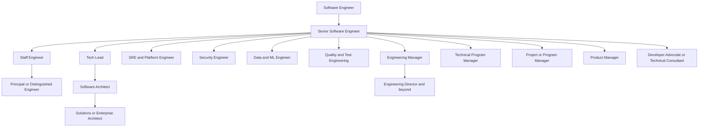

# Software Engineering Career Paths

> **Purpose:** A map of professional paths that can begin from software engineering. This folder contains career overviews only. Detailed learning notes will be created later for the path the learner chooses.

## How to Use This Map

Software engineering is a starting discipline, not a single destination. As experience grows, a software engineer can increase impact in different directions:

- Deeper technical influence
- Ownership of systems and production outcomes
- Leadership of technical direction
- Leadership of people and organizations
- Coordination of complex delivery
- Ownership of products and customer value
- Specialization in reliability, security, data, quality, or communication

Role names vary between organizations. A **Tech Lead** may be a temporary responsibility, a formal role, or part of a senior engineer's job. A **Staff Engineer** may be an individual-contributor level, while a **Software Architect** may be a role or a title. Read the outcomes and scope of each path rather than relying only on the title.

## The Starting Point

[[career-path/01_Software_Engineer/00_overview|Software Engineer]] is the starting role in this map. The engineer builds and maintains software while developing competence in:

- Programming and software construction
- Requirements and problem understanding
- Design and architecture
- Testing and quality
- Operations and production support
- Collaboration and communication

The next level is not simply better coding. It is broader ownership, stronger judgment, and a larger positive effect on other people and the system.

## Career Families

| Family                           | Path                                       | Main question                                                         | Overview                                                                 |                                               |
| -------------------------------- | ------------------------------------------ | --------------------------------------------------------------------- | ------------------------------------------------------------------------ | --------------------------------------------- |
| Technical individual contributor | Senior Software Engineer                   | Can I own a meaningful area and deliver it reliably?                  | [[career-path/02_Senior_Software_Engineer/00_overview]]                  | Senior Software Engineer]]                    |
| Technical individual contributor | Staff Engineer                             | Can I improve technical outcomes across multiple teams?               | [[career-path/03_Staff_Engineer/00_overview]]                            | Staff Engineer]]                              |
| Technical individual contributor | Principal or Distinguished Engineer        | Can I shape technical direction at organizational scale?              | [[career-path/04_Principal_and_Distinguished_Engineer/00_overview]]      | Principal and Distinguished Engineer]]        |
| Technical leadership             | Tech Lead                                  | Can I guide a team toward a coherent technical result?                | [[career-path/05_Tech_Lead/00_overview]]                                 | Tech Lead]]                                   |
| Technical leadership             | Software Architect                         | Can I shape system structure and explain its trade-offs?              | [[career-path/06_Software_Architect/00_overview                          | Software Architect]]                          |
| Specialist engineering           | SRE and Platform Engineer                  | Can I make software delivery and operation reliable at scale?         | [[career-path/07_SRE_and_Platform_Engineer/00_overview                   | SRE and Platform Engineer]]                   |
| Specialist engineering           | Security Engineer                          | Can I reduce security risk across the software lifecycle?             | [[career-path/08_Security_Engineer/00_overview                           | Security Engineer]]                           |
| Specialist engineering           | Data and ML Engineer                       | Can I build reliable data and machine-learning capabilities?          | [[career-path/09_Data_and_ML_Engineer/00_overview                        | Data and ML Engineer]]                        |
| Specialist engineering           | Quality and Test Engineer                  | Can I improve confidence in software behavior and quality?            | [[career-path/10_Quality_and_Test_Engineering/00_overview                | Quality and Test Engineering]]                |
| People leadership                | Engineering Manager                        | Can I create the conditions for a team to deliver and grow?           | [[career-path/11_Engineering_Manager/00_overview                         | Engineering Manager]]                         |
| Delivery leadership              | Technical Program Manager                  | Can I coordinate complex technical initiatives across teams?          | [[career-path/12_Technical_Program_Manager/00_overview                   | Technical Program Manager]]                   |
| Delivery leadership              | Project or Program Manager                 | Can I manage coordinated work toward agreed outcomes?                 | [[career-path/13_Project_and_Program_Manager/00_overview                 | Project and Program Manager]]                 |
| Product and business             | Product Manager                            | Can I discover valuable problems and guide product outcomes?          | [[career-path/14_Product_Manager/00_overview                             | Product Manager]]                             |
| Enterprise and customer-facing   | Solutions or Enterprise Architect          | Can I connect technology decisions to business and enterprise change? | [[career-path/15_Solutions_and_Enterprise_Architect/00_overview          | Solutions and Enterprise Architect]]          |
| Communication and ecosystem      | Developer Advocate or Technical Consultant | Can I help users, customers, and communities succeed with technology? | [[career-path/16_Developer_Advocate_and_Technical_Consultant/00_overview | Developer Advocate and Technical Consultant]] |

## Relationship Between the Paths

## Shared Capabilities Across Almost Every Path

Regardless of the destination, the following capabilities remain valuable:

| Capability | Why it matters | Existing reference |
|---|---|---|
| Problem framing | Prevents solving the wrong problem | [[BABOK v3 - Overview]], [[software-engineering-note/01_Software_Requirements/Software Requirements Overview]] |
| Technical judgment | Makes trade-offs explicit and reviewable | [[software-engineering-note/02_Software_Architecture/Software Architecture Overview]], [[software-engineering-note/03_Software_Design/Software Design Note Overview]] |
| Delivery awareness | Connects decisions to time, cost, risk, and value | [[PMBOK v8 - Overview]], [[software-engineering-note/09_Software_Engineering_Management/Software Engineering Management Overview]] |
| Communication | Enables shared understanding and decision making | [[software-engineering-note/14_Software_Engineering_Professional_Practice/Professionalism of Software Engineering Overview]] |
| Quality and reliability | Protects users and the organization after release | [[software-engineering-note/12_Software_Quality/Software Quality Overview]], [[software-engineering-note/06_Software_Engineering_Operations/Software Engineering Operations Overview]] |
| Systems thinking | Shows how local decisions affect the wider system | [[SEBoK v2 - Overview]], [[Computing Foundation Overview]] |
| Evidence of impact | Turns knowledge into credible professional capability | [[document-template/00_Essential Document/Essential Documents - Overview]] |

## Recommended Exploration Order

The recommended first route is:

1. [[career-path/01_Software_Engineer/00_overview|Software Engineer]]: establish the baseline
2. [[career-path/02_Senior_Software_Engineer/00_overview|Senior Software Engineer]]: the immediate promotion target
3. Explore the neighboring paths:
   - [[career-path/03_Staff_Engineer/00_overview|Staff Engineer]] for deeper individual-contributor influence
   - [[career-path/05_Tech_Lead/00_overview|Tech Lead]] for team-level technical leadership
   - [[career-path/11_Engineering_Manager/00_overview|Engineering Manager]] for people leadership
   - [[career-path/12_Technical_Program_Manager/00_overview|Technical Program Manager]] for cross-team delivery
   - [[career-path/13_Project_and_Program_Manager/00_overview|Project or Program Manager]] for formal delivery management
   - [[career-path/14_Product_Manager/00_overview|Product Manager]] for product and customer direction
4. Choose one specialization after understanding the shared core.

## What an Overview Contains

Each path overview describes:

- The purpose and center of gravity of the role
- The outcomes the role is expected to create
- The capability areas to develop
- How the role differs from nearby paths
- Evidence and artifacts that demonstrate progress
- Connections to the existing BOKs
- A suggested route for future detailed notes

These overviews are roadmaps, not job descriptions and not certification syllabi.

## External Reference Sources

- [U.S. Bureau of Labor Statistics: Software Developers, Quality Assurance Analysts, and Testers](https://www.bls.gov/ooh/computer-and-information-technology/software-developers.htm)
- [Engineering Ladders: Tech Lead](https://www.engineeringladders.com/TechLead.html)
- [Engineering Ladders: Tech Lead versus Engineering Manager](https://www.engineeringladders.com/TechLead-EngineeringManager.html)
- [Engineering Ladders: Technical Program Manager](https://www.engineeringladders.com/TechnicalProgramManager.html)
- [INCOSE Competency Framework](https://www.incose.org/resources-publications/publish-with-incose/competency-framework/)
- [Google Cloud: Site Reliability Engineering](https://cloud.google.com/sre)
- [OWASP Secure by Design Framework](https://owasp.org/www-project-secure-by-design-framework/)
- [AIPMM ProdBOK](https://aipmm.com/prodbok)
- [PMI: The Standard for Program Management](https://www.pmi.org/standards/program-management-fifth-edition)

## Related

- [[Body of Knowledge - Overview|Body of Knowledge Overview]]
- [[SWEBOK v4 - Overview|SWEBOK v4]]
- [[PMBOK v8 - Overview|PMBOK v8]]
- [[SEBoK v2 - Overview|SEBoK v2]]
- [[BABOK v3 - Overview|BABOK v3]]
- [[CyBOK v1 - Overview|CyBOK v1.1]]
- [[DMBoK v2 - Overview|DMBoK v2]]
