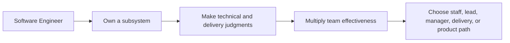

# Senior Software Engineer

> **Positioning:** The immediate growth path for an experienced software engineer. The center of gravity moves from completing assigned work to owning outcomes, reducing ambiguity, and increasing the effectiveness of the team.

## What This Path Is

A senior software engineer is trusted with meaningful technical and delivery responsibility. The role combines strong implementation ability with problem framing, design judgment, risk management, communication, and mentorship.

Senior does not mean knowing every technology. It means being able to make sound decisions in an unfamiliar or changing situation, explain those decisions, and follow through on the consequences.

## Primary Outcomes

- A subsystem, service, or product area that remains healthy over time
- Features delivered with appropriate quality and operational readiness
- Risks and dependencies surfaced before they become surprises
- Clear technical decisions that help others move forward
- Improved capability of less experienced engineers
- Better alignment between technical work and business or user needs

## Capability Areas

| Capability | Senior-level behavior | Existing vault anchor |
|---|---|---|
| Technical ownership | Owns a system area from requirements through operation | [[07_Software_Maintenance/Software Maintenance Overview]] |
| Architecture judgment | Compares options and records trade-offs | [[02_Software_Architecture/09_Evaluation_and_Governance]] |
| Delivery | Forecasts work, manages dependencies, and communicates changes | [[09_Software_Engineering_Management/Software Engineering Management Overview]] |
| Quality | Defines quality risks and chooses proportionate controls | [[12_Software_Quality/Software Quality Overview]] |
| Reliability | Uses monitoring, incidents, and feedback to improve the service | [[06_Software_Engineering_Operations/Software Engineering Operations Overview]] |
| Requirements | Clarifies the underlying problem and acceptance conditions | [[01_Software_Requirements/Software Requirements Overview]] |
| Influence | Leads through explanation, facilitation, and trust | [[14_Software_Engineering_Professional_Practice/Professionalism of Software Engineering Overview]] |
| Mentoring | Raises the capability of the team without creating dependency | [[14_Software_Engineering_Professional_Practice/02_Group_Dynamics_and_Psychology]] |

## Typical Progression

## Signals for Moving Forward

- You can lead an ambiguous initiative without waiting for a complete specification.
- You can explain technical risk in terms that stakeholders can act on.
- You regularly prevent problems through design, testing, or operational preparation.
- Other engineers seek your guidance because your reasoning is useful, not because you hold authority.
- You can balance local implementation quality with system and product constraints.
- You are building a record of outcomes, not only completed tasks.

## Evidence to Build

- Architecture Decision Record for a consequential decision
- Problem statement and current-state analysis
- Delivery plan with risks and dependencies
- Production-readiness review
- Incident review with corrective actions
- Mentoring plan or technical learning session
- Technical proposal accepted by multiple stakeholders

## Nearby Paths

- [[03_Staff_Engineer|Staff Engineer]]: broader influence across teams while remaining an individual contributor
- [[05_Tech_Lead|Tech Lead]]: direct technical coordination for a team or system
- [[06_Software_Architect|Software Architect]]: explicit focus on system structure and architecture decisions
- [[11_Engineering_Manager|Engineering Manager]]: focus on people, team health, and delivery conditions
- [[12_Technical_Program_Manager|Technical Program Manager]]: focus on cross-team technical initiatives
- [[14_Product_Manager|Product Manager]]: focus on product value, customer problems, and outcome direction

## Suggested Future Note Route

1. [[01_Software_Requirements/Software Requirements Overview]]
2. [[02_Software_Architecture/Software Architecture Overview]]
3. [[03_Software_Design/Software Design Note Overview]]
4. [[06_Software_Engineering_Operations/Software Engineering Operations Overview]]
5. [[09_Software_Engineering_Management/Software Engineering Management Overview]]
6. [[12_Software_Quality/Software Quality Overview]]
7. [[14_Software_Engineering_Professional_Practice/Professionalism of Software Engineering Overview]]
8. [[SEBoK v2 - Overview]]

## Sources

- [Engineering Ladders: Tech Lead](https://www.engineeringladders.com/TechLead.html)
- [Engineering Ladders: Tech Lead versus Engineering Manager](https://www.engineeringladders.com/TechLead-EngineeringManager.html)
- [[SWEBOK v4 - Overview]]
- [[PMBOK v8 - Overview]]
- [[BABOK v3 - Overview]]

## Related

- [[00_Career_Path_Overview]]
- [[01_Software_Engineer]]
- [[03_Staff_Engineer]]
- [[05_Tech_Lead]]
