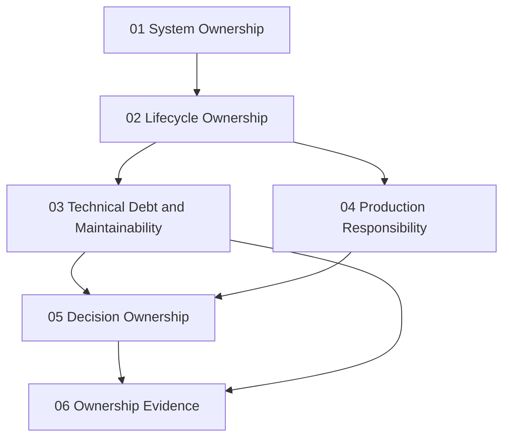

# Technical Ownership

> **Core idea:** A senior engineer owns a system area end-to-end, from problem understanding through production operation, and is accountable for its health over time.

## What Technical Ownership Means at Senior Level

A mid-level engineer completes tasks. A senior engineer owns outcomes.

Technical ownership is the foundation of senior engineering because every other capability area depends on it. You cannot exercise architecture judgment, manage delivery, or mentor others effectively if you do not first own a meaningful area and keep it healthy.

Ownership does not mean doing everything yourself. It means:

- Knowing the full surface area of your system
- Anticipating problems before they reach production
- Making decisions that others can follow
- Being the person the team turns to when something breaks
- Keeping the system maintainable for the next engineer

## Topic Notes

| # | Topic | Focus | Status | File |
|---|---|---|---|---|
| 01 | System Ownership | Defining and understanding your ownership boundary | ✅ Done | `01_System_Ownership.md` |
| 02 | Lifecycle Ownership | Following the system from requirements through operation | ✅ Done | `02_Lifecycle_Ownership.md` |
| 03 | Technical Debt and Maintainability | Managing debt strategically, not reactively | ✅ Done | `03_Technical_Debt_and_Maintainability.md` |
| 04 | Production Responsibility | Being accountable after code ships | ✅ Done | `04_Production_Responsibility.md` |
| 05 | Decision Ownership | Making, recording, and standing behind technical decisions | ✅ Done | `05_Decision_Ownership.md` |
| 06 | Ownership Evidence | Building a case for promotion from outcomes | ✅ Done | `06_Ownership_Evidence.md` |

**Completion:** 6/6 — 100%

## How the Topics Connect

**Reading order:** Start with System Ownership to define your boundary. Then Lifecycle Ownership to understand the full span. Technical Debt and Production Responsibility can be read in either order. Decision Ownership ties everything together. Ownership Evidence is the capstone.

## Existing Vault Anchors

These topic notes **do not duplicate** the existing knowledge base. They layer senior-level application on top of it:

| Senior topic | Existing foundation notes |
|---|---|
| System Ownership | [[software-engineering-note/07_Software_Maintenance/Software Maintenance Overview]], [[software-engineering-note/08_Software_Configuration_Management/Software Configuration Management Overview]] |
| Lifecycle Ownership | [[software-engineering-note/01_Software_Requirements/Software Requirements Overview]], [[software-engineering-note/06_Software_Engineering_Operations/Software Engineering Operations Overview]] |
| Technical Debt | [[software-engineering-note/07_Software_Maintenance/07_Maintenance_Fundamentals]], [[software-engineering-note/03_Software_Design/Software Design Note Overview]] |
| Production Responsibility | [[software-engineering-note/06_Software_Engineering_Operations/08_Service_Operations_and_Support]], [[software-engineering-note/06_Software_Engineering_Operations/07_Capacity_and_Disaster_Recovery]] |
| Decision Ownership | [[software-engineering-note/02_Software_Architecture/09_Evaluation_and_Governance]], [[software-engineering-note/14_Software_Engineering_Professional_Practice/Professionalism of Software Engineering Overview]] |
| Ownership Evidence | [[document-template/00_Essential Document/Essential Documents - Overview]] |

## Self-Assessment Checklist

Use this to gauge your current level of technical ownership:

- [ ] I can name every external dependency my system relies on
- [ ] I know who consumes my system and what they expect from it
- [ ] I have written or updated an Architecture Decision Record in the last quarter
- [ ] I can describe the top 3 technical risks in my area right now
- [ ] I have a plan for the largest piece of technical debt in my system
- [ ] I have been primary responder for at least one production incident
- [ ] I can explain my system's architecture to a new engineer in under 15 minutes
- [ ] My team can operate my system without me being present

## Related

- [[00_overview|Senior Software Engineer Overview]]
- [[career-path/03_Staff_Engineer/00_overview|Staff Engineer]] — ownership expands from one system to multiple systems
- [[career-path/05_Tech_Lead/00_overview|Tech Lead]] — ownership expands to team-level technical coordination
