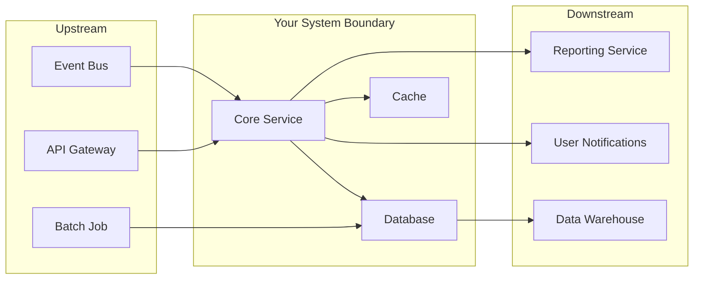

# System Ownership

> **One-line definition:** Knowing the full surface area of a system you are accountable for, including what it does, what depends on it, and what could go wrong.

## Why This Is a Senior Skill

A mid-level engineer may own a feature or a module. A senior engineer owns a **system boundary** — a service, a product area, or a subsystem — and is expected to understand it more deeply than anyone else on the team.

The difference is not technical skill alone. It is **accountability**: when something breaks at 3 AM, the senior engineer is the person the on-call team calls first, not because they wrote the code, but because they understand the system well enough to diagnose and direct the response.

## The Ownership Boundary

Every system has four surfaces you must know:

| Surface | What to know | How to verify |
|---|---|---|
| **Inputs** | Who sends data or requests to your system, in what format, at what volume | List every upstream caller or data source |
| **Outputs** | Who consumes your system's results and what they depend on | List every downstream consumer and their SLA expectations |
| **Dependencies** | External services, databases, queues, and third-party APIs your system relies on | Map every dependency with failure behavior |
| **State** | Where persistent data lives, how it changes, and what invariants must hold | Document every data store, its schema, and its consistency model |



## What a Senior Engineer Does Differently

### 1. Maintains a living system map

Not a one-time architecture diagram that goes stale. A senior engineer keeps a **current mental model** of:

- Every deployment environment (dev, staging, production)
- Every configuration that differs between environments
- Every scheduled job, cron, or background process
- Every alert, what it means, and what action it triggers
- The last three incidents and their root causes

### 2. Identifies the single points of failure

A senior engineer proactively asks:

- What happens if this dependency goes down for 30 minutes?
- What happens if this database runs out of disk space?
- What happens if this team member leaves and nobody else understands this component?
- What happens if traffic doubles overnight?

These are not theoretical questions. They are the basis of your risk register.

### 3. Defines ownership with the team

Ambiguous ownership is the most common cause of system neglect. A senior engineer ensures:

- Every component has a **named owner** (person, not team)
- Every dependency has a **contact** on the owning team
- On-call rotations cover the full system, not just the code
- Documentation exists for the most common operational tasks

### 4. Knows the system's history

Every system carries legacy decisions. A senior engineer understands:

- Why the architecture looks the way it does
- Which decisions were intentional and which were accidental
- What was tried before and why it was abandoned
- Which technical debts are intentional (accepted risk) versus unintentional (neglect)

## Ownership Handoff

One of the most important senior-level activities is **transferring ownership** cleanly. This happens when you move to a new team, go on leave, or promote a mid-level engineer into ownership of a subsystem.

A clean handoff includes:

| Item | Description |
|---|---|
| System map | Current architecture diagram with all four surfaces |
| Runbook | Operational procedures for common scenarios |
| Risk register | Known risks, their likelihood, and current mitigations |
| Debt inventory | Technical debts, their severity, and planned remediation |
| Contact list | Key people for dependencies, consumers, and stakeholders |
| Recent incidents | Last 3-5 incidents with root cause and corrective actions |
| Open work | In-progress changes, their status, and next steps |

## Practical Exercise

**Take your current primary system and complete this checklist:**

```markdown
## System: [Name]

### Inputs
- [ ] List all upstream callers (API, events, batch)
- [ ] Document expected request patterns (volume, frequency)

### Outputs
- [ ] List all downstream consumers
- [ ] Document their SLA expectations

### Dependencies
- [ ] List all external services and databases
- [ ] Note failure behavior for each (retry, fallback, fail-open)

### State
- [ ] List all data stores and their schemas
- [ ] Document data consistency requirements

### Risks
- [ ] Top 3 risks right now
- [ ] Current mitigations for each
```

## Knowledge Connections

- [[02_Lifecycle_Ownership]] — ownership extends beyond the code to the full lifecycle
- [[03_Technical_Debt_and_Maintainability]] — system ownership includes managing debt
- [[04_Production_Responsibility]] — system ownership includes production health
- [[software-engineering-note/07_Software_Maintenance/07_Maintenance_Fundamentals]] — maintenance fundamentals that underpin ownership
- [[software-engineering-note/08_Software_Configuration_Management/05_Release_and_Version_Management]] — version management as part of ownership

## Key Takeaways

- System ownership means knowing all four surfaces: inputs, outputs, dependencies, and state
- A senior engineer maintains a current mental model, not a stale diagram
- Ambiguous ownership causes system neglect: name the owner, not just the team
- A clean ownership handoff is one of the most valuable senior-level activities
- Your risk register is the practical output of system ownership
