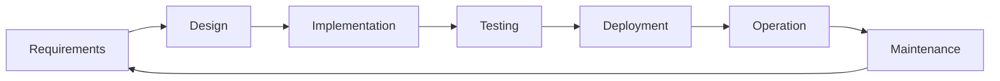

# Lifecycle Ownership

> **One-line definition:** Following your system from the initial problem statement through requirements, design, implementation, testing, deployment, operation, and eventual retirement.

## Why This Is a Senior Skill

A mid-level engineer typically participates in one or two lifecycle phases — usually implementation and testing. A senior engineer is expected to be **present and influential** across all phases, even when not doing the hands-on work.

The senior engineer's role is to ensure **continuity**: the problem that was identified in requirements is the same problem being solved in production six months later. Without lifecycle ownership, information degrades at every handoff.

## The Lifecycle from a Senior Engineer's Perspective

Each phase has a senior-level responsibility that goes beyond the task-level work:

| Phase | Mid-level role | Senior-level role |
|---|---|---|
| Requirements | Implement what is specified | Clarify the underlying problem, challenge assumptions, define acceptance conditions |
| Design | Build what is designed | Compare alternatives, document trade-offs, identify quality attribute risks |
| Implementation | Write code | Set standards, review critical paths, identify complexity early |
| Testing | Write and run tests | Define the test strategy, identify what must be tested vs. what can be sampled |
| Deployment | Deploy when ready | Ensure operational readiness, define rollback criteria, verify monitoring |
| Operation | Respond to alerts | Define SLIs/SLOs, analyze incident patterns, drive reliability improvements |
| Maintenance | Fix bugs as assigned | Manage technical debt strategically, plan evolution, prepare for retirement |

## The Continuity Problem

The most common failure in software projects is not a technical failure. It is a **continuity failure**: the team builds something that does not solve the original problem, or solves a problem that no longer exists by the time it ships.

Continuity breaks down at these handoff points:

### 1. Requirements to Design

The problem gets reframed during design without anyone noticing. A senior engineer prevents this by:

- Writing a clear **problem statement** before design begins
- Tracing every design decision back to a requirement or constraint
- Flagging when a design solves a different problem than the one identified

### 2. Design to Implementation

The design intent gets lost during implementation. A senior engineer prevents this by:

- Writing or reviewing the **design document** before coding starts
- Identifying the **critical implementation paths** that need extra attention
- Scheduling design reviews at key implementation milestones

### 3. Implementation to Testing

Testing validates the code, not the original intent. A senior engineer prevents this by:

- Ensuring tests cover the **acceptance conditions** from requirements, not just the implementation
- Reviewing test plans for **edge cases** that the requirements implied but the implementation may have missed

### 4. Deployment to Operation

The system works in staging but behaves differently in production. A senior engineer prevents this by:

- Defining **production readiness criteria** before deployment
- Verifying that monitoring, alerting, and runbooks exist before go-live
- Planning the **deployment strategy** (canary, blue-green, feature flags) based on risk

## Lifecycle Ownership in Practice

### The Requirements Traceability Mindset

A senior engineer does not need a formal requirements traceability matrix (though one can help). The mindset is:

> "For every feature in production, I can explain why it exists, what problem it solves, and how we know it works."

This is not bureaucratic. It is practical. When someone asks "why does this system do X?", you should be able to answer without searching through commit history.

### The Operational Readiness Review

Before any significant deployment, a senior engineer conducts or participates in an operational readiness review:

| Check | Question |
|---|---|
| Monitoring | Can we detect when this system is unhealthy? |
| Alerting | Will the right people be notified at the right time? |
| Runbooks | Do we have procedures for the most likely failure modes? |
| Rollback | Can we undo this deployment safely and quickly? |
| Capacity | Can this system handle expected load with headroom? |
| Security | Have we reviewed this for the most common attack patterns? |
| Data | Is data migration tested, reversible, and monitored? |
| Dependencies | Are all dependent services ready and aware of this change? |

### The Retirement Question

Lifecycle ownership includes knowing when a system should be **retired**, not just maintained. A senior engineer periodically evaluates:

- Is this system still solving the problem it was built for?
- Is the maintenance cost exceeding the value it delivers?
- Could a simpler system or a third-party service replace it?
- What is the cost of retirement (data migration, consumer notification, parallel running)?

## Practical Exercise

**For your current primary project, trace one feature from end to end:**

1. **What was the original problem?** Write it in one sentence.
2. **What requirement captured it?** Link to the requirement or user story.
3. **What design decision addressed it?** What alternative was considered?
4. **How was it implemented?** What was the critical implementation path?
5. **How was it tested?** What test validates the original problem is solved?
6. **How was it deployed?** What was the deployment risk and strategy?
7. **How is it monitored?** What alert tells you it is not working?
8. **Is it still needed?** Does the original problem still exist?

If you cannot answer any of these, that is a continuity gap in your lifecycle ownership.

## Knowledge Connections

- [[01_System_Ownership]] — lifecycle ownership applies to the system boundary you defined
- [[04_Production_Responsibility]] — the operation and maintenance phases in detail
- [[software-engineering-note/01_Software_Requirements/01_Requirements_Fundamentals]] — requirements fundamentals
- [[software-engineering-note/06_Software_Engineering_Operations/Software Engineering Operations Overview]] — operations and the DevOps lifecycle
- [[SEBoK v2 - Overview]] — SEBoK lifecycle models and processes

## Key Takeaways

- Lifecycle ownership means being present and influential across all phases, not just implementation
- Continuity failures are more common than technical failures: trace every feature back to the original problem
- Operational readiness reviews prevent deployment surprises
- Lifecycle ownership includes knowing when to retire a system, not just maintain it
- A senior engineer is the thread that connects the original problem to the production outcome
