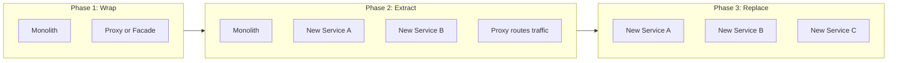

# Technical Debt and Maintainability

> **One-line definition:** Managing technical debt strategically rather than reactively, so the system remains maintainable and the team remains productive over time.

## Why This Is a Senior Skill

Every system accumulates technical debt. The difference between a mid-level and senior engineer is not that the senior engineer writes debt-free code. It is that the senior engineer **manages debt as a portfolio**, making conscious decisions about what to accept, what to pay down, and what to leave.

A mid-level engineer sees debt as something to fix. A senior engineer sees debt as a **financial instrument**: sometimes borrowing is the right decision, as long as you understand the interest rate and have a repayment plan.

## The Debt Taxonomy

Not all technical debt is the same. Classifying it helps you decide what to do about it:

| Type | Description | Typical action |
|---|---|---|
| **Prudent and deliberate** | Known shortcut taken to meet a deadline, with a plan to revisit | Schedule remediation when the deadline pressure passes |
| **Prudent and inadvertent** | Discovered after the fact: "now we understand the problem better" | Refactor when the next feature touches this area |
| **Reckless and deliberate** | "We don't have time for design, just ship it" with no plan | Flag as risk, negotiate remediation time |
| **Reckless and inadvertent** | Poor practices the team did not recognize at the time | Address through training and code review improvements |

The first two types are normal parts of software development. The last two are the ones that destroy team velocity over time.

## The Debt Inventory

A senior engineer maintains a **technical debt inventory** for their system. This is not a wishlist. It is a prioritized list with enough information to make decisions:

| Item | Impact if not addressed | Effort to fix | Risk of change | Priority |
|---|---|---|---|---|
| Legacy auth module using deprecated library | Security vulnerability exposure | 2-3 weeks | Medium: touches many call sites | High |
| Test coverage gaps in payment flow | Undetected regressions in critical path | 1 week | Low: additive only | High |
| Duplicated config across 3 services | Inconsistent behavior, manual sync errors | 3 days | Low | Medium |
| Monolithic reporting module | Slow to change, blocks independent deployment | 6-8 weeks | High: many consumers | Medium |
| Outdated dependency versions | Build failures, missing security patches | 1 week | Medium | Low |

## Making Debt Visible

The most important thing a senior engineer does with technical debt is **make it visible to decision-makers**. Engineers often understand the debt, but product managers and stakeholders do not see its cost.

### Translating debt into business terms

| Technical description | Business translation |
|---|---|
| "The auth module uses a deprecated library" | "We have a known security exposure that could require emergency patching" |
| "Test coverage is low in the payment flow" | "We risk a payment outage that could affect revenue" |
| "The reporting module is monolithic" | "Every reporting change takes 2 weeks instead of 2 days" |
| "Dependencies are outdated" | "Our build can break at any time from a transitive vulnerability" |

### The debt budget

Negotiate a **debt budget** with your product and project stakeholders: a fixed percentage of each sprint or quarter dedicated to debt reduction. Common allocations:

- **10-15%** for healthy systems: ongoing maintenance and small refactors
- **20-30%** for systems with significant accumulated debt: active paydown
- **40%+** for systems in crisis: the system is actively impeding feature delivery

The debt budget is not a separate project. It is embedded in regular sprint planning, tracked alongside feature work.

## The Maintainability Mindset

Maintainability is not a phase. It is a **continuous property** of the system. A senior engineer builds maintainability through:

### 1. Code review as investment

Every code review is an opportunity to either increase or decrease maintainability. A senior reviewer focuses on:

- **Readability:** Can a new engineer understand this in 5 minutes?
- **Testability:** Can this be tested in isolation?
- **Coupling:** Does this change increase or decrease dependencies between components?
- **Naming:** Do the names accurately describe what the code does?

### 2. Architectural seams

A maintainable system has clear **seams** — boundaries where you can change one part without affecting others. A senior engineer designs and protects these seams:

- Service boundaries that align with team ownership
- Interfaces that hide implementation details
- Event-driven communication that decouples producers from consumers
- Feature flags that allow safe experimentation without branching the codebase

### 3. Documentation as maintenance tool

Documentation is not a separate activity from maintenance. It is part of it. A senior engineer ensures:

- Every non-obvious design decision has a recorded rationale
- Every runbook is tested and current
- Every API has a contract that consumers can rely on
- Every onboarding path is validated by having a new engineer follow it

### 4. The Boy Scout Rule (with judgment)

"Leave the code better than you found it" is good advice, but a senior engineer applies it with judgment:

- **Do:** Fix naming, add missing tests, simplify a confusing function when you are already working in that area
- **Do not:** Start a large refactor in the middle of a feature delivery without planning and agreement
- **Do not:** "Improve" code that is working correctly and not changing, just because you would have written it differently

## The Debt Repayment Plan

For high-priority debt items, a senior engineer creates a **repayment plan**:

1. **Scope the work:** What exactly needs to change? What are the boundaries?
2. **Assess the risk:** What could go wrong during the change? What is the rollback plan?
3. **Break it into safe increments:** Can this be done in small, safe steps rather than one big bang?
4. **Get agreement:** Does the team and the stakeholders agree on the priority and timing?
5. **Execute and verify:** Make the change, verify it works, and update the debt inventory.

### The strangler fig pattern for large debt

For large monolithic components that need to be broken apart, the **strangler fig pattern** is the senior engineer's preferred approach:

Rather than rewriting the entire system, you gradually extract functionality into new components, routing traffic through a proxy until the old system can be retired.

## Practical Exercise

**Create a technical debt inventory for your current system:**

1. List the top 5 technical debts you are aware of
2. For each, estimate:
   - Impact if not addressed (high/medium/low)
   - Effort to fix (days/weeks/months)
   - Risk of making the change (high/medium/low)
3. Translate the top 2 into business terms
4. Propose a debt budget percentage for the next quarter
5. Create a repayment plan for the highest-priority item

## Knowledge Connections

- [[01_System_Ownership]] — debt inventory is part of your system map
- [[02_Lifecycle_Ownership]] — debt management spans the full lifecycle
- [[05_Decision_Ownership]] — accepting debt is a decision that should be recorded
- [[software-engineering-note/07_Software_Maintenance/01_Changing_Software]] — techniques for working with legacy code
- [[software-engineering-note/07_Software_Maintenance/05_Large_Scale_Changes]] — managing large-scale refactoring
- [[software-engineering-note/03_Software_Design/Software Design Note Overview]] — design principles that prevent debt accumulation
- [[software-engineering-note/15_Software_Engineering_Economics/Software Engineering Economics Overview]] — the economics of debt and refactoring

## Key Takeaways

- Technical debt is a financial instrument: sometimes borrowing is the right decision
- Classify debt into four types to decide what to do about it
- Maintain a prioritized debt inventory and translate it into business terms for stakeholders
- Negotiate a debt budget: a fixed percentage of each sprint for debt reduction
- Maintainability is continuous: code review, architectural seams, and documentation are daily practices
- Use the strangler fig pattern for large-scale debt repayment, not big-bang rewrites
