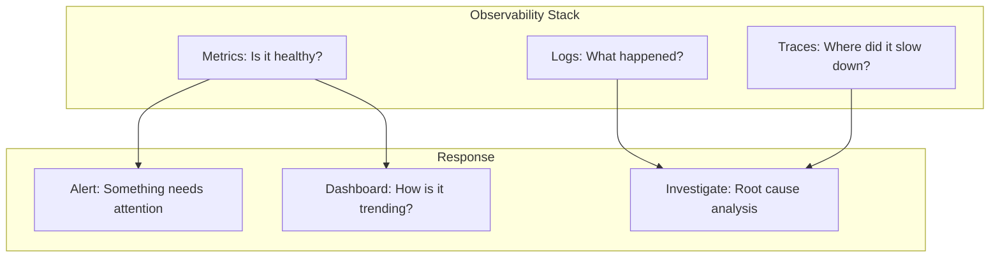

# Production Responsibility

> **One-line definition:** Being accountable for a system's health after it ships, not just until it passes testing.

## Why This Is a Senior Skill

A mid-level engineer's responsibility often ends when the code is merged and deployed. A senior engineer's responsibility **begins** at deployment. The system's behavior in production, under real load with real users, is the true measure of whether the work was done well.

Production responsibility is not about being on-call forever. It is about building the systems, processes, and team capabilities that make production health sustainable.

## The Production Mindset Shift

| Mid-level mindset | Senior mindset |
|---|---|
| "It works on my machine" | "It works in production under real conditions" |
| "The tests pass" | "The tests cover the failure modes that matter" |
| "It's deployed" | "It's deployed, monitored, and recoverable" |
| "That's ops' problem" | "That's my system's problem, and I need to help" |
| "I'll fix it tomorrow" | "I need to understand why it broke tonight" |

## The Three Pillars of Production Responsibility

### 1. Observability

You cannot be responsible for what you cannot see. A senior engineer ensures their system has:

**Metrics** — quantitative measures of system health:

| Metric type | What it tells you | Example |
|---|---|---|
| SLI (Service Level Indicator) | How the system is performing right now | Request latency p99 |
| Error rate | How often the system fails | 5xx responses as percentage of total |
| Saturation | How close the system is to its limits | CPU utilization, connection pool usage |
| Business metric | Whether the system is delivering value | Successful transactions per minute |

**Logs** — structured records of what happened:

- Every error with enough context to diagnose without reproducing
- Every significant state change (deployment, config change, scaling event)
- Correlation IDs that trace a request across service boundaries

**Traces** — end-to-end visibility across service boundaries:

- Request flow from entry point to final response
- Latency breakdown by service and operation
- Dependency call patterns and failure propagation



### 2. Incident Response

A senior engineer is not necessarily the person who resolves every incident. They are the person who ensures incidents are **handled well** and **learned from**.

**During an incident:**

| Role | Responsibility |
|---|---|
| Incident commander | Coordinates the response, makes decisions, communicates status |
| Investigator | Diagnoses the root cause, tests hypotheses |
| Communicator | Updates stakeholders, manages external communication |
| Scribe | Documents the timeline, actions taken, and observations |

A senior engineer may fill any of these roles, but their primary value is in **preparing the team** to handle incidents:

- Are runbooks written and tested?
- Does the on-call rotation have adequate coverage?
- Are escalation paths clear and tested?
- Does the team practice incident response (game days, chaos engineering)?

**After an incident:**

The incident review (post-mortem, retrospective) is where the senior engineer adds the most value:

1. **Timeline reconstruction:** What happened, when, and what did we do?
2. **Root cause analysis:** Not just "what broke" but "why did it break and why didn't we catch it sooner?"
3. **Corrective actions:** What will we change to prevent recurrence or reduce impact?
4. **Action ownership:** Who will do what by when?
5. **Follow-through:** Did the actions get completed and verified?

### 3. Reliability Engineering

Production responsibility is not just reactive. A senior engineer proactively improves reliability:

**Capacity planning:**

- Understand current utilization and growth trends
- Identify the breaking point of each component
- Plan capacity additions before limits are reached
- Test capacity assumptions with load testing

**Deployment safety:**

- Use progressive rollout strategies (canary, blue-green, feature flags)
- Define rollback criteria before deploying
- Automate rollback when error budgets are exceeded
- Separate deployment from release (deploy code without activating features)

**Dependency resilience:**

- Identify every external dependency and its failure mode
- Implement circuit breakers, timeouts, and fallbacks
- Test dependency failure scenarios regularly
- Have a plan for when each dependency is unavailable

**Error budgets:**

An error budget is the amount of unreliability you can tolerate before you stop shipping new features and focus on reliability. A senior engineer uses error budgets to:

- Make objective decisions about release readiness
- Balance feature velocity against reliability
- Communicate reliability trade-offs to stakeholders
- Trigger automatic reliability improvements when budgets are exhausted

## The On-Call Balance

Being on-call is part of production responsibility, but a senior engineer ensures it is **sustainable**:

| Unsustainable on-call | Sustainable on-call |
|---|---|
| Every alert wakes someone up | Alerts are tuned: only actionable issues page |
| The same person is always on-call | Rotation is fair and shared across the team |
| Incidents are resolved heroically | Incidents are resolved using runbooks and tools |
| Post-incident work is deprioritized | Corrective actions are tracked and completed |
| On-call load is not measured | On-call load is measured and used to improve the system |

## Production Readiness Checklist

Before any significant change reaches production, a senior engineer verifies:

```markdown
## Production Readiness: [Feature/Change Name]

### Monitoring
- [ ] Key metrics are defined and being collected
- [ ] Alerts are configured with appropriate thresholds
- [ ] Dashboards exist for operational visibility

### Resilience
- [ ] Failure modes are identified and tested
- [ ] Rollback procedure is documented and tested
- [ ] Dependencies have timeout and circuit breaker handling

### Operations
- [ ] Runbook exists for the most likely failure scenarios
- [ ] On-call team is aware of the change and its risks
- [ ] Escalation paths are clear

### Deployment
- [ ] Deployment strategy is appropriate for the risk level
- [ ] Progressive rollout is configured (canary, feature flag)
- [ ] Rollback can be executed within the required time

### Data
- [ ] Data migration is tested and reversible
- [ ] Data consistency is verified after deployment
- [ ] Backup and recovery procedures are current
```

## Practical Exercise

**For your current primary system, evaluate production readiness:**

1. What are your top 3 SLIs and their current values?
2. When was the last incident? What was the root cause? Were corrective actions completed?
3. What is your on-call load (pages per week)? Is it sustainable?
4. What is your deployment rollback time? Have you tested it recently?
5. What is your error budget policy? What happens when it is exhausted?

## Knowledge Connections

- [[01_System_Ownership]] — production responsibility applies to your system boundary
- [[02_Lifecycle_Ownership]] — production is one phase of the lifecycle you own
- [[03_Technical_Debt_and_Maintainability]] — debt affects production reliability
- [[software-engineering-note/06_Software_Engineering_Operations/08_Service_Operations_and_Support]] — operations fundamentals
- [[software-engineering-note/06_Software_Engineering_Operations/07_Capacity_and_Disaster_Recovery]] — capacity planning and disaster recovery
- [[software-engineering-note/06_Software_Engineering_Operations/01_The_Three_Ways]] — the Three Ways of DevOps

## Key Takeaways

- A senior engineer's responsibility begins at deployment, not ends there
- Observability has three pillars: metrics, logs, and traces — you need all three
- Incident reviews are where the most reliability improvement happens
- Reliability engineering is proactive: capacity planning, deployment safety, and dependency resilience
- On-call must be sustainable: measure the load and improve the system, not just endure it
- An error budget is the objective mechanism for balancing reliability against feature velocity
