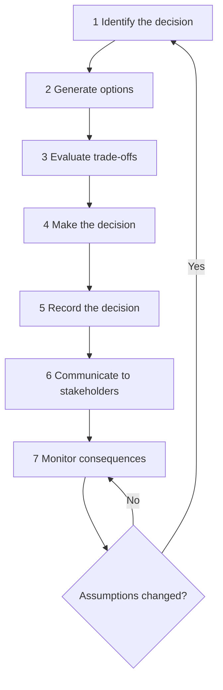
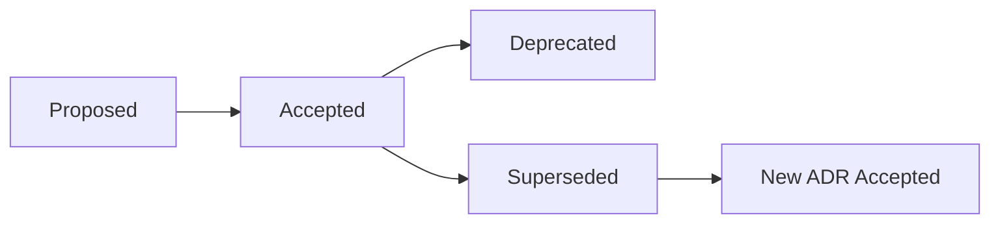

# Decision Ownership

> **One-line definition:** Making technical decisions deliberately, recording them so others can understand the reasoning, and standing behind the consequences.

## Why This Is a Senior Skill

A mid-level engineer implements decisions. A senior engineer **makes** them — and more importantly, **explains** them in a way that others can evaluate, challenge, and follow.

Decision ownership is not about being the person who always has the right answer. It is about being the person who ensures that:

1. The decision is made deliberately, not accidentally
2. The reasoning is recorded so future engineers can understand it
3. The consequences are monitored and the decision is revisited when assumptions change

## The Decision-Making Process

A senior engineer follows a consistent process for consequential decisions:



### Step 1: Identify the decision

Not every technical choice needs a formal process. A senior engineer distinguishes:

| Decision type | Examples | Process needed |
|---|---|---|
| **Routine** | Variable naming, minor refactoring, test structure | Code review is sufficient |
| **Consequential** | Database choice, API design, architectural pattern, build-vs-buy | Full decision process |
| **Strategic** | Platform direction, technology stack, multi-year investment | Full process plus stakeholder alignment |

The test: "Will someone in 6 months need to understand why we chose this?" If yes, it needs a record.

### Step 2: Generate options

A senior engineer resists the temptation to jump to the first reasonable option. Instead:

- Generate at least 2-3 credible alternatives
- Include the "do nothing" option when relevant
- Include the "simplest possible" option as a baseline
- Seek input from people with different perspectives (operations, security, product)

### Step 3: Evaluate trade-offs

Every option has trade-offs. A senior engineer makes them **explicit** using quality attributes:

| Quality attribute | Question to ask |
|---|---|
| Performance | How fast is it under expected and peak load? |
| Scalability | How does it behave when load grows 10x? |
| Reliability | What happens when components fail? |
| Security | What is the attack surface and exposure? |
| Maintainability | How easy is it to change in the future? |
| Cost | What is the total cost of ownership (infrastructure, licensing, engineering time)? |
| Time to deliver | How long until this is in production? |
| Team capability | Does the team have the skills to build and operate this? |

A simple evaluation matrix:

| Criterion | Weight | Option A | Option B | Option C |
|---|---|---|---|---|
| Performance | High | Good | Good | Excellent |
| Maintainability | High | Excellent | Fair | Good |
| Time to deliver | Medium | 2 weeks | 6 weeks | 4 weeks |
| Team capability | Medium | Team knows it | Learning curve | Team knows it |
| Cost | Low | Low | High | Medium |

### Step 4: Make the decision

A senior engineer does not wait for perfect information. They make the decision when:

- The options are understood well enough to compare
- The trade-offs are explicit
- The key stakeholders have been consulted
- The cost of delay exceeds the value of additional analysis

### Step 5: Record the decision

The Architecture Decision Record (ADR) is the primary tool for decision ownership.

## Architecture Decision Records

An ADR is a short document that captures a consequential decision. It is not a design document. It is a **decision log**.

### ADR template

```markdown
# ADR-NNN: [Decision Title]

## Status
[Proposed | Accepted | Deprecated | Superseded by ADR-XXX]

## Context
What is the issue or situation that motivates this decision?
What are the forces at play (technical, political, business)?

## Options Considered
1. [Option A]: [brief description]
2. [Option B]: [brief description]
3. [Option C]: [brief description]

## Decision
We will [chosen option].

## Consequences
### Positive
- [benefit 1]
- [benefit 2]

### Negative
- [trade-off 1]
- [trade-off 2]

### Risks
- [risk 1 and mitigation]
- [risk 2 and mitigation]

## Follow-up Actions
- [ ] [action 1 by whom by when]
- [ ] [action 2 by whom by when]
```

### Where to store ADRs

ADRs should live **with the code** they relate to:

- In the repository: `docs/adr/` or `docs/decisions/`
- Numbered sequentially: `ADR-001`, `ADR-002`, etc.
- Linked from the README or architecture documentation
- Reviewed as part of the pull request process

### ADR lifecycle



An ADR is never deleted. When a decision is overturned, the new ADR references the old one with "Supersedes ADR-NNN" and the old ADR is marked "Superseded by ADR-XXX."

## Standing Behind Your Decisions

Decision ownership means accepting the consequences:

### When the decision works well

- Share credit with the team who contributed options and analysis
- Document what worked so others can learn
- Identify what you would do differently next time

### When the decision does not work

- Acknowledge it openly and early
- Explain what changed (assumptions, constraints, information)
- Propose the corrective action
- Record the lesson in a new ADR that supersedes the original

The senior engineer who says "I made this decision, here is why, and here is what we will do now that our assumptions changed" earns more trust than the one who deflects or hides.

## Decision Anti-Patterns

| Anti-pattern | Description | What to do instead |
|---|---|---|
| **Accidental decision** | No one chose it; it just happened (default framework, first library found) | Make it explicit: is this a deliberate choice or a placeholder? |
| **Resume-driven development** | Chosen because it looks good on a resume, not because it fits the problem | Evaluate against quality attributes, not novelty |
| **Consensus paralysis** | Waiting for everyone to agree before moving forward | Consult widely, but one person makes the call |
| **Authority override** | A senior person dictates without explaining the reasoning | Require reasoning even from the most senior person |
| **Decision avoidance** | Delaying the decision until it becomes urgent | Set a decision deadline and stick to it |
| **Cargo culting** | Adopting what worked at another company without understanding the context | Evaluate whether the original context applies to yours |

## Practical Exercise

**Write an ADR for a decision you made or are about to make:**

1. Identify a consequential technical decision from your current work
2. Generate at least 2 alternatives you considered (or should have considered)
3. Evaluate them against at least 4 quality attributes
4. Write the ADR using the template above
5. Share it with your team for review
6. Store it in your repository's `docs/adr/` directory

**Bonus:** Find a decision in your system that was made accidentally (no one remembers why). Write a retrospective ADR that documents the current state and whether the decision should be revisited.

## Knowledge Connections

- [[01_System_Ownership]] — decisions are made within your system boundary
- [[02_Lifecycle_Ownership]] — decisions span the full lifecycle
- [[03_Technical_Debt_and_Maintainability]] — accepting debt is a decision that needs an ADR
- [[04_Production_Responsibility]] — production incidents often trace back to decisions
- [[06_Ownership_Evidence]] — ADRs are concrete evidence of senior-level judgment
- [[software-engineering-note/02_Software_Architecture/09_Evaluation_and_Governance]] — architecture evaluation and governance
- [[software-engineering-note/14_Software_Engineering_Professional_Practice/Professionalism of Software Engineering Overview]] — professional practice and communication

## Key Takeaways

- Distinguish routine, consequential, and strategic decisions: only the latter two need a formal process
- Generate at least 2-3 options before deciding: resist the first reasonable answer
- Make trade-offs explicit using quality attributes: performance, scalability, reliability, security, maintainability, cost
- Record consequential decisions in ADRs: they live with the code and are never deleted
- Decision ownership means standing behind the consequences, including when assumptions change
- Watch for decision anti-patterns: accidental decisions, resume-driven development, and consensus paralysis
