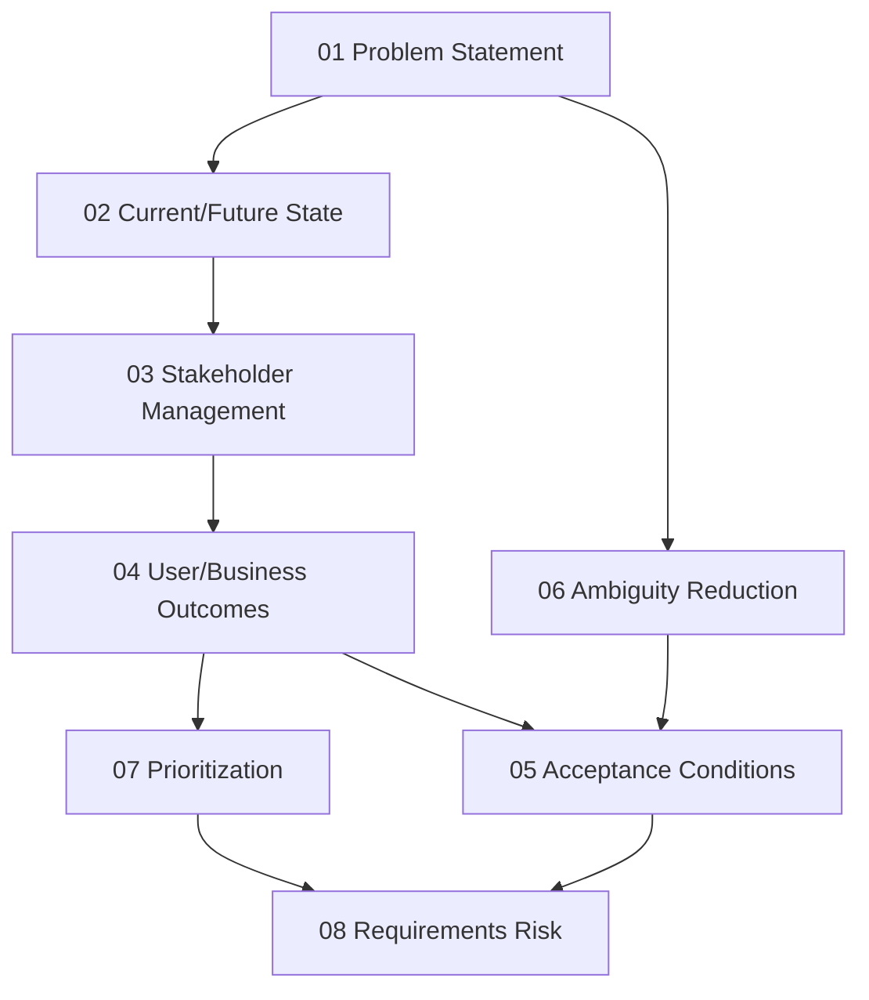

# Problem Framing and Requirements

> **Core idea:** A senior engineer defines the right problem before building a solution, reducing ambiguity through structured analysis rather than waiting for perfect clarity.

## What Problem Framing Means at Senior Level

A mid-level engineer implements solutions to well-defined problems. A senior engineer **defines the problem itself**, often when it is still ambiguous, contested, or poorly understood.

The most expensive mistake in software engineering is not a technical failure. It is building the wrong thing correctly. Problem framing is the senior engineer's primary defense against this.

Problem framing is not a phase that happens before "real work" begins. It is **continuous work** that spans the entire lifecycle. Requirements change. Stakeholders change their minds. The market shifts. A senior engineer keeps the problem definition current and aligned with reality.

## The Problem Framing Mindset

| Mid-level approach | Senior approach |
|---|---|
| "What should I build?" | "What problem are we solving and why?" |
| "Here are the requirements" | "Are these requirements solving the right problem?" |
| "The stakeholder wants X" | "What underlying need does X address?" |
| "The requirements are unclear" | "I will reduce the ambiguity through structured analysis" |
| "The scope changed" | "I will assess the impact and renegotiate priorities" |
| "This is not my responsibility" | "I will identify who needs to be involved and facilitate alignment" |

## Topic Notes

| # | Topic | Focus | Status | File |
|---|---|---|---|---|
| 01 | Problem Statement Definition | Framing the problem before jumping to solutions | ✅ Done | `01_Problem_Statement_Definition.md` |
| 02 | Current and Future State Analysis | Understanding where we are and where we need to be | ✅ Done | `02_Current_and_Future_State.md` |
| 03 | Stakeholder Identification and Management | Knowing who cares and what they need | ✅ Done | `03_Stakeholder_Management.md` |
| 04 | User and Business Outcomes | Connecting requirements to measurable value | ✅ Done | `04_User_and_Business_Outcomes.md` |
| 05 | Acceptance Conditions and Validation | Defining success before building | ✅ Done | `05_Acceptance_Conditions.md` |
| 06 | Ambiguity Reduction | Making progress when requirements are unclear | ✅ Done | `06_Ambiguity_Reduction.md` |
| 07 | Prioritization and Trade-offs | Deciding what matters most | ✅ Done | `07_Prioritization.md` |
| 08 | Requirements Risk Management | Identifying and mitigating requirement-related risks | ✅ Done | `08_Requirements_Risk.md` |

**Completion:** 8/8 : 100%

## How the Topics Connect

**Reading order:** Start with Problem Statement Definition to learn how to frame the problem. Then Current/Future State to understand the gap. Stakeholder Management and User/Business Outcomes can be read in either order. Acceptance Conditions defines success. Ambiguity Reduction, Prioritization, and Requirements Risk address the challenges you will face.

## Existing Vault Anchors

These topic notes **do not duplicate** the existing knowledge base. They layer senior-level application on top of it:

| Senior topic | Existing foundation notes |
|---|---|
| Problem Statement Definition | [[software-engineering-note/01_Software_Requirements/01_Requirements_Fundamentals]], [[body-of-knowledge/BABOK/04_Strategy_Analysis]] |
| Current and Future State | [[body-of-knowledge/BABOK/04_Strategy_Analysis]] (Analyze Current State, Define Future State) |
| Stakeholder Management | [[software-engineering-note/01_Software_Requirements/03_Requirements_Elicitation]], [[body-of-knowledge/BABOK/02_Elicitation_and_Collaboration]] |
| User and Business Outcomes | [[software-engineering-note/01_Software_Requirements/02_Business_and_User_Requirements]] |
| Acceptance Conditions | [[software-engineering-note/01_Software_Requirements/13_ATDD_BDD_and_Acceptance]] |
| Ambiguity Reduction | [[software-engineering-note/01_Software_Requirements/07_Quality_and_Prototyping]] |
| Prioritization | [[software-engineering-note/01_Software_Requirements/08_Prioritization_Validation_and_Reuse]] |
| Requirements Risk | [[software-engineering-note/01_Software_Requirements/11_Tools_Process_Improvement_and_Risk]] |

## Self-Assessment Checklist

Use this to gauge your current level of problem framing skill:

- [ ] I can write a problem statement that does not mention a solution
- [ ] I have identified the current state and future state for my current project
- [ ] I know who my top 5 stakeholders are and what they each need
- [ ] I can connect every feature to a measurable user or business outcome
- [ ] I have defined acceptance conditions before implementation began
- [ ] I have a technique for reducing ambiguity when requirements are unclear
- [ ] I have facilitated a prioritization session with conflicting stakeholders
- [ ] I have identified and mitigated a requirements-related risk before it became a problem

## Related

- [[00_overview|Senior Software Engineer Overview]]
- [[01_Technical_Ownership/00_overview|Technical Ownership]] : problem framing is the first phase of lifecycle ownership
- [[career-path/04_Engineering_Manager/00_overview|Engineering Manager]] : at EM level, problem framing expands to team and organizational problems
- [[career-path/06_Product_Manager/00_overview|Product Manager]] : product managers and senior engineers collaborate closely on problem framing
