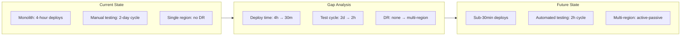

# Current and Future State Analysis

> **One-line definition:** Understanding where the system, process, or organization is today and defining where it needs to be, so the team can design a path that closes the gap.

## Why This Is a Senior Skill

A mid-level engineer works within the current state. A senior engineer **understands the current state well enough to change it** and **defines the future state clearly enough to reach it**.

Without current state analysis, you build solutions that do not fit the existing environment. Without future state definition, you build solutions that do not reach the desired outcome. A senior engineer does both before design begins.

## Current State Analysis

### What to understand about the current state

| Dimension | Questions to answer | How to gather the information |
|---|---|---|
| **Technical** | What systems, services, and infrastructure exist? How are they connected? What are their limitations? | Architecture diagrams, dependency maps, infrastructure inventory |
| **Process** | How does work flow today? Where are the bottlenecks? What manual steps exist? | Process maps, cycle time metrics, team interviews |
| **People** | Who is involved? What are their skills, roles, and pain points? | Stakeholder interviews, team surveys, observation |
| **Data** | What data exists? Where does it live? How does it flow? What is its quality? | Data dictionaries, data flow diagrams, quality metrics |
| **Business** | What are the current costs, revenues, and user satisfaction levels? | Financial reports, user metrics, support ticket analysis |

### The current state is not static

A common mistake is treating the current state as a snapshot that stays valid throughout the project. In reality:

- Other teams are making changes that affect your current state
- User behavior is evolving
- The market is shifting
- Technical debt is accumulating or being paid down

A senior engineer **updates the current state understanding** as the project progresses, not just at the beginning.

### Current state documentation

The current state should be documented at a level of detail that supports decision-making, not exhaustive completeness:

**Sufficient for decision-making:**

- High-level architecture showing key components and their interactions
- Process flow for the most common 2-3 scenarios
- List of known limitations and pain points
- Key metrics (latency, throughput, error rate, cost)
- Stakeholder roles and responsibilities

**Excessive for most projects:**

- Every configuration parameter and environment variable
- Every edge case and exception path
- Complete data schema with every field and constraint
- Full history of every decision that led to the current state

The test: "Can someone new to the project understand the current state well enough to contribute in their first week?" If yes, the documentation is sufficient.

## Future State Definition

### What to define about the future state

| Dimension | Questions to answer | How to make it measurable |
|---|---|---|
| **Technical** | What should the system look like? What capabilities should it have? | Architecture target state, capability checklist |
| **Process** | How should work flow? What should be automated? | Target process maps, automation coverage metrics |
| **People** | What skills will be needed? How will roles change? | Skills matrix, role definitions, training plan |
| **Data** | What data will be needed? How will it be managed? | Target data model, quality targets, governance model |
| **Business** | What outcomes should be achieved? | Target metrics (revenue, cost, satisfaction, conversion) |

### The future state is a target, not a blueprint

A common mistake is defining the future state as a detailed technical blueprint ("we will use service mesh with Istio and Kafka for event streaming"). This locks the team into a specific implementation before they understand the trade-offs.

A senior engineer defines the future state as **outcomes and capabilities**, not specific technologies:

**Good future state definition:**

- "The system handles 10x current traffic with sub-200ms latency (p99)"
- "Deployment cycle time is under 30 minutes with automated rollback"
- "Users can complete the checkout flow in under 2 minutes on mobile"
- "Support ticket volume related to order processing is reduced by 60%"

**Bad future state definition:**

- "We will use Kubernetes with Istio service mesh and Kafka for event streaming"
- "We will rewrite the frontend in React with TypeScript"
- "We will migrate to PostgreSQL from MySQL"

The first set describes outcomes. The second set describes implementation choices. Outcomes belong in the future state definition. Implementation choices belong in the design phase.

### The future state must be achievable

A senior engineer ensures the future state is:

- **Measurable:** Every aspect can be verified with data, not opinions
- **Achievable:** The team has the skills, time, and resources to reach it
- **Aligned:** It addresses the problem statement and stakeholder needs
- **Bounded:** It has a clear scope and does not try to solve every problem

If the future state is not achievable, the senior engineer raises this early: "Given our constraints, we can reach 70% of this target. Should we adjust the target or the constraints?"

## The Gap Analysis

The gap between current and future state is where the work happens. A senior engineer conducts a gap analysis to identify what needs to change:

### Gap analysis template

| Capability | Current state | Future state | Gap | Priority | Effort | Risk |
|---|---|---|---|---|---|---|
| Deployment | 4-hour manual deploy | Sub-30min automated deploy | CI/CD pipeline, automated tests, rollback automation | High | 6 weeks | Medium |
| Testing | 2-day manual test cycle | 2-hour automated test cycle | Test automation framework, test data management, parallel execution | High | 8 weeks | High |
| Disaster recovery | Single region, no DR | Multi-region active-passive | Infrastructure replication, data synchronization, failover automation | Medium | 12 weeks | High |

### Prioritizing the gaps

Not all gaps are equal. A senior engineer prioritizes based on:

- **Impact:** How much does closing this gap contribute to the desired outcomes?
- **Effort:** How much work is required to close it?
- **Risk:** What could go wrong if we do not close it, or if we close it incorrectly?
- **Dependencies:** Does closing this gap enable or block other gaps?

The priority matrix:

| | Low effort | High effort |
|---|---|---|
| **High impact** | Do first (quick wins) | Plan carefully (strategic investments) |
| **Low impact** | Do if time permits (fill-ins) | Skip or defer (avoid) |

## Current and Future State in Agile

In agile projects, current and future state analysis is not a one-time phase. It is continuous:

- **Sprint planning:** Review the current state of the product and refine the future state for the next increment
- **Retrospectives:** Assess whether the current state is moving toward the future state
- **Roadmap reviews:** Update the future state definition based on what has been learned

A senior engineer ensures the team does not lose sight of the future state while focusing on the current sprint. The question is always: "Is this increment moving us toward the target?"

## Practical Exercise

**For your current project:**

1. **Current state:** Document the current state across the five dimensions (technical, process, people, data, business). Use one paragraph per dimension.

2. **Future state:** Define the future state as measurable outcomes, not implementation choices. Write 3-5 outcome statements.

3. **Gap analysis:** Identify the top 3-5 gaps between current and future state. For each, estimate impact, effort, risk, and priority.

4. **Validation:** Share the current state, future state, and gap analysis with a stakeholder. Ask: "Does this accurately describe where we are and where we need to be?"

**Bonus:** Find a project from the past year that did not reach its intended outcome. Conduct a retrospective gap analysis. What gaps were not closed? Why?

## Knowledge Connections

- [[01_Problem_Statement_Definition]] : the problem statement defines the gap between current and future state
- [[03_Stakeholder_Management]] : stakeholders have different views of the current state and different priorities for the future state
- [[07_Prioritization]] : gap analysis feeds prioritization decisions
- [[body-of-knowledge/BABOK/04_Strategy_Analysis]] : BABOK strategy analysis (analyze current state, define future state, assess risks, define change strategy)
- [[software-engineering-note/01_Software_Requirements/01_Requirements_Fundamentals]] : requirements fundamentals

## Key Takeaways

- Current state analysis answers "where are we now?" across five dimensions: technical, process, people, data, business
- Future state definition answers "where do we need to be?" as measurable outcomes, not implementation choices
- Gap analysis identifies what needs to change and prioritizes based on impact, effort, risk, and dependencies
- The current state is not static: update your understanding as the project progresses
- In agile, current and future state analysis is continuous, not a one-time phase
