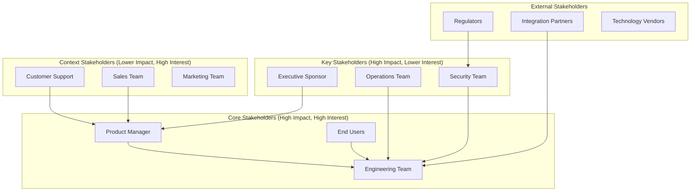

# Stakeholder Identification and Management

> **One-line definition:** Knowing who cares about the problem, what they each need, and how to align their interests so the team can build something that works for everyone.

## Why This Is a Senior Skill

A mid-level engineer implements requirements handed to them. A senior engineer **identifies the stakeholders** who should have input, **elicits their needs**, and **manages conflicts** when those needs clash.

Stakeholders are not just the people who sign the checks. They are anyone who:

- Is affected by the system (users, customers, support staff)
- Has authority over the system (product managers, executives, regulators)
- Has knowledge the team needs (domain experts, operations staff, other engineers)
- Can block or enable the project (legal, security, compliance, other teams)

Missing a key stakeholder is one of the most expensive mistakes in requirements engineering. You discover their needs late, after you have already built something that does not work for them.

## Stakeholder Identification

### The stakeholder map

A senior engineer creates a stakeholder map early in the project:

### The stakeholder identification checklist

For any significant project, identify stakeholders across these categories:

**Direct stakeholders:**
- [ ] End users (who will use the system daily)
- [ ] Product manager (who defines the product direction)
- [ ] Engineering team (who will build and maintain it)
- [ ] Operations team (who will deploy and operate it)

**Indirect stakeholders:**
- [ ] Customer support (who will handle user issues)
- [ ] Sales and marketing (who will sell and promote it)
- [ ] Finance (who will track costs and revenue)
- [ ] Legal and compliance (who will ensure regulatory adherence)

**Technical stakeholders:**
- [ ] Security team (who will review and approve security)
- [ ] Architecture team (who will review design decisions)
- [ ] Other engineering teams (whose systems you depend on or who depend on you)
- [ ] Infrastructure team (who provides the platform you build on)

**External stakeholders:**
- [ ] Customers or clients (if different from end users)
- [ ] Regulators (if the system handles regulated data or activities)
- [ ] Integration partners (if the system connects to external systems)
- [ ] Vendors (if the system depends on third-party services)

### The power-interest grid

Not all stakeholders require the same level of engagement. A senior engineer uses a power-interest grid to prioritize:

| | Low interest | High interest |
|---|---|---|
| **High power** | Keep satisfied (minimal updates, address concerns quickly) | Manage closely (regular engagement, active collaboration) |
| **Low power** | Monitor (occasional updates, no active engagement needed) | Keep informed (regular updates, solicit feedback) |

**High power, high interest:** These stakeholders can make or break the project. Engage them actively and frequently.

**High power, low interest:** These stakeholders do not need daily involvement, but they can block the project if they become unhappy. Keep them satisfied with periodic updates and address their concerns immediately.

**Low power, high interest:** These stakeholders care deeply but have limited authority. Keep them informed and listen to their input. They often have valuable insights.

**Low power, low interest:** These stakeholders have minimal impact. Monitor them with occasional updates but do not invest significant engagement effort.

## Stakeholder Elicitation

### The elicitation plan

Once stakeholders are identified, a senior engineer plans how to elicit their needs:

| Stakeholder | Elicitation method | Frequency | Output |
|---|---|---|---|
| End users | User interviews, usability testing | Bi-weekly | User stories, pain points, feature requests |
| Product manager | Weekly sync, roadmap reviews | Weekly | Prioritized requirements, acceptance criteria |
| Operations team | Operational readiness reviews | Per release | Operational requirements, runbooks |
| Security team | Security reviews, threat modeling | Per feature | Security requirements, threat mitigations |
| Other engineering teams | Architecture reviews, dependency discussions | As needed | Interface contracts, integration requirements |

### Elicitation techniques

Different stakeholders require different approaches:

**Interviews (one-on-one):**
- Best for: Understanding individual perspectives, sensitive topics, detailed technical discussions
- Senior engineer role: Ask open-ended questions, listen for underlying needs, probe for constraints

**Workshops (group sessions):**
- Best for: Aligning multiple stakeholders, resolving conflicts, brainstorming solutions
- Senior engineer role: Facilitate discussion, ensure all voices are heard, document agreements

**Observation (watching users work):**
- Best for: Understanding actual workflows (not just what people say they do), identifying pain points
- Senior engineer role: Observe without interrupting, ask clarifying questions afterward

**Surveys (structured questionnaires):**
- Best for: Gathering input from many stakeholders, quantifying preferences
- Senior engineer role: Design clear questions, analyze responses, identify patterns

**Prototypes (working models):**
- Best for: Validating assumptions, getting concrete feedback, reducing ambiguity
- Senior engineer role: Build quick prototypes, test with stakeholders, iterate based on feedback

### The hidden stakeholder problem

The most dangerous stakeholders are the ones you do not identify until late in the project. Common hidden stakeholders:

- **The team that owns the system you are integrating with:** They have their own roadmap, constraints, and priorities
- **The compliance team:** They have regulatory requirements that must be met, even if no one mentioned them
- **The users in a different region:** They have different needs, constraints, or regulatory requirements
- **The operations team in a different time zone:** They will be paged when your system breaks at 3 AM their time

A senior engineer actively searches for hidden stakeholders by asking:

- "Who else will be affected by this system?"
- "Who owns the systems we depend on?"
- "Who will be responsible for operating this?"
- "Are there regulatory or compliance requirements we need to consider?"

## Stakeholder Management

### Managing conflicting needs

Stakeholders often have conflicting needs:

- Users want more features; operations wants stability
- Product wants fast delivery; security wants thorough review
- Sales wants customization; engineering wants simplicity

A senior engineer does not ignore conflicts. They **surface them early** and **facilitate resolution**:

1. **Acknowledge the conflict:** "We have two valid but competing needs here"
2. **Understand the underlying interests:** "Why is this important to you? What outcome are you trying to achieve?"
3. **Explore trade-offs:** "If we prioritize X, what is the impact on Y?"
4. **Seek alignment:** "Is there a solution that addresses both needs, even partially?"
5. **Escalate when necessary:** "This is a strategic decision that needs executive input"

### The stakeholder communication plan

A senior engineer ensures stakeholders receive the information they need, when they need it:

| Stakeholder | Information needed | Format | Frequency |
|---|---|---|---|
| Executive sponsor | Progress against goals, risks, blockers | Dashboard, monthly report | Monthly |
| Product manager | Feature status, technical constraints, trade-offs | Weekly sync, Slack updates | Weekly |
| Engineering team | Requirements, design decisions, dependencies | Daily standup, design docs | Daily |
| Operations team | Deployment plans, operational procedures, incidents | Runbooks, incident reports | Per release |
| End users | Release notes, known issues, feedback channels | Release notes, user forums | Per release |

### Building stakeholder trust

Trust is the foundation of effective stakeholder management. A senior engineer builds trust by:

- **Being transparent:** Share bad news early, do not hide problems
- **Following through:** Do what you say you will do, when you say you will do it
- **Listening actively:** Show that you understand their concerns, even when you cannot address them immediately
- **Managing expectations:** Be realistic about what is possible, do not overpromise
- **Delivering value:** Demonstrate progress regularly, not just at the end

## Practical Exercise

**For your current project:**

1. **Identify stakeholders:** Use the stakeholder identification checklist. List every stakeholder you can think of.

2. **Create a stakeholder map:** Place each stakeholder on the power-interest grid. Identify your top 5 stakeholders.

3. **Plan elicitation:** For your top 5 stakeholders, define the elicitation method, frequency, and expected output.

4. **Identify conflicts:** List any conflicts you are aware of between stakeholder needs. How will you address them?

5. **Search for hidden stakeholders:** Ask the questions in the hidden stakeholder section. Who did you miss?

**Bonus:** Find a project from the past year where a stakeholder was identified too late. What was the impact? How could it have been avoided?

## Knowledge Connections

- [[01_Problem_Statement_Definition]] : stakeholders have different views of what the problem is
- [[02_Current_and_Future_State]] : stakeholders have different priorities for the future state
- [[04_User_and_Business_Outcomes]] : user and business outcomes are defined with stakeholder input
- [[07_Prioritization]] : stakeholder input feeds prioritization decisions
- [[software-engineering-note/01_Software_Requirements/03_Requirements_Elicitation]] : requirements elicitation techniques
- [[body-of-knowledge/BABOK/02_Elicitation_and_Collaboration]] : BABOK elicitation and collaboration

## Key Takeaways

- Stakeholders are anyone affected by, authoritative over, knowledgeable about, or able to block the project
- Use a stakeholder map and power-interest grid to identify and prioritize stakeholders
- Plan elicitation methods appropriate to each stakeholder (interviews, workshops, observation, surveys, prototypes)
- Actively search for hidden stakeholders before they surprise you late in the project
- Manage conflicts by surfacing them early, understanding underlying interests, and facilitating resolution
- Build trust through transparency, follow-through, active listening, expectation management, and value delivery
