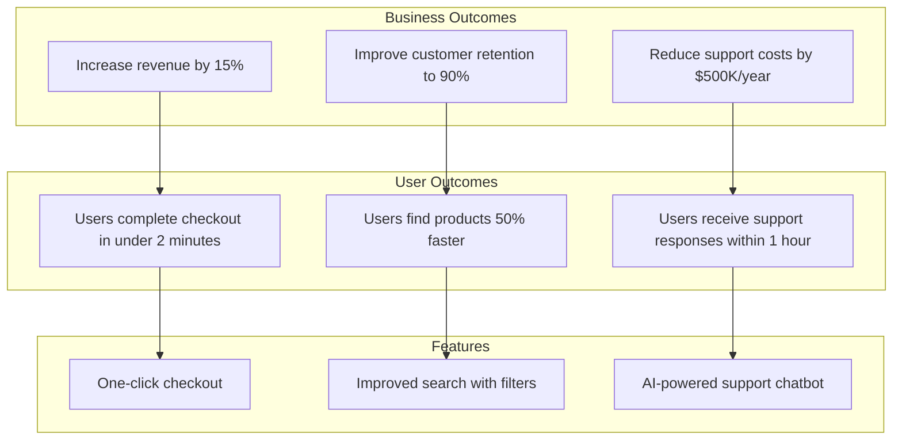

# User and Business Outcomes

> **One-line definition:** Connecting every requirement to a measurable user or business outcome, so the team knows why they are building each feature and how to verify it delivers value.

## Why This Is a Senior Skill

A mid-level engineer implements features. A senior engineer ensures features **deliver measurable value**.

The difference is not technical. It is about understanding why a feature exists and how success will be measured. A mid-level engineer asks "what should I build?" A senior engineer asks "what outcome are we trying to achieve, and how will we know we achieved it?"

Features without clear outcomes lead to:

- Building things no one uses
- Inability to measure success
- Scope creep (if we do not know what success looks like, we keep adding features)
- Wasted engineering effort on low-value work

## The Outcome Hierarchy

Outcomes exist at three levels:



### Business outcomes

Business outcomes are the **ultimate reason** the project exists. They are measured in business terms:

- Revenue (increases, new streams, conversion rates)
- Cost (reductions in infrastructure, support, operations)
- Risk (reductions in security exposure, compliance violations, outages)
- Market position (market share, competitive advantage, brand perception)

### User outcomes

User outcomes are **what users can do** after the system is built that they could not do before (or could not do well). They are measured in user behavior:

- Task completion (time, success rate, error rate)
- Satisfaction (NPS, CSAT, user feedback)
- Adoption (usage rates, feature adoption, retention)
- Efficiency (time saved, steps reduced, automation coverage)

### Features

Features are **what the system does** to enable user outcomes. They are the implementation, not the outcome.

## Connecting Features to Outcomes

### The outcome traceability matrix

A senior engineer ensures every feature traces back to a user outcome and a business outcome:

| Feature | User outcome | Business outcome | Success metric |
|---|---|---|---|
| One-click checkout | Users complete checkout in under 2 minutes | Increase revenue by 15% through higher conversion | Checkout completion time (p95) < 2 min, conversion rate increase |
| Improved search | Users find products 50% faster | Improve customer retention to 90% through better experience | Search time (p95) < 5 sec, repeat purchase rate |
| AI chatbot | Users receive support responses within 1 hour | Reduce support costs by $500K/year through automation | First response time < 1 hour, support ticket volume reduction |

### The "so what?" test

For every feature, apply the "so what?" test:

```
Feature: "We need to add a cache layer"
So what? → "The API will be faster"
So what? → "Users will experience lower latency"
So what? → "Users will complete tasks faster"
So what? → "Conversion rate will increase"
So what? → "Revenue will increase by an estimated 5%"

Outcome: Increase revenue by 5% through improved API performance
```

If you cannot trace a feature to a business outcome through a chain of "so what?" questions, the feature may not be worth building.

### The feature vs. outcome confusion

A common mistake is confusing features with outcomes:

| Feature (what we build) | Outcome (what we achieve) |
|---|---|
| "Add a dashboard" | "Operations team detects issues 80% faster" |
| "Implement OAuth" | "Users can log in with existing accounts, reducing signup friction" |
| "Migrate to microservices" | "Teams can deploy independently, reducing cycle time by 60%" |
| "Add real-time notifications" | "Users respond to events 5x faster, improving engagement" |

The first column describes what to build. The second column describes why it matters. A senior engineer ensures the team focuses on outcomes, not just features.

## Defining Measurable Outcomes

### The outcome statement template

A well-defined outcome has four components:

| Component | Question it answers | Example |
|---|---|---|
| **Who** | Which user or stakeholder? | "Mobile users in Southeast Asia" |
| **What** | What will they be able to do? | "Complete checkout in under 2 minutes" |
| **How much** | What is the target improvement? | "50% faster than current 4-minute average" |
| **By when** | When should this be achieved? | "Within 3 months of launch" |

**Complete outcome statement:** "Mobile users in Southeast Asia complete checkout in under 2 minutes (50% faster than current 4-minute average) within 3 months of launch"

### The SMART criteria for outcomes

Outcomes should be:

- **Specific:** Clearly defined, not vague ("improve performance" is vague; "reduce page load time to under 2 seconds" is specific)
- **Measurable:** Quantifiable with data, not opinions ("users are happier" is not measurable; "NPS increases from 30 to 50" is measurable)
- **Achievable:** Realistic given constraints ("100% uptime" is not achievable; "99.9% uptime" is achievable)
- **Relevant:** Aligned with business and user needs ("faster page loads" is relevant if users complain about speed; not relevant if they complain about missing features)
- **Time-bound:** Has a deadline ("improve conversion" is open-ended; "improve conversion by 10% within 6 months" is time-bound)

### The outcome validation checklist

Before accepting an outcome, verify:

- [ ] The outcome is measurable with data, not opinions
- [ ] The outcome traces to a business need
- [ ] The outcome is achievable given constraints (time, budget, skills)
- [ ] The outcome has a clear success metric and target
- [ ] The outcome has a deadline or timeframe
- [ ] Key stakeholders agree on the outcome

## Outcome-Driven Development

### Starting with outcomes, not features

A senior engineer advocates for outcome-driven development:

**Feature-driven (common but problematic):**
1. Product manager defines features
2. Engineering team implements features
3. Team ships features
4. Hope that features deliver value

**Outcome-driven (senior engineer approach):**
1. Product manager and engineering define outcomes together
2. Team explores multiple feature options to achieve outcomes
3. Team implements the best option based on trade-offs
4. Team measures whether outcomes were achieved
5. Team iterates if outcomes were not achieved

### The outcome review

After shipping a feature, a senior engineer ensures the team reviews whether the outcome was achieved:

| Question | How to answer |
|---|---|
| Did we achieve the target metric? | Compare pre-launch and post-launch metrics |
| If not, why not? | Analyze user behavior, technical performance, market changes |
| What did we learn? | Document insights for future projects |
| Do we need to iterate? | Decide whether to adjust the feature, try a different approach, or move on |

### The outcome pivot

Sometimes a feature achieves the user outcome but not the business outcome, or vice versa. A senior engineer recognizes when to pivot:

**Example:**
- Feature: Improved search with filters
- User outcome achieved: Users find products 50% faster ✓
- Business outcome not achieved: Customer retention did not improve ✗

**Analysis:** Faster search did not improve retention because the real retention driver was product quality, not search speed.

**Pivot:** Shift focus from search improvements to product quality improvements (reviews, ratings, quality assurance).

## Practical Exercise

**For your current project:**

1. **List the top 3 features** you are working on or planning

2. **For each feature, apply the "so what?" test:** Trace it to a user outcome and a business outcome

3. **Write outcome statements** using the four-component template (who, what, how much, by when)

4. **Validate the outcomes** using the SMART criteria and validation checklist

5. **Plan outcome measurement:** How will you measure whether the outcomes were achieved? What metrics will you track?

**Bonus:** Find a feature from the past year that was shipped but did not deliver the expected value. Conduct an outcome review. What was the actual outcome? Why was it not achieved? What would you do differently?

## Knowledge Connections

- [[01_Problem_Statement_Definition]] : outcomes address the problem statement's desired state
- [[02_Current_and_Future_State]] : outcomes define the future state in measurable terms
- [[03_Stakeholder_Management]] : stakeholders define and prioritize outcomes
- [[05_Acceptance_Conditions]] : acceptance conditions verify that outcomes were achieved
- [[07_Prioritization]] : outcomes drive prioritization decisions
- [[software-engineering-note/01_Software_Requirements/02_Business_and_User_Requirements]] : business and user requirements
- [[body-of-knowledge/BABOK/04_Strategy_Analysis]] : BABOK strategy analysis and business goals

## Key Takeaways

- Outcomes exist at three levels: business outcomes, user outcomes, and features
- Every feature should trace to a user outcome and a business outcome
- Apply the "so what?" test to connect features to outcomes
- Define outcomes using the SMART criteria: specific, measurable, achievable, relevant, time-bound
- Practice outcome-driven development: start with outcomes, explore feature options, measure results
- Review outcomes after shipping to learn and iterate
