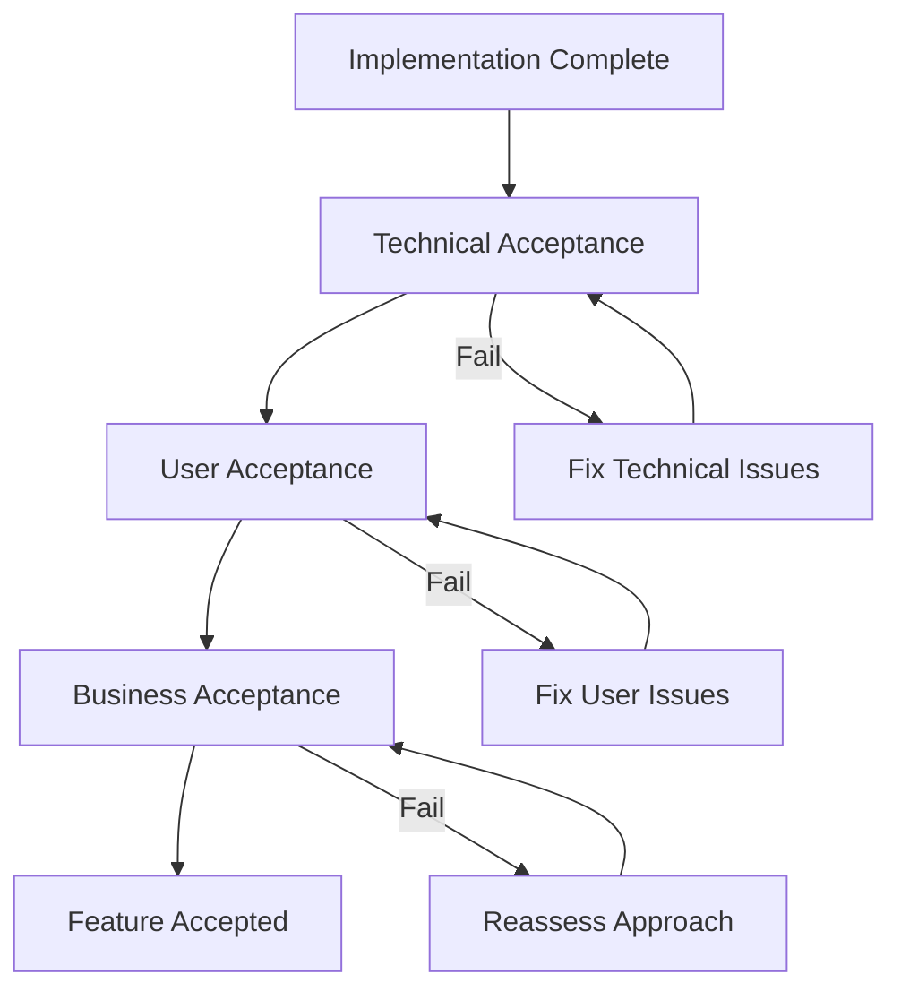

# Acceptance Conditions and Validation

> **One-line definition:** Defining how success will be verified before implementation begins, so the team builds something that can be objectively validated.

## Why This Is a Senior Skill

A mid-level engineer implements requirements and trusts that testing will catch problems. A senior engineer **defines acceptance conditions before design begins**, ensuring that the team and stakeholders share a clear understanding of what "done" means.

Without acceptance conditions:

- Stakeholders reject work that meets the written requirements but not their unstated expectations
- Testing focuses on whether the code works, not whether it delivers the intended outcome
- Disputes arise over whether a feature is complete
- The team ships something that technically works but does not solve the problem

Acceptance conditions bridge the gap between requirements and validation. They answer: "How will we know this is done and done correctly?"

## The Acceptance Condition Framework

### Three levels of acceptance

Acceptance operates at three levels, each with different conditions:

| Level | Question it answers | Who defines it | Who validates it |
|---|---|---|---|
| **Business acceptance** | Does this deliver the business outcome? | Product manager, executive sponsor | Business metrics review after launch |
| **User acceptance** | Does this solve the user's problem? | Product manager, user representatives | User acceptance testing, usability testing |
| **Technical acceptance** | Does this meet quality and operational standards? | Engineering team, operations, security | Code review, automated tests, operational readiness review |

All three levels must be satisfied for a feature to be truly "done."

### The acceptance condition template

For each feature or requirement, define acceptance conditions using this structure:

```markdown
## Feature: [Feature Name]

### Business Acceptance
- [ ] [Business metric] reaches [target value] within [timeframe]
- [ ] [Business outcome] is achieved as measured by [metric]

### User Acceptance
- [ ] User can [task] in [time/steps] with [success rate]
- [ ] User reports [satisfaction level] on [feedback mechanism]

### Technical Acceptance
- [ ] All automated tests pass (unit, integration, end-to-end)
- [ ] Performance meets [SLA] under [load condition]
- [ ] Security review completed with no critical findings
- [ ] Operational readiness review passed
- [ ] Documentation is complete (runbooks, API docs, user guides)
```

## Writing Effective Acceptance Conditions

### The characteristics of good acceptance conditions

| Characteristic | What it means | Bad example | Good example |
|---|---|---|---|
| **Testable** | Can be verified objectively | "The system is fast" | "Page load time (p95) is under 2 seconds under 1000 concurrent users" |
| **Specific** | Leaves no room for interpretation | "The feature works correctly" | "User can complete checkout in 3 steps with no errors" |
| **Measurable** | Uses numbers, not adjectives | "Users find it easy to use" | "80% of users complete the task on first attempt without assistance" |
| **Complete** | Covers all aspects of done-ness | "The code is tested" | "Unit tests cover 80% of code paths, integration tests cover all user flows, performance tests validate SLA" |
| **Agreed** | Stakeholders have reviewed and accepted | Defined by engineering alone | Reviewed and signed off by product, engineering, and operations |

### Acceptance conditions vs. acceptance criteria

These terms are often used interchangeably, but there is a useful distinction:

- **Acceptance conditions:** The full set of conditions that must be met for a feature to be accepted (business, user, and technical)
- **Acceptance criteria:** The specific, testable statements used in agile user stories to define what "done" means for that story

A senior engineer ensures both exist: acceptance conditions at the feature level and acceptance criteria at the story level.

### The Given-When-Then format

For user-facing acceptance criteria, the Given-When-Then format (from BDD) is effective:

```
Given [precondition]
When [action]
Then [expected outcome]

Example:
Given a user with items in their cart
When they click "Checkout"
Then they see the payment page within 2 seconds
And their cart items are preserved
And the total includes tax and shipping
```

This format is:

- **Unambiguous:** Each condition has a clear precondition, action, and outcome
- **Testable:** Can be directly translated into automated tests
- **Stakeholder-friendly:** Non-technical stakeholders can read and validate them

## Acceptance Conditions in Practice

### The acceptance conditions workshop

Before implementation begins, a senior engineer facilitates an acceptance conditions workshop:

**Participants:** Product manager, engineering team, QA (if applicable), operations representative

**Agenda (60 minutes):**

1. **Review the feature** (10 min): What are we building and why?
2. **Define business acceptance** (15 min): What business outcome must be achieved? How will we measure it?
3. **Define user acceptance** (15 min): What can the user do? How will we verify it?
4. **Define technical acceptance** (15 min): What quality and operational standards must be met?
5. **Review and agree** (5 min): Does everyone agree on these conditions?

**Output:** A written set of acceptance conditions, posted in the project documentation

### The acceptance conditions review

During implementation, a senior engineer periodically reviews progress against acceptance conditions:

- Are we building toward the defined conditions, or are we drifting?
- Have any conditions become irrelevant or need updating?
- Are there new conditions that have emerged during implementation?

### The acceptance conditions validation

After implementation, a senior engineer ensures validation against all three levels:



### The definition of done

A senior engineer helps the team define a shared "definition of done" that applies to all work:

```markdown
## Team Definition of Done

### Code Quality
- [ ] Code reviewed by at least one other engineer
- [ ] All automated tests pass
- [ ] No critical or high-severity static analysis findings
- [ ] Code follows team coding standards

### Testing
- [ ] Unit tests cover new code paths
- [ ] Integration tests cover new user flows
- [ ] Performance tests validate SLA (if applicable)
- [ ] Security tests completed (if applicable)

### Documentation
- [ ] Code is self-documenting with clear naming
- [ ] API documentation updated (if applicable)
- [ ] Runbook updated (if applicable)
- [ ] User documentation updated (if applicable)

### Operations
- [ ] Monitoring and alerting configured
- [ ] Rollback procedure documented and tested
- [ ] Deployment tested in staging environment
- [ ] Operations team notified of the change

### Acceptance
- [ ] All acceptance conditions validated
- [ ] Product manager has reviewed and accepted
- [ ] User acceptance testing completed (if applicable)
```

## When Acceptance Conditions Change

Acceptance conditions are not immutable. They change when:

- **The problem understanding evolves:** New information reveals that the original conditions were insufficient or incorrect
- **Constraints change:** Timeline, budget, or technical constraints force a renegotiation of what is achievable
- **Stakeholder needs shift:** The business or user needs change during the project

A senior engineer manages these changes by:

1. **Documenting the change:** What changed and why?
2. **Assessing the impact:** How does this affect the implementation plan?
3. **Getting agreement:** Do all stakeholders agree on the new conditions?
4. **Updating the documentation:** Ensure the acceptance conditions reflect the current understanding

## Practical Exercise

**For your current project:**

1. **Select one feature** you are currently implementing or planning

2. **Write acceptance conditions** using the three-level template (business, user, technical)

3. **Apply the characteristics check:** Are your conditions testable, specific, measurable, complete, and agreed?

4. **Write 3-5 acceptance criteria** in Given-When-Then format for the most important user flows

5. **Review with stakeholders:** Share the acceptance conditions with your product manager and ask: "Does this accurately describe what success looks like?"

**Bonus:** Find a feature from the past year that was shipped but later deemed incomplete or incorrect. Write retrospective acceptance conditions. What was missing?

## Knowledge Connections

- [[01_Problem_Statement_Definition]] : acceptance conditions verify the desired state from the problem statement
- [[04_User_and_Business_Outcomes]] : acceptance conditions verify that outcomes were achieved
- [[06_Ambiguity_Reduction]] : acceptance conditions reduce ambiguity about what "done" means
- [[software-engineering-note/01_Software_Requirements/13_ATDD_BDD_and_Acceptance]] : ATDD, BDD, and acceptance testing
- [[software-engineering-note/01_Software_Requirements/05_Documenting_Requirements]] : documenting requirements and acceptance criteria

## Key Takeaways

- Acceptance operates at three levels: business, user, and technical : all three must be satisfied
- Good acceptance conditions are testable, specific, measurable, complete, and agreed
- Define acceptance conditions before implementation begins, not after
- Use Given-When-Then format for user-facing acceptance criteria
- A team-wide definition of done ensures consistent quality across all work
- Acceptance conditions can change, but changes must be documented, assessed, and agreed
