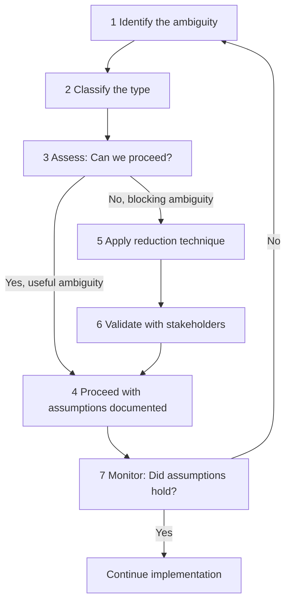

# Ambiguity Reduction

> **One-line definition:** Making progress when requirements are unclear by systematically reducing ambiguity through structured analysis, prototyping, and stakeholder engagement.

## Why This Is a Senior Skill

Ambiguity is not a problem to be solved before work begins. It is the medium in which senior engineering work happens.

A mid-level engineer waits for clear requirements before starting. A senior engineer **makes progress despite ambiguity** and **actively reduces it** through structured techniques. The engineers who thrive at senior level are the ones who can move forward without needing everything to be clear first, and who can tell the difference between useful ambiguity and ambiguity that must be resolved before proceeding.

## Types of Ambiguity

Not all ambiguity is the same. Classifying it helps you choose the right reduction technique:

| Type | Description | Example | Reduction technique |
|---|---|---|---|
| **Problem ambiguity** | The problem itself is unclear or contested | "We need to improve the user experience" | Problem framing workshop, Five Whys |
| **Solution ambiguity** | Multiple valid solutions exist | "We could use a cache, a CDN, or optimize queries" | Prototyping, spike experiments, trade-off analysis |
| **Stakeholder ambiguity** | Stakeholders disagree on priorities or needs | Product wants speed, security wants thoroughness | Facilitated negotiation, stakeholder alignment workshop |
| **Technical ambiguity** | Technical feasibility or approach is uncertain | "We are not sure if this API can handle the load" | Spike experiments, proof of concept, load testing |
| **Scope ambiguity** | The boundaries of the work are unclear | "Does this include mobile? What about international users?" | Scope definition workshop, explicit inclusions and exclusions |

## The Ambiguity Reduction Process



### Step 1: Identify the ambiguity

The first step is recognizing that ambiguity exists. Common signals:

- Stakeholders use vague language ("fast," "easy," "better")
- The team is debating approaches without a clear basis for decision
- Requirements documents have gaps or contradictions
- Different stakeholders describe the same feature differently
- The team is making assumptions without documenting them

### Step 2: Classify the type

Use the taxonomy above to classify the ambiguity. Different types require different reduction techniques.

### Step 3: Assess whether you can proceed

Not all ambiguity needs to be resolved before proceeding. A senior engineer distinguishes:

**Useful ambiguity (proceed with documented assumptions):**

- The ambiguity will resolve naturally as work progresses
- The cost of resolving it now exceeds the cost of proceeding with assumptions
- Multiple valid interpretations exist and any would lead to a reasonable outcome
- The ambiguity is in details that do not affect the current phase of work

**Blocking ambiguity (must resolve before proceeding):**

- The ambiguity affects the fundamental approach or architecture
- Different interpretations would lead to significantly different implementations
- The ambiguity involves stakeholder needs that could change the entire scope
- Proceeding without resolution risks significant rework

### Step 4: Proceed with documented assumptions

When ambiguity is useful, proceed but document your assumptions:

```markdown
## Assumptions Log

### ASS-001: User authentication method
- **Assumption:** Users will authenticate via OAuth with existing Google accounts
- **Rationale:** 80% of our user base uses Google Workspace; OAuth reduces friction
- **Risk:** If wrong, we need to implement a separate auth system (2 weeks effort)
- **Validation:** User research survey in sprint 2
- **Owner:** [Name]
```

### Step 5: Apply reduction techniques

When ambiguity is blocking, apply the appropriate technique:

#### For problem ambiguity: Problem decomposition

Break the vague problem into smaller, specific sub-problems:

```
Vague: "Improve system reliability"

Decomposed:
1. Reduce API error rate from 2% to under 0.1%
2. Eliminate single points of failure in the payment flow
3. Reduce mean time to recovery from 45 minutes to under 10 minutes
4. Add circuit breakers for all external dependencies
```

Each sub-problem is specific enough to address independently.

#### For solution ambiguity: Spike experiments

Build a time-boxed prototype to validate an approach:

| Spike | Question to answer | Time box | Success criteria |
|---|---|---|---|
| Cache spike | Can Redis handle our query patterns at scale? | 3 days | Load test results showing latency under 50ms at 10K QPS |
| Event-driven spike | Can we decouple order processing with Kafka? | 5 days | Working prototype with order events consumed by 2 services |
| Serverless spike | Can AWS Lambda handle our batch processing workload? | 3 days | Cost and performance comparison with current EC2 approach |

#### For stakeholder ambiguity: Facilitated alignment

Bring conflicting stakeholders together to align:

1. **Surface the conflict:** "We have two valid perspectives here"
2. **Understand interests:** "What outcome are you trying to achieve?"
3. **Explore trade-offs:** "If we prioritize X, what is the impact on Y?"
4. **Seek common ground:** "Is there an approach that addresses both needs?"
5. **Decide and document:** "We will proceed with approach Z, which prioritizes X because [rationale]"

#### For technical ambiguity: Proof of concept

Build a focused prototype to validate technical feasibility:

- Test the riskiest assumption first
- Use production-like conditions (data volume, concurrency, network)
- Define success criteria before starting
- Time-box the effort to prevent over-investment

#### For scope ambiguity: Explicit boundaries

Define what is in scope and what is explicitly out of scope:

```markdown
## Scope Definition

### In Scope
- Web application for desktop browsers (Chrome, Firefox, Safari, Edge)
- User authentication via OAuth (Google, GitHub)
- Core features: [list]

### Out of Scope
- Mobile applications (iOS, Android)
- Internet Explorer support
- Third-party integrations beyond [list]
- Internationalization beyond English and Thai
```

## Ambiguity Reduction Patterns

### The assumption storm

When the team is making many assumptions, run an assumption storm:

1. **Brainstorm:** Everyone writes down their assumptions on sticky notes (5 minutes)
2. **Cluster:** Group related assumptions (5 minutes)
3. **Prioritize:** Rank by risk (what happens if this assumption is wrong?) and confidence (how sure are we?)
4. **Plan:** For high-risk, low-confidence assumptions, plan a validation activity

### The ambiguity budget

Allocate time explicitly for ambiguity reduction:

- **10-20% of sprint capacity** for exploration, spikes, and stakeholder alignment
- Tracked separately from feature delivery
- Reviewed in retrospectives: did we spend enough time reducing ambiguity?

### The decision log

When ambiguity is resolved through a decision, record it:

| Decision | Ambiguity resolved | Options considered | Decision | Rationale | Date |
|---|---|---|---|---|---|
| Auth method | How will users authenticate? | OAuth, username/password, magic link | OAuth with Google | 80% user base uses Google Workspace | 2026-01-15 |
| Data store | Where will we store events? | PostgreSQL, DynamoDB, Kafka | DynamoDB | Best fit for event stream pattern at our scale | 2026-01-20 |

## When Ambiguity Cannot Be Reduced

Sometimes ambiguity persists despite your best efforts. A senior engineer manages this by:

- **Building flexibility:** Design the system to accommodate multiple interpretations (feature flags, configuration, modular architecture)
- **Reducing blast radius:** Make small, reversible changes rather than large, irreversible ones
- **Increasing feedback loops:** Ship smaller increments and get feedback faster
- **Documenting uncertainty:** Be explicit about what is unknown and what the team is assuming

## Practical Exercise

**For your current project:**

1. **Identify ambiguity:** List the top 3 areas of ambiguity you are currently facing

2. **Classify each:** What type of ambiguity is it (problem, solution, stakeholder, technical, scope)?

3. **Assess:** For each, can you proceed with documented assumptions, or must you resolve it first?

4. **Plan reduction:** For blocking ambiguity, choose a reduction technique and plan the activity (time-boxed spike, workshop, proof of concept)

5. **Document assumptions:** For useful ambiguity, write an assumption log entry with risk, validation plan, and owner

**Bonus:** Run an assumption storm with your team. How many assumptions did you surface? Which ones are highest risk?

## Knowledge Connections

- [[01_Problem_Statement_Definition]] : problem framing reduces problem ambiguity
- [[03_Stakeholder_Management]] : stakeholder engagement reduces stakeholder ambiguity
- [[05_Acceptance_Conditions]] : acceptance conditions reduce ambiguity about what "done" means
- [[07_Prioritization]] : prioritization reduces scope ambiguity
- [[software-engineering-note/01_Software_Requirements/07_Quality_and_Prototyping]] : prototyping and requirements quality
- [[software-engineering-note/01_Software_Requirements/03_Requirements_Elicitation]] : elicitation techniques for reducing ambiguity

## Key Takeaways

- Ambiguity is the medium of senior engineering work, not an obstacle to it
- Classify ambiguity into five types: problem, solution, stakeholder, technical, scope
- Distinguish useful ambiguity (proceed with documented assumptions) from blocking ambiguity (must resolve first)
- Use structured reduction techniques: problem decomposition, spike experiments, facilitated alignment, proof of concept, explicit scope boundaries
- Run assumption storms to surface and prioritize hidden assumptions
- When ambiguity persists, build flexibility, reduce blast radius, and increase feedback loops
