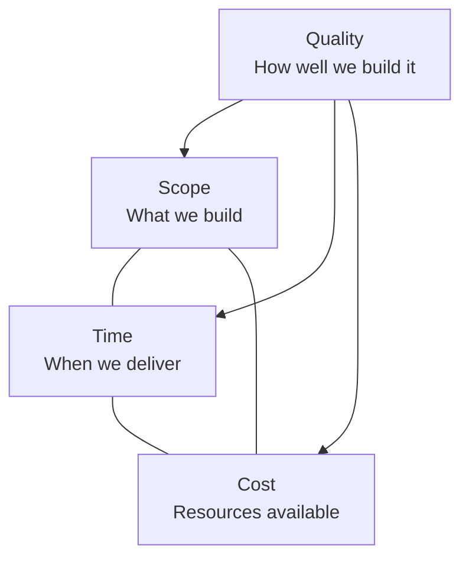

# Prioritization and Trade-offs

> **One-line definition:** Deciding what matters most when resources are limited, making explicit trade-offs between competing needs, and communicating the reasoning to stakeholders.

## Why This Is a Senior Skill

A mid-level engineer implements what is prioritized for them. A senior engineer **facilitates prioritization**, **makes trade-offs explicit**, and **defends priority decisions** with data and reasoning.

Every project has more requirements than resources to implement them. Prioritization is not about choosing what is good. It is about choosing what to **not do** (or do later) so the team can deliver the most important things first.

A senior engineer ensures prioritization is:

- **Explicit:** Everyone understands what was chosen and what was deferred
- **Rational:** Based on data and agreed criteria, not opinions or politics
- **Adaptive:** Revisited regularly as conditions change
- **Transparent:** Stakeholders understand the reasoning and trade-offs

## Prioritization Frameworks

### MoSCoW Method

The simplest framework, suitable for most projects:

| Category | Meaning | Rule |
|---|---|---|
| **Must have** | The project fails without these | Non-negotiable; if more than 60% of requirements are "Must," the framework breaks down |
| **Should have** | Important but not critical; workarounds exist | Delivered if time permits after Must haves |
| **Could have** | Desirable but low impact if deferred | Only if Should haves are complete and time remains |
| **Won't have** | Explicitly excluded from this release | Documented for future consideration |

**Senior engineer role:** Challenge stakeholders who label everything as "Must have." Ask: "If we ship without this, does the project fail?" If the answer is no, it is not a Must have.

### Weighted Shortest Job First (WSJF)

A more quantitative approach from SAFe, useful when comparing features of different sizes:

```
WSJF = Cost of Delay / Job Duration
```

| Component | What it measures | How to estimate |
|---|---|---|
| **User-business value** | How much value does this deliver? | Relative scoring (1-10) with product manager |
| **Time criticality** | Does the value decay over time? | Relative scoring (1-10); high for regulatory deadlines, market windows |
| **Risk reduction / opportunity enablement** | Does this reduce risk or unlock future work? | Relative scoring (1-10); high for technical debt, platform capabilities |
| **Job duration** | How long will this take? | Relative sizing (story points, t-shirt sizes) |

**Cost of Delay** = User-business value + Time criticality + Risk reduction

**Senior engineer role:** Ensure the scoring is based on data, not opinions. Challenge inflated value scores and underestimated durations.

### Value vs. Effort Matrix

A visual framework for quick prioritization:

| | Low effort | High effort |
|---|---|---|
| **High value** | Quick wins (do first) | Strategic bets (plan carefully) |
| **Low value** | Fill-ins (do if time permits) | Money pits (avoid or defer) |

**Senior engineer role:** Ensure value is assessed from both user and business perspectives, not just one.

### RICE Scoring

A structured scoring model for comparing features:

```
RICE Score = (Reach × Impact × Confidence) / Effort
```

| Factor | What it measures | Scale |
|---|---|---|
| **Reach** | How many users will this affect per quarter? | Absolute number (e.g., 5000 users) |
| **Impact** | How much will this improve the user's experience? | 3 = massive, 2 = high, 1 = medium, 0.5 = low, 0.25 = minimal |
| **Confidence** | How sure are we about these estimates? | 100% = high, 80% = medium, 50% = low |
| **Effort** | How much work is required? | Person-months |

**Senior engineer role:** Ensure confidence scores are honest. Low-confidence estimates should trigger validation activities before committing resources.

## Making Trade-offs Explicit

### The trade-off matrix

Every prioritization decision involves trade-offs. A senior engineer makes them explicit:

| Decision | What we gain | What we give up | Risk of giving it up | Mitigation |
|---|---|---|---|---|
| Prioritize feature A over B | Deliver high-value feature sooner | Feature B users wait 2 more months | Moderate: workaround exists | Communicate timeline to feature B stakeholders |
| Defer technical debt payment | More feature delivery this quarter | System becomes harder to change | High: debt compounds | Schedule debt payment next quarter |
| Build in-house vs. buy | Full control, no licensing cost | 3 months of engineering time | Medium: maintenance burden | Plan for ongoing maintenance cost |

### The iron triangle

Every project operates within the iron triangle of scope, time, and cost. You can fix two and adjust the third:



**Senior engineer role:** When stakeholders demand fixed scope, fixed time, and fixed cost, explain that something must give. Quality is usually what suffers. Make this trade-off explicit.

### The cost of delay

Every deferred requirement has a cost. A senior engineer quantifies it:

| Requirement | Cost of delay per month | Total delay if deferred | Total cost of delay |
|---|---|---|---|
| Payment optimization | $50K/month in lost revenue | 3 months | $150K |
| Security patch | Risk of breach (estimated $2M exposure) | 1 month | High risk |
| Admin dashboard | 20 hours/month of manual reporting | 6 months | $36K (at $30/hour) |

This analysis helps stakeholders understand that deferral is not free.

## Prioritization in Practice

### The prioritization workshop

For significant initiatives, a senior engineer facilitates a prioritization workshop:

**Participants:** Product manager, engineering lead, key stakeholders (2-3 people)

**Agenda (90 minutes):**

1. **Review the candidate list** (15 min): What are all the requirements we are considering?
2. **Apply the framework** (30 min): Score each requirement using the chosen framework (MoSCoW, WSJF, RICE)
3. **Challenge the scores** (20 min): Are the scores realistic? Are we overestimating value or underestimating effort?
4. **Identify dependencies** (10 min): Are there requirements that must be done before others?
5. **Agree on the priority** (15 min): What is the agreed priority order? What is explicitly deferred?

**Output:** A prioritized backlog with explicit deferrals and the reasoning behind each decision

### The priority renegotiation

Priorities change. A senior engineer manages renegotiation by:

1. **Triggering the conversation early:** "Based on what we have learned, we need to revisit our priorities"
2. **Presenting the data:** "Here is what has changed and why the current priority may no longer be optimal"
3. **Proposing options:** "We can either A, B, or C. Here are the trade-offs"
4. **Getting explicit agreement:** "Do we agree to proceed with option B?"
5. **Documenting the decision:** Update the priority list and communicate the change

### The priority communication

After prioritization, a senior engineer ensures all stakeholders understand:

- **What was prioritized** and why
- **What was deferred** and when it will be reconsidered
- **What trade-offs were made** and their implications
- **What assumptions were made** and how they will be validated

## Common Prioritization Anti-Patterns

| Anti-pattern | Description | What to do instead |
|---|---|---|
| **HiPPO** (Highest Paid Person's Opinion) | Priority is set by the most senior person, not by data | Use a structured framework with data-driven scoring |
| **Everything is priority 1** | All requirements are labeled as highest priority | Force ranking: if everything is priority 1, nothing is |
| **Loudest voice wins** | Priority goes to the stakeholder who argues most forcefully | Use a structured workshop with equal voice for all participants |
| **Sunk cost bias** | Continuing to invest in a low-value requirement because we already started | Evaluate based on remaining value, not past investment |
| **Scope creep by prioritization** | Adding new requirements without removing existing ones | One in, one out: every addition requires a deferral |
| **Analysis paralysis** | Spending more time prioritizing than implementing | Time-box the prioritation process and make decisions with available data |

## Practical Exercise

**For your current project:**

1. **List the top 10 requirements** you are considering for the next release

2. **Apply a prioritization framework:** Score each using MoSCoW, WSJF, or RICE

3. **Identify trade-offs:** For the top 3 priorities, document what is being deferred and the cost of delay

4. **Challenge the scores:** Are any scores inflated or underestimated? What data supports or contradicts them?

5. **Communicate the priority:** Draft a message to stakeholders explaining the priority, the deferrals, and the reasoning

**Bonus:** Find a requirement from the past year that was prioritized incorrectly (either over-prioritized and delivered low value, or under-prioritized and should have been done sooner). What went wrong?

## Knowledge Connections

- [[04_User_and_Business_Outcomes]] : outcomes drive prioritization decisions
- [[06_Ambiguity_Reduction]] : ambiguity reduction informs prioritization by clarifying value and effort
- [[07_Prioritization]] feeds into [[08_Requirements_Risk]] : deferred requirements carry risk
- [[software-engineering-note/01_Software_Requirements/08_Prioritization_Validation_and_Reuse]] : prioritization techniques and validation
- [[software-engineering-note/09_Software_Engineering_Management/Software Engineering Management Overview]] : project management and resource allocation
- [[software-engineering-note/15_Software_Engineering_Economics/Software Engineering Economics Overview]] : engineering economics and cost-benefit analysis

## Key Takeaways

- Prioritization is choosing what not to do, not choosing what is good
- Use structured frameworks (MoSCoW, WSJF, RICE, value-effort matrix) to make prioritization rational and transparent
- Make trade-offs explicit: document what is gained, what is given up, and the risks
- Quantify the cost of delay to help stakeholders understand that deferral is not free
- Challenge prioritization anti-patterns: HiPPO, everything-is-priority-1, loudest voice wins
- Priorities change: manage renegotiation proactively with data and explicit agreement
